[TOC]


# 安装


## zabbbix仓库安装


```sh

root@dns-01:~# lsb_release -a

No LSB modules are available.

Distributor ID: Debian

Description:    Debian GNU/Linux 8.1 (jessie)

Release:    8.1

Codename:   jessie

root@dns-01:~# uname -a

Linux dns-01.kartor.cn 3.16.0-4-amd64 #1 SMP Debian 3.16.7-ckt20-1+deb8u1 (2015-12-14) x86_64 GNU/Linux

```

```sh

root@zbserver-01:~/zabbix# pwd

/root/zabbix

root@zbserver-01:~/zabbix# wget http://repo.zabbix.com/zabbix/3.2/debian/pool/main/z/zabbix-release/zabbix-release_3.2-1+jessie_all.deb

root@zbserver-01:~/zabbix#  dpkg -i zabbix-release_3.2-1+jessie_all.deb

root@zbserver-01:~/zabbix#  apt-get update

```


## server及mysql安装


```sh

root@zbserver-01:~/zabbix# apt-get install zabbix-server-mysql zabbix-frontend-php

```

会要求你设置mysql数据库的root密码，如下图：

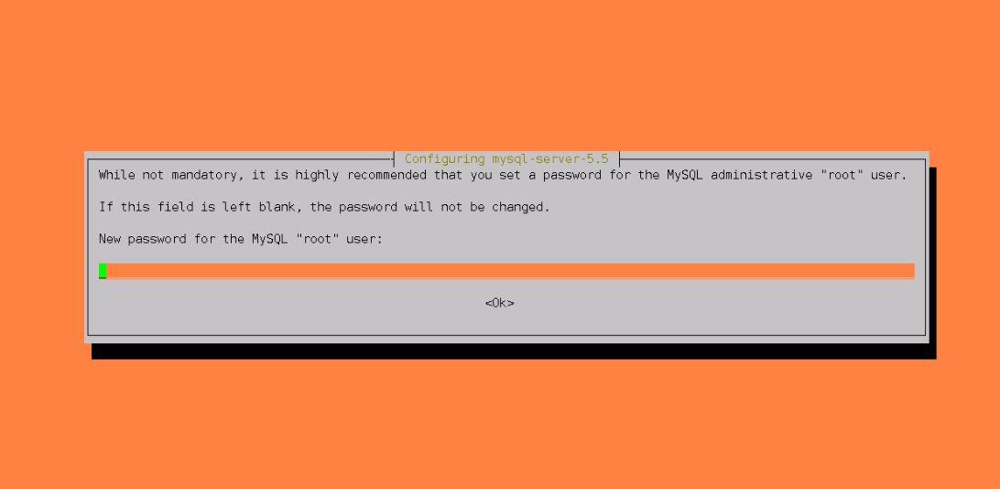

密码为:   mysqlroot


## 创建初始数据库


```sh

root@zbserver-01:~/zabbix# mysql -uroot -pmysqlroot

Welcome to the MySQL monitor.  Commands end with ; or \g.

Your MySQL connection id is 43

Server version: 5.5.53-0+deb8u1 (Debian)


Copyright (c) 2000, 2016, Oracle and/or its affiliates. All rights reserved.


Oracle is a registered trademark of Oracle Corporation and/or its

affiliates. Other names may be trademarks of their respective

owners.


Type 'help;' or '\h' for help. Type '\c' to clear the current input statement.


mysql> create database zabbix character set utf8 collate utf8_bin;

Query OK, 1 row affected (0.00 sec)


mysql> grant all privileges on zabbix.* to 'zabbix'@'%' identified by 'zabbixpassword';

Query OK, 0 rows affected (0.00 sec)


mysql> flush privileges;

Query OK, 0 rows affected (0.00 sec)

```

zabbix用户的密码为zabbixpassword


##  导入初始数据


```sh

root@zbserver-01:~/zabbix#  zcat /usr/share/doc/zabbix-server-mysql/create.sql.gz | mysql -uzabbix -p zabbix

Enter password: 

```

输入zabbix数据库的用户密码，等待一会数据导入完成。


## 启动zabbix server


```sh

root@zbserver-01:~/zabbix# service zabbix-server start

root@zbserver-01:~/zabbix# service zabbix-server status

● zabbix-server.service - Zabbix Server

   Loaded: loaded (/lib/systemd/system/zabbix-server.service; disabled)

   Active: active (running) since Wed 2016-12-14 13:51:43 CST; 20s ago

  Process: 21912 ExecStart=/usr/sbin/zabbix_server -c $CONFFILE (code=exited, status=0/SUCCESS)

 Main PID: 21914 (zabbix_server)

   CGroup: /system.slice/zabbix-server.service

           └─21914 /usr/sbin/zabbix_server -c /etc/zabbix/zabbix_server.conf


Dec 14 13:51:43 zbserver-01.kartor.cn systemd[1]: zabbix-server.service: Supervising process 21914 which is not our child. We'll most likely not notice when it exits.

root@zbserver-01:~/zabbix# systemctl is-enabled zabbix-server.service 

disabled

root@zbserver-01:~/zabbix# systemctl enable zabbix-server.service     # 配置开机启动

Synchronizing state for zabbix-server.service with sysvinit using update-rc.d...

Executing /usr/sbin/update-rc.d zabbix-server defaults

Executing /usr/sbin/update-rc.d zabbix-server enable

```

## 为zabbix server配置数据库连接


```sh

root@zbserver-01:~/zabbix# vim /etc/zabbix/zabbix_server.conf

DBHost=127.0.0.1

DBName=zabbix

DBUser=zabbix

DBPassword=zabbixpassword

```

以上数据库连接信息根据实际情况进行修改。


## 修改zabbix前端的php配置信息


```sh

root@zbserver-01:~/zabbix# vim /etc/apache2/conf-enabled/zabbix.conf

php_value max_execution_time 300 

php_value memory_limit 128M 

php_value post_max_size 16M 

php_value upload_max_filesize 2M 

php_value max_input_time 300 

php_value always_populate_raw_post_data -1 

php_value date.timezone Asia/Chongqing

```

这里设置的是一些php的优化配置参数，最重要的是调整`php_value date.timezone`这个时区的值。注意在`/etc/apache2/conf-enabled/zabbix.conf`文件中是根据当前php的版本来判断启用哪个配置段，如果本地是php5，那就修改`<IfModule mod_php5.c>`配置段的时区参数，如果是php7，则修改另一段的时区参数，最好两者都一起修改。如下：

```


<Directory "/usr/share/zabbix">

    Options FollowSymLinks

    AllowOverride None

    Order allow,deny

    Allow from all


    <IfModule mod_php5.c>

        php_value max_execution_time 300

        php_value memory_limit 128M

        php_value post_max_size 16M

        php_value upload_max_filesize 2M

        php_value max_input_time 300

        php_value always_populate_raw_post_data -1

        php_value date.timezone Asia/Chongqing

    </IfModule>

    <IfModule mod_php7.c>

        php_value max_execution_time 300

        php_value memory_limit 128M

        php_value post_max_size 16M

        php_value upload_max_filesize 2M

        php_value max_input_time 300

        php_value always_populate_raw_post_data -1

        php_value date.timezone Asia/Chongqing

    </IfModule>

</Directory>

```

##  重启apache服务


```sh

root@zbserver-01:~/zabbix# systemctl restart apache2.service

```


## 访问前端及配置


浏览器打开`http://zabbix-frontend-hostname/zabbix`，如下：

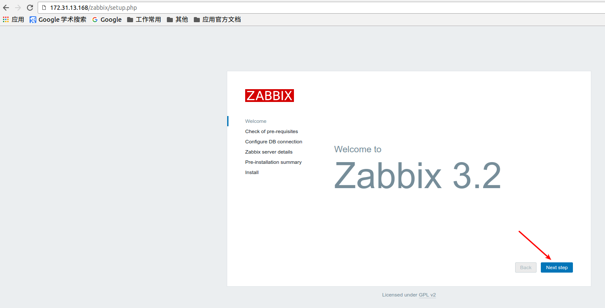


点击`Next step`后会检测当前的环境是否满足：

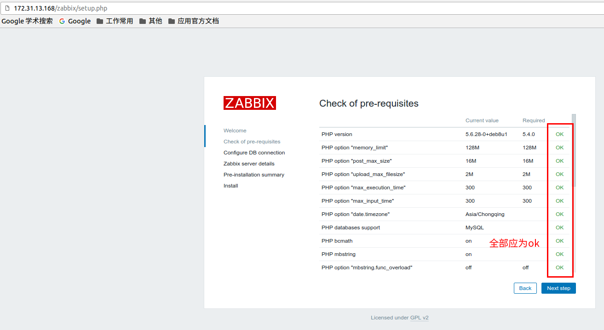


点击`Next step`后如下：

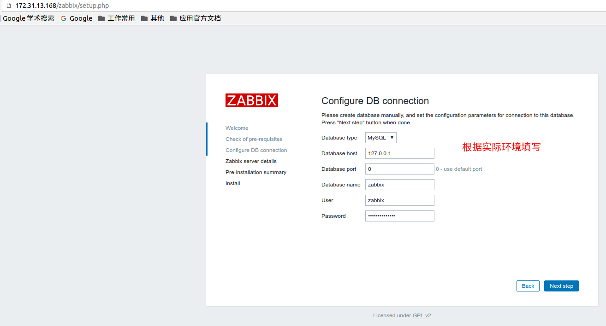


因数据库安装在zabbix-server本地，只监听在`127.0.0.1`，所以上图的`Database host`填写`127.0.0.1`。

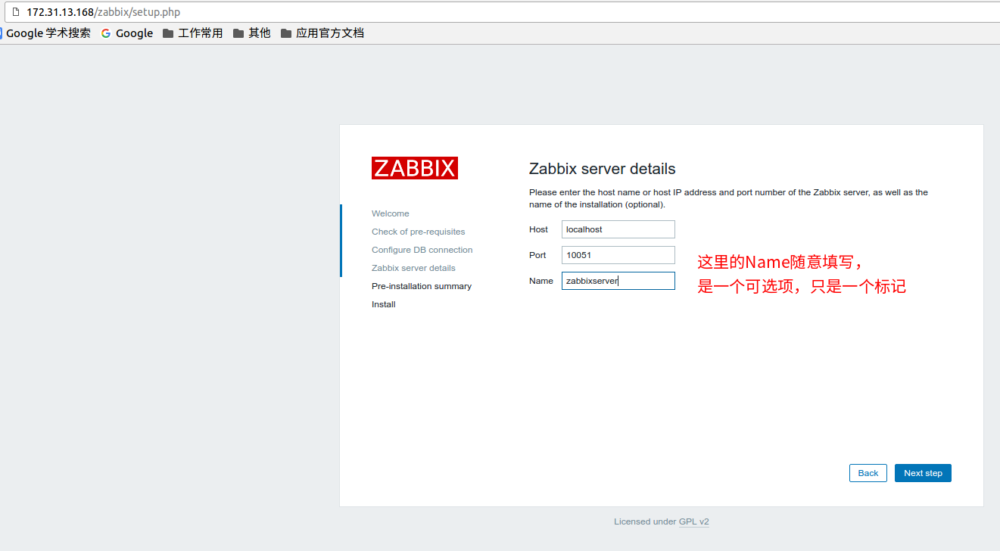
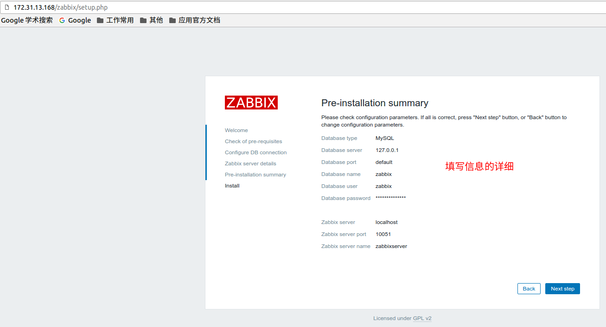

点击`Next step`后开始安装前端程序

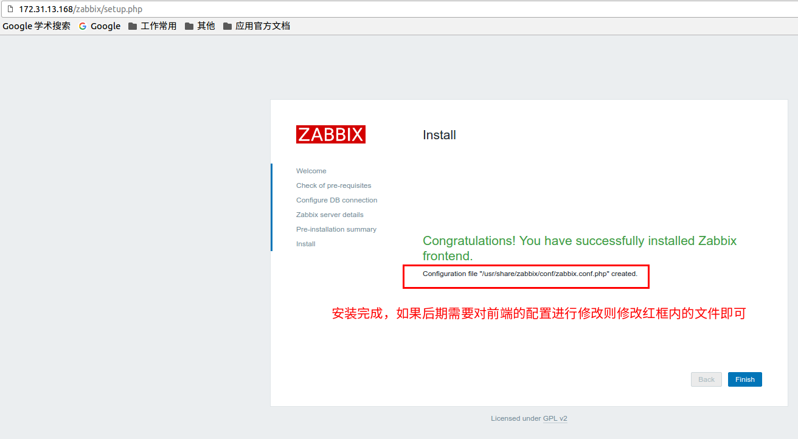
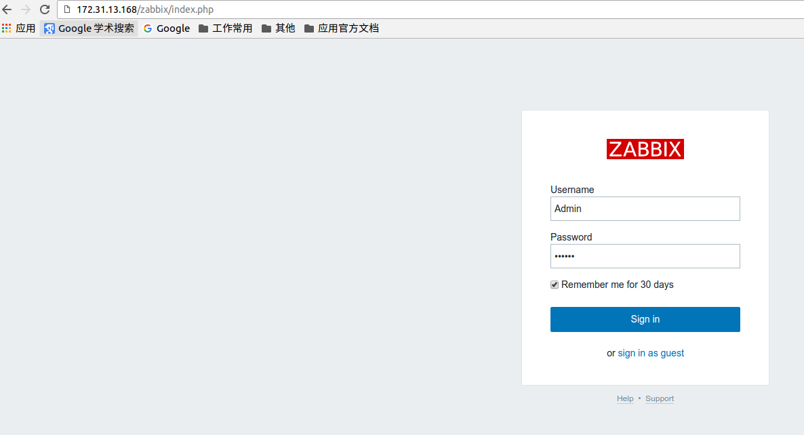


默认用户及密码为 Admin/zabbix

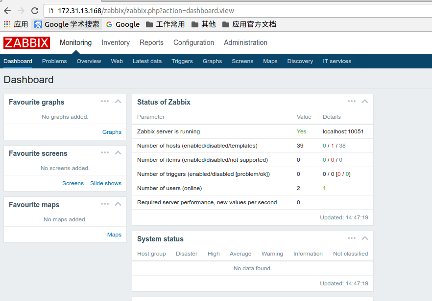


登陆成功。


# 前端页面语言切换及乱码处理


在前端页面的右上角有个人型的图标，


点开此图标就可以跳转到切换语言的界面，如下：

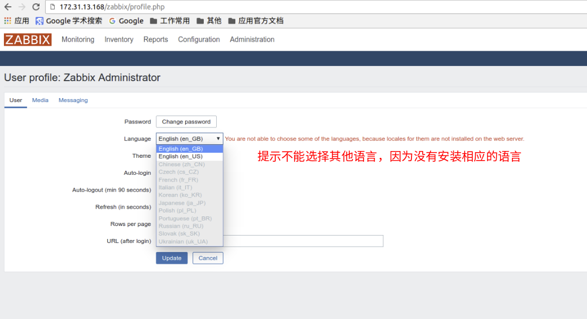

[这里](https://www.zabbix.org/wiki/How_to/install_locale)有解决此问题的方法，如下：

 ```sh

root@zbserver-01:~#  locale -a   #检查本地可用语言

C

C.UTF-8

en_US.utf8

POSIX

```

```sh

root@zbserver-01:~# dpkg-reconfigure locales   #运行此命令后选择 zh_CN.UTF-8 UTF-8安装

root@zbserver-01:~#  locale -a  # 再次检查

C

C.UTF-8

en_US.utf8

POSIX

zh_CN.utf8

```

重启前端服务：

```sh

root@zbserver-01:~# service apache2 restart

```

重新服务后就可以在切换语言界面选择`Chinese(zh_CN)`，这样前端的界面切换成了中文，如下：

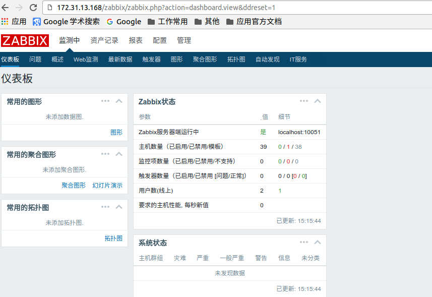

但有在查看一些图形时会出现乱码，如下：

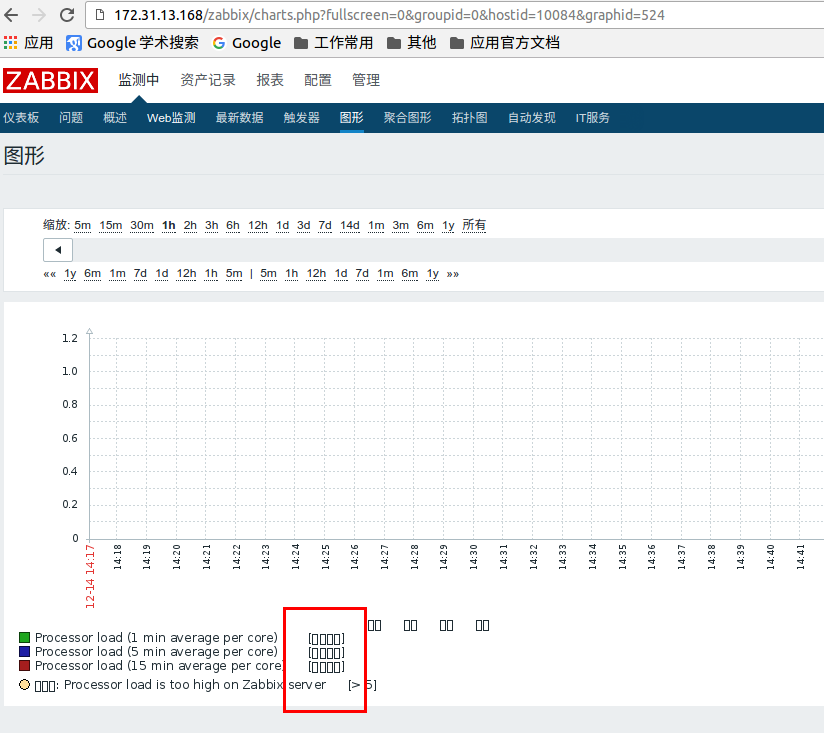

字体文件是存放在`/usr/share/zabbix/fonts`，在windows系统上在字体文件夹目录下拷贝一个中文字体放在此目录下，并去修改zabbix的前端的php源码文件，使其使用我们指定的字体，

这里选择黑体字(simhei.ttf)，如下：

```sh


root@zbserver-01:~# ls /usr/share/zabbix/fonts/

graphfont.ttf  simhei.ttf

```

修改源码文件：

```sh

root@zbserver-01:~# cd /usr/share/zabbix/include/

root@zbserver-01:/usr/share/zabbix/include# cp defines.inc.php defines.inc.php.back

root@zbserver-01:/usr/share/zabbix/include# vim defines.inc.php    # 把此文件中的graphfont修改为我们上传的字体文件的名称

```

修改后效果如下：

```sh

root@zbserver-01:/usr/share/zabbix/include# grep FONT_NAME defines.inc.php -n

45:define('ZBX_GRAPH_FONT_NAME',        'simhei'); // font file name

93:define('ZBX_FONT_NAME', 'simhei');

```

再重启apache2服务：

```sh

root@zbserver-01:/usr/share/zabbix/include# service apache2 restart

```

刷新页面，乱码问题解决：

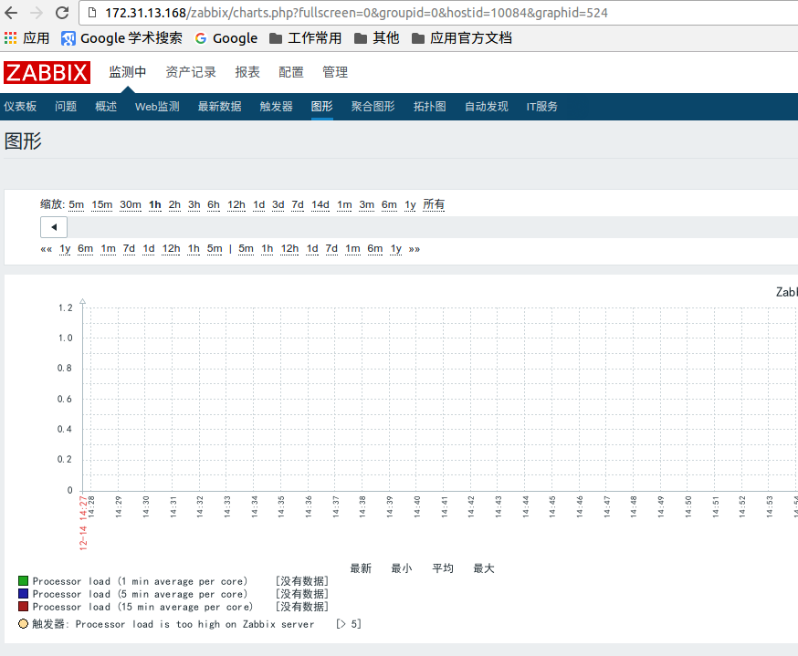


