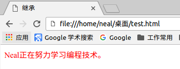
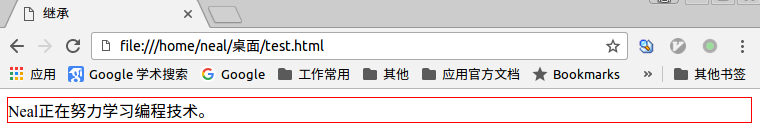

# 继承

CSS的某些样式是具有继承性的，那么什么是继承呢？继承是一种规则，它允许样式不仅应用于某个特定html标签元素，而且应用于其后代。比如下边的代码： 某种颜色应用于`p`标签，这个颜色不仅应用`p`标签，还应用于`p`标签中的所有子元素，这里子元素为`span`标签。

```html
<html>
<head>
  <title>继承</title>
  <meta http-equiv="content-type" content="text/html;charset=utf-8">
  <style type="text/css">
    p{
      color:red;
    }
  </style>
</head>
<body>
  <p>Neal正在努力学习<span>编程技术</span>。</p>
</body>
</html>
```

浏览器解析结果：



段落的文字全部字体全部都是红色。

但有一些css样式是不具有继承性的，比如：`border:1px solid red;`，如下边代码：

```html
<html>
<head>
  <title>继承</title>
  <meta http-equiv="content-type" content="text/html;charset=utf-8">
  <style type="text/css">
    p{
      border:1px solid red;
    }
    </style>
  </head>
  <body>
    <p>Neal正在努力学习<span>编程技术</span>。</p>
  </body>
</html>
```

浏览器解析结果：



只有`p`标签被加上了相应的样式，而`span`标签则没有。

# 特殊性

如果为同一个元素设置了不同的css样式，那么元素会启用哪一个css样式呢？浏览器是根据`选择器`的权限来判断使用哪种css样式，哪个权值高就使用哪种css样式。

权值的规则：

标签的权值为`1`,类选择符的权值是`10`，ID选择符的权值为`100`。

举例：

```html
<html>
<head>
  <title>权限测试</title>
  <meta http-equiv="content-type" content="text/html;charset=utf-8">
  <style type="text/css">
    span{
      color:red;
    }
    .stress{
      color:green;
    }
    </style>
  </head>
  <body>
    <p>Neal正在努力学习<span class="stress">编程技术</span>。</p>
  </body>
</html>
```

根据权值规则，设置红色字体的是标签选择器，权值是`1`，设置绿色字体的是类选择器，权值是`10`，所以最后文字颜色是绿色。
如果选择中`后代选择器`或`子选择器`则把各自的权值相加，如下边代码：

```css
p>span{
  color:red;
}
```

这个css样式的权值为`1 + 1`=`2`

# 层叠

当多个拥有相同权值的css样式同时作用于一个元素时，是哪个css样式生效呢？

层叠就是在html文件中对于同一个元素可以有多个css样式存在，当有相同权重的样式存在时，会根据这些css样式的前后顺序来决定，处于最后面的css样式会被应用。即最靠近元素的css样式会生效。

举例：

```html
p{
  color:red;
}
p{
  color:blue;
}

<p>段落一。</p>
```

上边代码中对`段落一`生效的css样式是把字体设置成蓝色的css样式。

所以前面的css样式优先级就不难理解了：

内联样式表（标签内部）> 嵌入样式表（当前文件中）> 外部样式表（外部文件中）。

# 重要性

当网页代码中有些特殊的需求，需要为某些样式设置具有最高的权值，这时就可以使用`!important`来解决。

举例：

```html
p{
  color:red!important;
}
p{
  color:blue;
}

<p>段落一。</p>
```

这样`段落一`生效的css样式是把字体设置成`红色`。

这里注意当网页制作者不设置css样式时，浏览器会按照自己的一套样式来显示网页。并且用户也可以在浏览器中设置自己习惯的样式，比如有的用户习惯把字号设置为大一些，使其查看网页的文本更加清楚。这时注意样式优先级为： `浏览器默认的样式 < 网页制作者样式 < 用户自己设置的样式`，但记住!important优先级样式是个例外，权值高于用户自己设置的样式。
