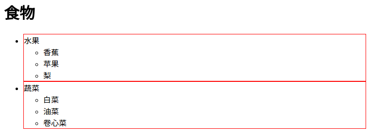
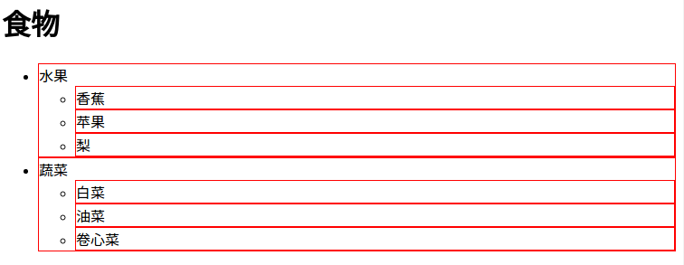
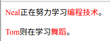

# 什么是选择器

每一个css样式代码由两部分组成，选择器和声明，如下代码：

```css
选择器{
  css样式代码；
}
```

`{}`之前的就是选择器，选择器是样式的作用对象，表示样式对网页上的哪些元素生效。

# 标签选择器

标签选择器就是html代码中的标签，如`<html>`、`<body>`、`<h1>`、`<p>`、``等，例如：

```css
p{
  font-size: 12px;
  color: red;
}
```

上边css样式代码的作用： 为html代码中的`<p>`标签设置12px字号，字体颜色为红色的样式。

# 类选择器

语法：

```css
.类选择器名称{
  css样式代码;
}
```

1. `类选择器名称`前有一个英文的圆点。
2. `类选择器名称`不可以是中文。

上边的代码表示css样式对指定的类选择器名称生效，这个类选择器名称存在于html的各种标签中，例如下边的代码：

```html
<head>
  <style type="text/css">
    .stress{
      color: red;
    }
  </style>
</head>
<body>
  <p>Neal正在学习<span class="stress">编程技术</span>。</p>
</body>
```

上边的代码使用`class="类选择器名称"`为一个标签设置一个类，并使用嵌入式css样式设置css样式。记住，在css样式中的类选择器前有一个英文圆点。

# ID选择器

与类选择器比较，ID选择选择类似类选择器，但有区别：

1. 为html标签设置id属性，即`id="id名称"`，而不是`class="类名称"`。
2. css样式中的ID选择器前是一个英文井号(#)，而不是一个英文圆点(.)。

举例：

```html
<head>
  <style type="text/css">
    #setRed{
      color: red;
    }
  </style>
</head>
<body>
  <p>Neal正在学习<span id="setRed">编程技术</span>。</p>
</body>
```

上边的代码设置`编程技术`为红色字体。

# 类选择器与ID选择器的区别

相同点： 都可以应用于html的任何元素

不同点：

1、 ID，从字面上看就应该具有唯一性，所以一个html页面中ID的值应该是唯一的，即`ID选择器只能在文档中使用一次`。而类选择器可以使用多次。

正确代码：

```html
<p>Neal正在努力学习<span class="stress">编程技术</span>，先学习<span class="stress">html</span>，再学习<span class="stress">css</span>。</p>
```

错误代码：

```html
<p>Neal正在努力学习<span id="stress">编程技术</span>，先学习<span id="stress">html</span>，再学习<span id="stress">css</span>。</p>
```

注： 在纯粹的测试代码中会发现上边的`错误代码`部分浏览器也能起作用，但这种做法依然是错误的，ID就应该是一个唯一值，是一种规范，可以参考[这里](http://www.imooc.com/qadetail/135825)或[这里](http://www.divcss5.com/rumen/r3.shtml)

2、 类选择器还有一个`词列表方法`，可以使用此方法对一个元素同时设置多个样式。而ID选择器则不可以。

正确代码：

```html
.stress{
  color: red;
}
.bigsize{
  font-size: 25px;
}

<p>Neal正在努力学习<span class="stress bigsize">编程技术</span>。</p>
```

上边代码的作用是为`编程技术`四个文字设置为红色字体，并且字号为25px。

错误代码：

```html
#stress{
  color: red;
}
#bigsize{
  font-size: 25px;
}

<p>Neal正在努力学习<span id="stress bigsize">编程技术</span>。</p>
```
上边的代码并不能为`编程技术`设置文本颜色为红色，并且字号为25px。

# 子选择器

html中的标签不是可以嵌套使用吗？那子选择器用于选择指定标签元素的`第一代子元素`，第二代及更深入的层次子选择器不起作用。子选择器使用大于符号(>)。

举例：

```html
<html>
<head>
  <title>子选择器</title>
  <meta http-equiv="content-type" content="text/html;charset=utf-8">
  <style type="text/css">
    .food>li{
      border: 1px solid red;
    }
  </style>
</head>
<body>
  <h1>食物</h1>
  <ul class="food">
    <li>水果
      <ul>
        <li>香蕉</li>
        <li>苹果</li>
        <li>梨</li>
      </ul>
    </li>
    <li>蔬菜
      <ul>
        <li>白菜</li>
        <li>油菜</li>
        <li>卷心菜</li>
      </ul>
    </li>
  </ul>
</body>
</html>
```

上边代码中对名称为`food`的类中的第一代子元素`li`设置了红色实线边框，像素为1px。最终效果如下图：



# 后代选择器

后代选择器也叫包含选择器。子选择器用于指定标签元素下的`第一代子元素`，而后代选择器则用于选择指定标签元素下的`所有后辈元素`，两者的生效范围不同。子选择器用大于符号(>)，而后代选择器用空格。

对子选择器上的事例代码做修改，把

```css
.food>li{
  border: 1px solid red;
}
```

修改成

```css
.food li{
  border: 1px solid red;
}
```

最后在浏览器中的效果如下图：



总结： `>`作用于元素的第一代后代，`空格`作用于元素的所有后代

# 通用选择器

通用选择器匹配html中`所有`的标签元素，用星号(*)来指定。

举例：

```html
<head>
<style type="text/css">
  * {
    color: red;
    font-size: 20px;
  }
</style>
</head>
<body>
  <h1>标题</h1>
  <p>段落一</p>
  <p>段落二</p>
</body>
```

上边的代码会把`标题`、`段落一`和`段落二`这些文字的字号为20px，字体颜色为红色。

# 伪类选择符

更有趣的是伪类选择符，为什么叫做伪类选择符，它允许给html不存在的标签（标签的某种状态）设置样式。比如一些网页上的超级链接，当鼠标滑过有超级链接的文字时，文字会改变颜色，这种就可以通过伪类标签实现。

举例：

```html
<head>
  <style type="text/css">
  a:hover{
    color:red;
  }
  </style>
</head>
<body>
  <p>如果你想了解更多，请点击我的<a href="https://zhaochj.github.io">博客</a>。</p>
</body>
```

上边的代码就实现了当鼠标滑过`博客`这两个文字时，文字的颜色就会变为红色。

伪类选择符不是只有`:hover`一个，也不是只有`a:hover{}`这一种搭配方式，但能兼容所有浏览器，且最常见的搭配就是`a`标签与`:hover`搭配。

# 分组选择符

把html中的多个标签设置成同一个样式，这时就可以使用分组选择符，分组选择符是一个英文逗号(,)。

举例：

```html
<html>
<head>
  <title>子选择器</title>
  <meta http-equiv="content-type" content="text/html;charset=utf-8">
  <style type="text/css">
    .first span,#second span{
      color:red;
    }
  </style>
</head>
<body>
  <p class=first><span>Neal</span>正在努力学习<span>编程技术</span>。</p>
  <p id="second"><span>Tom</span>则在学习<span>舞蹈</span>。</p>
</body>
</html>
```

上边代码会把在`<p></p>`标签内并且被`<span></span>`包裹的文字的字体颜色全部设置成红色，如下图：


