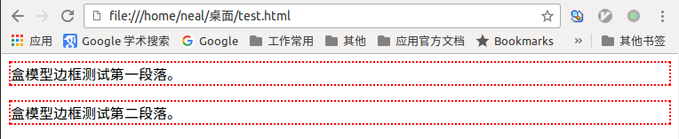
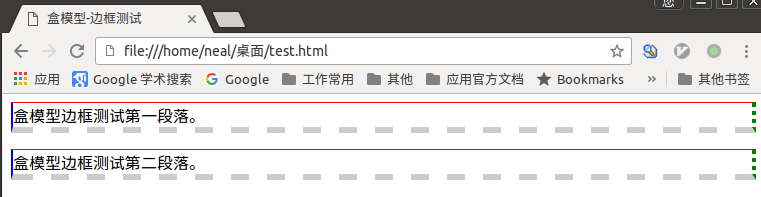

# 元素分类

在学习css布局之前，需要提前储备一些知识，在css中，html中的标签元素大体被分为三种不同的类型： `块状元素`、`内联元素（又叫行内元素）`和`内联块状元素`.

常用的`块状元素`有：

`<div>、<p>、<h1>...<h6>、<ol>、<ul>、<dl>、<table>、<address>、<blockquote>、<form>`

常用的`内联元素`有：

`<a>、<span>、<br>、<i>、<em>、<strong>、<label>、<q>、<var>、<cite>、<code>`

常用的`内联块状元素`有：

`、<input>`

# 元素分类-块级元素

什么是块级元素？在html中`<div>、 <p>、<h1>、<form>、<ul> 和 <li>`就是块级元素。

块级元素特点：

1. 每个块级元素都从新的一行开始，并且其后的元素也另起一行。也就是块级元素独占一行。
2. 元素的高度、宽度、行高以及顶和底边距都可设置。
3. 元素宽度在不设置的情况下，是它本身父容器的100%（和父元素的宽度一致），除非设定一个宽度。

使用`display:block`可以把其他类型的元素转换为块状元素，如下：

```css
a{display: block;}
```

上边代码表示把内联元素`a`转换为了块状元素。

# 元素分类-内联元素

什么是内联元素（行内元素）？在html中`<span>、<a>、<label>、<strong>和<em>`就是典型的内联元素（行内元素）(inline元素)。

内联元素特点：

1. 和其他元素都在一行上。
2. 元素的高度、宽度及顶部和底部边距不可设置。
3. 元素的宽度就是它包含的文字或图片的宽度，不可改变。

使用`display:inline`可以把其他类型的元素转换为内联元素，如下：

```css
div{
  display: inline;
}
```

上边代码把块元素`div`转换为了内联元素。

# 元素分类-内联块状元素

内联块状元素（inline-block）就是同时具备内联元素、块状元素的特点。

内联块状元素(inline-block)特点：

1. 和其他元素都在一行上。
2. 元素的调试、宽度、行高以及顶和底边距都可设置。

使用`display:inline-block`可以把其他类型元素转换为内联块状元素，如下：

```css
a{
  display:inline-block;
  width: 20px;
  height: 20px;
}
```

上边的代码把`a`标签从内联元素转换为了内联块状元素，这样才能对`a`标签的元素设置长度和宽度。

# 盒模型-边框(一)

盒子模型的边框就是围绕着内容及补白的线，这条线你可以设置它的`粗细、样式和颜色(边框三个属性)`。

边框宽度用`border-width`属性定义，边框样式用`border-style`属性定义，边框颜色用`border-color`属性定义。

举例：

```html
<html>
<head>
  <title>盒模型-边框测试</title>
  <meta http-equiv="content-type" content="text/html;charset=utf-8">
  <style type="text/css">
    p{
       border-width:2px;
       border-style:dotted;
       border-color:red;
    }
  </style>
</head>
<body>
  <p>盒模型边框测试第一段落。</p>
  <p>盒模型边框测试第二段落。</p>
</body>
</html>
```

效果如下：



上边代码中的css的样式代码可以简化，

```css
p{
   border-width:2px;
   border-style:dotted;
   border-color:red;
}
```
可以简化为：

```css
p{
  border:2px dotted red;
}
```


注意：

1. `border-width`中的宽度最常是以像素(px)为单位。
2. `border-style`常见的样式有： dashed(虚线)，dotted(点线)和solid(实线)。
3. `border-color`可以设置为十六进制的颜色，也可以设置成像`red`、`blue`等这样的格式。

# 盒模型-边框(二)

如果想对`p`标签单独设置一个`下边框`，而其他三边不设置边框样式。css样式中允许只为一个方向的边框设置样式，这样的属性有四个：

1. `border-top`设置上边框样式；
2. `border-left`设置左边框样式；
3. `border-right`设置右边框样式；
4. `border-bottom`设置下边框样式

举例：

```html
<html>
<head>
  <title>盒模型-边框测试</title>
  <meta http-equiv="content-type" content="text/html;charset=utf-8">
  <style type="text/css">
    p{
       border-top: 1px solid red;
       border-left: 2px solid blue;
       border-right: 4px dotted green;
       border-bottom: 6px dashed #ccc;
    }
  </style>
</head>
<body>
  <p>盒模型边框测试第一段落。</p>
  <p>盒模型边框测试第二段落。</p>
</body>
</html>
```

浏览器解析效果如下：




# 盒模型-宽度和高度

css定义的宽（width）和高（height）指的是填充实际内容的尺寸，而盒模型的宽度和高度则与此有所区别。

以一个图来说明，如下：


因此一个元素实际宽度（盒子的宽度）=左边界+左边框+左填充+内容宽度+右填充+右边框+右边界。

举例：

```html
div{
  width: 200px;
  padding: 20px;
  border: 1px solid red;
  margin: 10px;
}

...

<body>
  <div>文本内容</div>
</body>
```

元素的实际长度为：10px+1px+20px+200px+20px+1px+10px=262px。


# 盒模型-填充

元素`内容`与`边框`之间是可以设置距离的，称之为`填充`。

填充分为`上填充`、`右填充`、`下填充`和`左填充`，一般按照这种顺时针方向来说这四个填充。在css样式中定义如下：

1. 用`padding-top`属性定义`上填充`
2. 用`padding-right`属性定义`右填充`
3. 用`padding-bottom`属性定义`下填充`
4. 用`padding-left`属性定义`左填充`

举例：

```css
div{
  padding-top: 20px;
  padding-right: 10px;
  padding-bottom: 15px;
  padding-left: 30px;
}
```

上边的代码可以简化为：

```css
div{
  padding: 20px 10px 15px 30px;
}
```

`padding`属性的值是与`上填充`、`右填充`、`下填充`和`左填充`一一对应。

如果四个方向的填充都相同可以这样定义：

```css
div{
  padding: 10px;
}
```

如果上下填充相同，值为10px；左右填充相同，值为20px；则可以这样定义：

```css
div{
  padding: 10px 20px;
}
```

# 盒模型-边界

元素与其它元素之间的距离可以使用边界（margin）来设置。边界同样可分为上、右、下、左。如：

```css
div{
  margin-top: 20px;
  margin-right: 10px;
  margin-bottom: 15px;
  margin-left: 30px;
}
```

可以简写为：

```css
div{margin: 20px 10px 15px 30px;}
```

如果上右下左的边界相同，都为10px，那可以这样写：

```css
div{margin: 10px;}
```

如果上下边界一样，为10px，左右边界一样，为20px，那可以这样写：

```css
div{margin: 10px 20px;}
```
