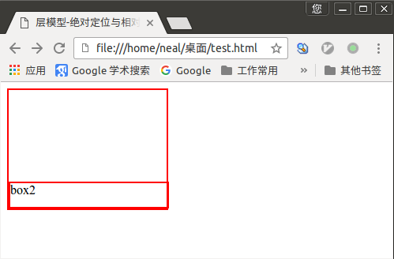

# css布局模型

css包含3种基本的布局模型，用英文概括为：Flow、Layer 和 Float。

在网页中，元素有三种布局模型：

1. 流动模型（Flow）
2. 浮动模型（Float）
3. 层模型（Layer）

# 流动模型（Flow）

流动模型是默认的网页布局模式。流动模型特征：

1. `块状元素`都会在所处的包含元素内自上而下按顺序`垂直延伸分布`，默认状态下，块状元素的宽度都为100%。
2. 在流动模型下，`内联元素`都会在所处的包含元素内从左到右水平分布显示，内联元素不独占一行。

举例：

```html
<!DOCTYPE HTML>
<html>
<head>
<meta http-equiv="Content-Type" content="text/html; charset=utf-8">
<title>css布局模型-流动模型</title>
<style type="text/css">
  h1,p,div{
    border: 1px solid red;
  }
  #box1{
    width: 300px;
    height: 100px;
  }
</style>
</head>
<body>
  <h1>标题</h1> <!--h1是块状元素，没有设置宽度，宽度默认为100%，且独占一行-->
  <p>Neal正在努力学习<span class="stress">编程技术</span>，点击<a href="https://zhaochj.github.io" target="_blank" title="Neal的博客">这里</a>访问他的博客。</p> <!--p是块状元素，没有设置宽度，宽度默认为100%，且独占一行-->

  <a href="http://zhaochj.blog.51cto.com/" target="_blank" title="Neal的博客">这里</a>是他在51cto的博客地址，
  <strong>博客会经常更新</strong> <!--a标签和strong标签是内联元素，内联元素不会自己独占一行-->

  <div id="box1">box1</div>
</body>
</html>
```

上边代码浏览器解析后效果如下：


# 浮动模型（Float）

块状元素有独占一行的特性，如果想让两个块状元素并排在一行显示，这时就需要设置元素浮动来实现。

元素浮动分为左浮动和右浮动，元素浮动用`float`属性定义，值有`left`和`right`。

未定义浮动举例：

```html
<!DOCTYPE HTML>
<html>
<head>
<meta http-equiv="Content-Type" content="text/html; charset=utf-8">
<title>css布局模型-浮动模型</title>
<style type="text/css">
  div{
    width: 100px;
    height: 100px;
    border: 2px solid red;
  }
</style>
</head>
<body>
  <div id="box1">box1</div>
  <div id="box2">box2</div>
</body>
</html>
```

浏览器解析效果如下：


定义左浮动举例：

```html
<!DOCTYPE HTML>
<html>
<head>
<meta http-equiv="Content-Type" content="text/html; charset=utf-8">
<title>css布局模型-浮动模型</title>
<style type="text/css">
  div{
    width: 100px;
    height: 100px;
    border: 2px solid red;
    float: left; /*定义左浮动*/
  }
</style>
</head>
<body>
  <div id="box1">box1</div>
  <div id="box2">box2</div>
</body>
</html>
```

浏览器解析效果如下：


定义右浮动举例：

```html
<!DOCTYPE HTML>
<html>
<head>
<meta http-equiv="Content-Type" content="text/html; charset=utf-8">
<title>css布局模型-浮动模型</title>
<style type="text/css">
  div{
    width: 100px;
    height: 100px;
    border: 2px solid red;
    float: right; /*定义d右浮动*/
  }
</style>
</head>
<body>
  <div id="box1">box1</div>
  <div id="box2">box2</div>
</body>
</html>
```

浏览器解析效果如下：


如果想让box1显示在左边，而box2显示在右边，可以这样定义：

```html
<!DOCTYPE HTML>
<html>
<head>
<meta http-equiv="Content-Type" content="text/html; charset=utf-8">
<title>css布局模型-浮动模型</title>
<style type="text/css">
  div{
    width: 100px;
    height: 100px;
    border: 2px solid red;
  }
  #box1{
    float: left;   /*box1定义左浮动*/
  }
  #box2{
    float: right;  /*box2定义右浮动*/
  }
</style>
</head>
<body>
  <div id="box1">box1</div>
  <div id="box2">box2</div>
</body>
</html>
```

浏览器解析效果如下：


# 什么是层模型？

什么是层布局模型？层布局模型就像是图像软件PhotoShop中非常流行的图层编辑功能一样，每个图层能够精确定位操作，但在网页设计领域，由于网页大小的活动性，层布局没能受到热捧。但是在网页上局部使用层布局还是有其方便之处的。下面我们来学习一下html中的层布局。

如何让html元素在网页中精确定位，就像图像软件PhotoShop中的图层一样可以对每个图层能够精确定位操作。CSS定义了一组定位（positioning）属性来支持层布局模型。

层模型有三种形式：

1. 绝对定位(position: absolute)
2. 相对定位(position: relative)
3. 固定定位(position: fixed)

# 层模型-绝对定位

如果想为元素设置层模型中的绝对定位，需要设置position:absolute(表示绝对定位)，这条语句的作用将元素从文档流中拖出来，然后使用`left、right、top、bottom`属性相对于其最接近的一个具有定位属性的父包含块进行绝对定位。如果不存在这样的包含块，则相对于body元素，即相对于浏览器窗口。

举例：

```html
<!DOCTYPE HTML>
<html>
<head>
<meta http-equiv="Content-Type" content="text/html; charset=utf-8">
<title>层模型-绝对定位</title>
<style type="text/css">
  div{
    width: 100px;
    height: 100px;
    border: 2px solid red;
    position: absolute;
    left:100px;
    top:50px;
  }
</style>
</head>
<body>
  <div id="box1">box1</div>
</body>
</html>
```

浏览器解析效果如下：


# 层模型-相对定位

如果想为元素设置层模型中的相对定位，需要设置`position:relative`（表示相对定位），它通过`left、right、top、bottom`属性确定元素在正常文档流中的偏移位置。相对定位完成的过程是首先按static(float)方式生成一个元素(并且元素像层一样浮动了起来)，然后相对于以前的位置移动，移动的方向和幅度由`left、right、top、bottom`属性确定，`偏移前的位置保留不动`。

比如有以下一段代码：

```html
<!DOCTYPE HTML>
<html>
<head>
<meta http-equiv="Content-Type" content="text/html; charset=utf-8">
<title>层模型-相对定位</title>
<style type="text/css">
  div{
    width: 100px;
    height: 100px;
    border: 2px solid red;
  }
</style>
</head>
<body>
  <div id="box1">box1</div><span>这里是测试文字。</span>
</body>
</html>
```

浏览器解析效果如下：


现在要让这个元素相对于以前的位置向下移50px，向右移100px，可以这样修改css样式：

```html
<!DOCTYPE HTML>
<html>
<head>
<meta http-equiv="Content-Type" content="text/html; charset=utf-8">
<title>层模型-相对定位</title>
<style type="text/css">
  div{
    width: 100px;
    height: 100px;
    border: 2px solid red;
    position: relative;  /*定义相对定位*/
    top: 50px;   /* 向下移50px */
    left: 100px; /* 向右移100px */
  }
</style>
</head>
<body>
  <div id="box1">box1</div><span>这里是测试文字。</span>
</body>
</html>
```

效果如下：


从上边两个图片可以看出div元素相对之前的位置向下移动了50px，向右移动了100px。而且还有一个特殊的现象，那就是`这里是测试文字`这个被`<span></span>`包含的元素位置并没有发生改变，这说明什么？这说明当`div`元素发生了相对位移后，原来它所在位置并依然保留着，这就验证了本节开头的`偏移前的位置保留不动`。


# 层模型-固定定位

fixed：表示固定定位，与absolute定位类型类似，但它的相对移动的坐标是视图（屏幕内的网页窗口）本身。由于视图本身是固定的，它不会随浏览器窗口的滚动条滚动而变化，除非你在屏幕中移动浏览器窗口的屏幕位置，或改变浏览器窗口的显示大小，因此固定定位的元素会始终位于浏览器窗口内视图的某个位置，不会受文档流动影响，这与background-attachment:fixed;属性功能相同。

简而言之就是当浏览器的窗口大小、窗口位置不在屏幕上发生位置变化时，对作用了`固定定位`的元素位置不会随浏览器窗口的上下滚动而发生变化。一些网站上的广告就是这么干的。

举例：

```html
<!DOCTYPE HTML>
<html>
<head>
<meta http-equiv="Content-Type" content="text/html; charset=utf-8">
<title>层模型-固定定位</title>
<style type="text/css">
  div{
    width: 100px;
    height: 100px;
    border: 2px solid red;
    position: fixed;  /*定义国定定位*/
    bottom: 0px;
    right: 0px;
  }
</style>
</head>
<body>
  <p>测试文本测试文本</p>
  <p>测试文本测试文本</p>
  <p>测试文本测试文本</p>
  <p>测试文本测试文本</p>
  <p>测试文本测试文本</p>
  <p>测试文本测试文本</p>
  <p>测试文本测试文本</p>
  <p>测试文本测试文本</p>
  <p>测试文本测试文本</p>
  <p>测试文本测试文本</p>
  <p>测试文本测试文本</p>
  <p>测试文本测试文本</p>
  <p>测试文本测试文本</p>
  <div id="box1">广告内容在这里</div>
</body>
</html>
```

浏览器解析效果如下：


# relative与absolute组合使用

使用`position:absolute`可以实现设置元素相对浏览器（body）进行设置定位，那可不可以实现相对其它元素进行定位？这时就需要`position:relative`来帮忙实现。

两者结合使用需要遵守以下规范：

1、 参照定位的元素必须是相对定位元素的`前辈元素`：

```html
<div id="box1">  <!--参照定位的元素-->
  <div id="box2">相对参照元素进行定位</div>
</div>
```

上边的代码很明显，box1是box2的父元素，当然也是前辈元素。

2、 参照定位的元素在css样式中需要加入`position:relative`

```css
#box1{
  width: 200px;
  height: 200px;
  position: relative;
}
```

3、 定位元素在css样式中加入`position:absolute`，这样就可以使用`top、right、bottom、left`来进行偏移定位。

```css
#box2{
  position: absolute;
  top: 20px;
  left: 30px;
}
```

举例：

```html
<!DOCTYPE HTML>
<html>
<head>
<meta http-equiv="Content-Type" content="text/html; charset=utf-8">
<title>层模型-绝对定位与相对定位相结合</title>
<style type="text/css">
  #box1{
    width: 200px;
    height: 150px;
    border: 2px solid red;
    position: relative;
  }
  #box2{
  	width: 199px;
  	height: 30px;
  	border: 2px solid red;
  	position: absolute;
  	bottom: 0px;
  }
</style>
</head>
<body>
  <div id="box1">
    <div id="box2">box2</div>
  </div>
</body>
</html>
```

浏览器解析效果如下：


