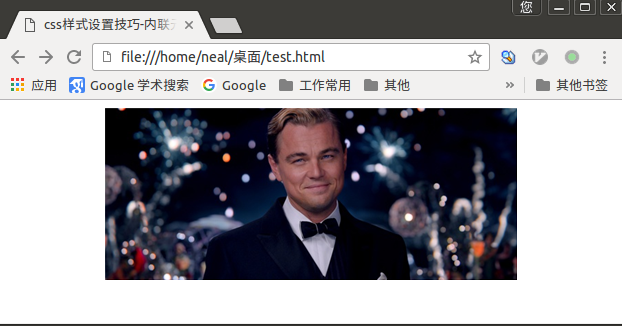
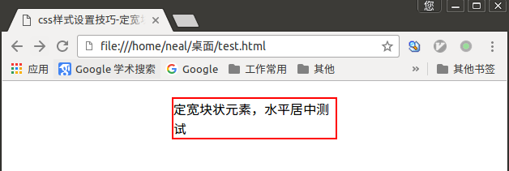
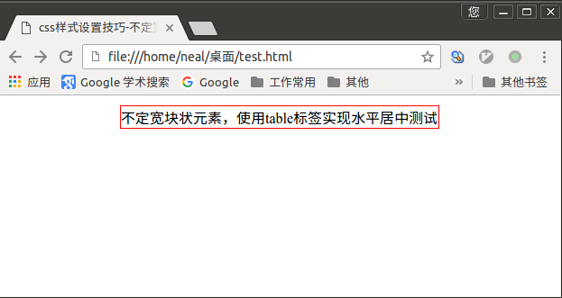
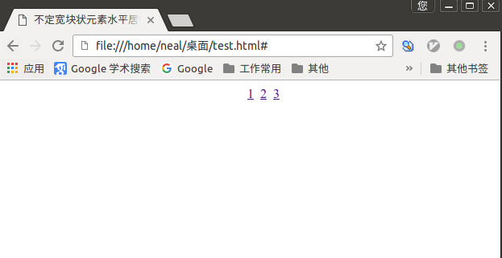
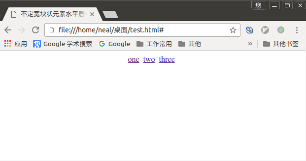
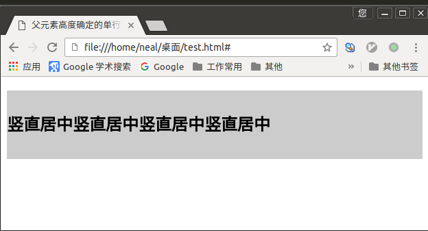
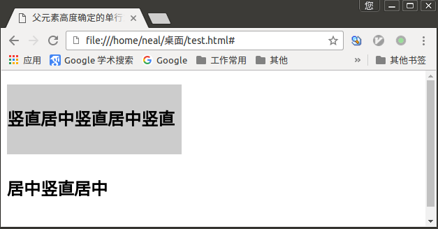
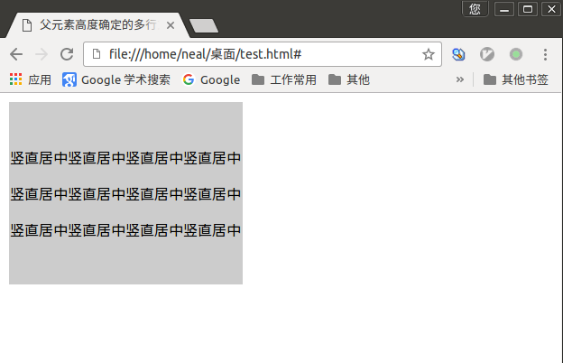
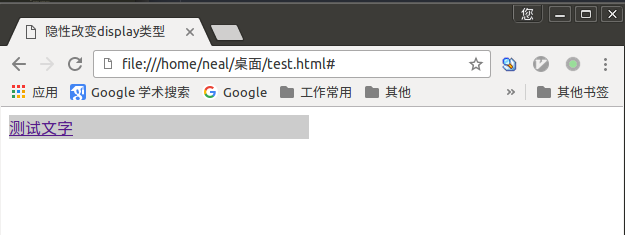

# 水平居中设置-行内元素

行内元素就是指的像`<a>`、`<span>`和``这样的内联元素，对行内元素水平居中是通过给`父元素`设置`text-align:center`来实现。

举例：

```html
<!DOCTYPE HTML>
<html>
<head>
<meta http-equiv="Content-Type" content="text/html; charset=utf-8">
<title>css样式设置技巧-内联元素水平居中</title>
<style type="text/css">
  #imgCenter{   /*对div元素进行水平居中设置*/
  	text-align: center;
  }
</style>
</head>
<body>
  <div id="imgCenter"></div>
</body>
</html>
```

浏览器解析结果如下：



# 水平居中设置-定宽块状元素

当是块状元素时，`text-algin:center`就不起作用了。所谓定宽块状元素就是元素的宽度(width)是一个固定值。

满足`定宽`和`块状`两个条件的元素是可以通过设置`左右margin`值为`auto`来实现居中的。

举例：

```html
<!DOCTYPE HTML>
<html>
<head>
<meta http-equiv="Content-Type" content="text/html; charset=utf-8">
<title>css样式设置技巧-定宽块状元素水平居中</title>
<style type="text/css">
  div{
    width: 200px;
    border: 2px solid red;
    margin: 20px auto;
  }
</style>
</head>
<body>
  <div>定宽块状元素，水平居中测试</div>
</body>
</html>
```

浏览器解析效果如下：



如果对`top`和`bottom`方向没有距离要求，上边的`margin: 20px auto;`可以简写为`margin: auto;`，也可以写成`margin-left: auto;`和`margin-right: auto;`。


# 水平居中-不定宽块状元素

不定宽块状元素：块状元素的宽度width不固定。

不定宽度的块状元素有三种方法居中（这三种方法目前使用的都很多）：

1. 加入`table`标签
2. 设置`display: inline` 方法：与第一种类似，显示类型设为行内元素，进行不定宽元素的属性设置
3. 设置`position:relative` 和`left:50%`：利用 相对定位 的方式，将元素向左偏移50%，即达到居中的目的


- **table标签法**

为什么选择方法一加入table标签? 是利用table标签的长度自适应性--即不定义其长度也不默认父元素body的长度（table其长度根据其内文本长度决定），因此可以看做一个定宽度块元素，然后再利用定宽度块状居中的margin的方法，使其水平居中。

步骤：

1. 为需要设置的居中的元素外面加入一个`table`标签 ( 包括 <tbody>、<tr>、<td> )。
2. 为这个`table`设置`左右margin居中`（这个和定宽块状元素的方法一样）。

举例：

```html
<!DOCTYPE HTML>
<html>
<head>
<meta http-equiv="Content-Type" content="text/html; charset=utf-8">
<title>css样式设置技巧-不定宽块状元素水平居中</title>
<style type="text/css">
  .wrap{
    border: 1px solid red;
  }
  table{
    margin: 1px auto;
  }
</style>
</head>
<body>
  <table>
    <tr>
      <td>
        <div class="wrap">不定宽块状元素，使用table标签实现水平居中测试</div>
      </td>
    </tr>
  </table>
</body>
</html>
```

浏览器解析效果如下：



- **类型转换法**

内联元素（行内元素）可以使用`text-align: center`来实现居中效果，那对于不定宽块状元素可以先把块状元素转换成行内元素来实现居中效果。

举例：

```html
<!DOCTYPE HTML>
<html>
<head>
<meta charset="utf-8">
<title>不定宽块状元素水平居中</title>
<style>
.container{
	text-align: center;  /*行内元素居中*/
}
.container ul{  /*ul块元素转换为行内元素*/
	display: inline;
}
.container li{   /*li块元素转换为行内元素*/
	display: inline;
  margin-right: 4px;
}
</style>
</head>

<body>
<div class="container">
    <ul>
    	<li><a href="#">1</a></li>
        <li><a href="#">2</a></li>
        <li><a href="#">3</a></li>
    </ul>
</div>
</body>
</html>
```

浏览器解析效果如下：



- **浮动和位移法**

具体方法： 通过给父元素设置`float`，然后给父元素设置`position:relative`和`left:50%``，子元素设置`position:relative`和`left: -50%` 来实现水平居中。

举例：

```html
<!DOCTYPE HTML>
<html>
<head>
<meta charset="utf-8">
<title>不定宽块状元素水平居中</title>
<style type="text/css">
  div{
  	float: left;
  	position: relative;
  	left: 50%;
  }
  .container ul{
  	list-style: none; /*消除ul-li中li默认样式前面的小圆点*/
  	margin: 0px;
  	padding: 0px;  /*使ul的上下左右四个方向的边界与div四个边界的距离为0,并且可以实现li中的2向中心线靠近*/
  	position: relative;
  	left: -50%;
  }
  .container li{
  	display: inline;  /*把块状元素转化为行内元素，li中的包含的内容就显示在一行*/
  	margin-right: 4px;  /*控制li包含内容间的间距*/
  }
</style>
</head>

<body>
<div class="container">
    <ul>
    	<li><a href="#">1</a></li>
        <li><a href="#">2</a></li>
        <li><a href="#">3</a></li>
    </ul>
</div>
</body>
</html>
```

浏览器解析效果如下：



此方法[这里](http://www.imooc.com/qadetail/197158)有比较详细的说明，可作参考。


# 垂直居中-父元素高度确定的单行文本

父元素高度确定的单行文本的竖直居中方法是通过设置`height`和`line-height`高度一致来实现的。(height: 该元素的高度，line-height: 顾名思义，行高（行间距），指在文本中，行与行之间的 基线间的距离 )。

`line-height`与`font-size`的计算值之差，在CSS中成为“行间距”。分为两半，分别加到一个文本行内容的顶部和底部，所以当`height`与`line-height`值相等时，对于一个单行文字就会竖直居中显示。

举例：

```html
<!DOCTYPE HTML>
<html>
<head>
<meta charset="utf-8">
<title>父元素高度确定的单行文本垂直居中</title>
<style type="text/css">
  .wrap{
    height: 100px;
    line-height: 100px;
    background: #ccc;
  }
</style>
</head>
<body>
  <div class="wrap">
    <h2>竖直居中竖直居中竖直居中竖直居中</h2>
  </div>
</body>
</html>
```

浏览器解析效果如下：



这种文字行高与块高一致带来了一个弊端： 当文字的长度大于块的宽度时，就有内容脱离了块。在上边的代码中另入`width: 250px`样式试一下：

```html
<html>
<head>
<meta charset="utf-8">
<title>父元素高度确定的单行文本垂直居中</title>
<style type="text/css">
  .wrap{
    height: 100px;
    width: 250px;
    line-height: 100px;
    background: #ccc;
  }
</style>
</head>
<body>
  <div class="wrap">
    <h2>竖直居中竖直居中竖直居中竖直居中</h2>
  </div>
</body>
</html>
```

效果如下：



# 垂直居中-父元素高度确定的多行文本

- **table标签法**

table标签法是使用插入`table(包括tbody、tr、td)标签`，同时设置`vertical-align: middle`来实现。

举例：

```html
<!DOCTYPE HTML>
<html>
<head>
<meta charset="utf-8">
<title>父元素高度确定的多行文本垂直居中</title>
<style type="text/css">
.wrap{
	height: 200px;
	background: #ccc;
  vertical-align: middle;  /*在td标签中，这是默认设置，可省略*/
}
</style>
</head>
<body>
<table><tbody><tr><td class="wrap">
  <div>
    <p>竖直居中竖直居中竖直居中竖直居中</p>
    <p>竖直居中竖直居中竖直居中竖直居中</p>
    <p>竖直居中竖直居中竖直居中竖直居中</p>
  </div>
</td></tr></tbody></table>
</body>
</html>
```

浏览器解析效果如下：




- **table-cell类型法**

这种方法把块状元素转化为表格单元显示，并设置`vertical-align: middle`来实现。

举例：

```html
<!DOCTYPE HTML>
<html>
<head>
<meta charset="utf-8">
<title>父元素高度确定的多行文本垂直居中</title>
<style type="text/css">
.wrap{
	height: 200px;
	background: #ccc;
	display: table-cell; /*IE8以上及Chrome、Firefox*/
  vertical-align: middle; /*IE8以上及Chrome、Firefox*/
}

</style>
</head>
<body>
  <div class="wrap">
    <p>竖直居中竖直居中竖直居中竖直居中</p>
    <p>竖直居中竖直居中竖直居中竖直居中</p>
    <p>竖直居中竖直居中竖直居中竖直居中</p>
  </div>
</body>
</html>
```

这种方法对一些比较老的浏览器不兼容。

# 隐性改变display类型

有一个有趣的现象就是当为元素（不论之前是什么类型元素，display:none 除外）设置以下 2 个句之一：

 1. position: absolute
 2. float: left 或 float:right

简单来说，只要html代码中出现以上两句之一，元素的display显示类型就会自动变为以`display:inline-block（块状元素）`的方式显示，当然就可以设置元素的`width`和`height`了，且默认宽度不占满父元素。

如下面的代码，小伙伴们都知道`a`标签是`行内元素` ，所以设置它的`width`是没有效果的，但是设置为`position:absolute`以后，就可以了。

```html
<!DOCTYPE HTML>
<html>
<head>
<meta  charset="utf-8">
<title>隐性改变display类型</title>
<style type="text/css">
.container a{
   /*position:absolute;*/
   float:left;
	 width:300px;
	 background:#ccc;
}
</style>
</head>
<body>
<div class="container">
    <a href="#" title="">测试文字</a>
</div>
</body>
</html>
```

解析效果如下：


