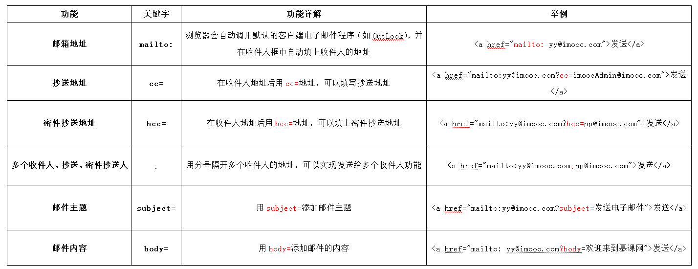
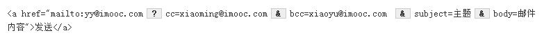

# 认识标签

## body标签

在网页上要展示出来的页面内容一定要放在body标签中。

```html
<body>
    <h1>标题1</ht>
    <p>段落内容</p>
    ...
</body>
```

## 段落标签

如果想在网页上显示文章，就需要`<p>`标签，文章的每一个段落放在一个`<p>`标签中。

语法：
`<p>段落文本</p>`

默认的段落标签格式是段前段后都会有一个空白行。

## 标题标签

标题标签一共有6个，`h1、h2、h3、h4、h5、h6`分别为一级标题、二级标题、三级标题、四级标题、五级标题、六级标题。并且依据重要性递减。

讲法： `<hx>标题文本</hx>`（x为1-6）

## 强调文字标签

强调文字的标签可以用`<em>`或`<strong>`，两个都表示强调，但在语气上有区别：`<em>`表示强调，`<strong>`表示更强烈的强调。并且在浏览器中`<em>` 默认用*斜体*表示，`<strong>` 用**粗体**表示。两个标签相比，目前国内前端程序员更喜欢使用`<strong>`表示强调。

## span标签

span标签的作用是为了设置在span标签里文字的单独样式。

## q标签

`<q>`标签用于**短文本**引用，当要文档中想引用一个名人说过的话时就可以用`<q>`标签。浏览器默认会为使用了`<q>`标签的文字加上双引号，所以对使用了`<q>`标签的文字无需再使用双引号。

## blockquote标签

`<blockquote>`标签用于**长文件引用**，如在文章中引入了大段某知名作家的文字，这时就需要使用`<blockquote>`标签。

浏览器对`<blockquote>`标签的解析是**缩进样式**，即在`<blockquote></blockquote>`内的文字被浏览器解析时两边都有相应的缩进。

## br标签

`<br />`标签实现分行显示文本。比如一首诗，每一句都应该占一行。`<br />`这样没有内容的标签，被称为空标签。

在html代码中输入回车、空格都是没有作用的。在html文本中想输入回车换行，就必须输入`<br />`。

## 输入空格

在htm代码中输入一个空格使用`&nbsp;`，注意后边的分号。有几个空格就应该输入几个`&nbsp;`。

## hr标签

`<hr />`标签表示添加水平横线，水平横线使文章看起来更整齐。`<hr />`与`<br />`标签一样也是一个空标签，所以只有一个开始标签，没有结束标签。

默认时浏览器解析`<hr />`标签的样式线条较粗，颜色为灰色。

## address标签

一般网页中会有一些网站的联系地址信息需要在网页中展示出来，这些联系地址信息如公司的地址就可以`<address>`标签。也可以定义一个地址（比如电子邮件地址）、签名或者文档的作者身份。

`<address></address>`标签在浏览器上显示的样式为斜体。

## code标签

在介绍语言的技术网站中，往往会在网站中显示一些计算机专业的编程代码，当代码是**一行代码**时，就可以使用`<code></code>`标签。

## pre标签

加入一行代码用`<code>`标签，如果是一大段代码，那就用`<pre>`。使用`<pre>`标签的代码块里的空格、换行符都将被保留下来。

## ul-li标签组合(无序列表)

当需要无序的罗列出一些信息列表时，如新闻列表、图片列表等。这时就需要使用`<ul><li>信息</li></ul>`这样的组合。语法如下：

```html
<ul>
    <li>信息</li>
    <li>信息</li>
    ......
</ul>
```
ul-li在网页中显示的默认样式一般为：每项li前都自带一个圆点。


## ol-li标签组合(有序列表)

语法：

```html
<ol>
    <li>信息</li>
    <li>信息</li>
    ...
</ol>
```

`<ol>`在网页中显示的默认样式一般为：每项`<li>`前都自带一个序号，序号默认从数字`1`开始。

## div标签

在网页制作过程过中，可以把一些独立的逻辑部分划分出来，放在一个`<div>`标签中，这个`<div>`标签的作用就相当于一个容器。

什么是逻辑部分？它是页面上相互关联的一组元素。如网页中的独立的栏目版块，就是一个典型的逻辑部分。

语法：

```html
<div>...</div>
```

如果一个网页中div过多，那会导致混乱，为了例逻辑更加清晰，可以为一个独立的逻辑部分设置一个名称，用`id`属性来为`<div>`提供唯一的名称，这个就像我们每个人都有一个身份证号，这个身份证号是唯一标识我们的身份的，也是必须唯一的。

语法：

```html
<div id="版块名称">...</div>
```

## table标签

创建表格的四个元素： table、tbody、tr、th、td

1. `<table>...</table>`: 整个表格以`<table>`开始，以`</table>`标记结束。
2. `<tbody>...</tbody>`: 当表格内容非常多时，表格为下载一点显示一点，但如果加上`<tbody>`标签后，这个表格就要等表格内容全部下载完才会显示。
3. `<tr>...</tr>`: 表格的一行，所以有几对tr，表格就有几行。
4. `<td>...</td>`: 表格的一个单元格，一行中包含几对`<td>...</td>`，说明一行中就有几列。
5. `<th>...</th>`: 表格的头部的一个单元格，即是表格的表头。
6. 表格中列的个数，取决于一行中数据单元格的个数。

语法：

```html
<table>
  <tbody>
    <tr>
      <th>信息</th>
      <th>信息</th>
      <th>信息</th>
      ...
    </tr>
    <tr>
      <td>信息</td>
      <td>信息</td>
      <td>信息</td>
      ...
    </tr>
    ...
  </tbody>
</table>
```

默认行为：

1. table表格在没有增加css样式之前，在浏览器中显示是没有表格线的。
2. 表头， 也就是th标签中的文本默认为粗体并且居中显示。

## caption标签，为表格添加标题和摘要

- 摘要

摘要的内容是不会在浏览器中显示出来。它的作用是增加表格的可读性(语义化)，使搜索引擎更好的读懂表格内容，还可以使屏幕阅读器更好的帮助特殊用户读取表格内容。

语法： `<table summary="表格简介文本"`

- 标题

用以描述表格内容，标题的显示位置：表格上方。

语法：

```html
<table>
  <caption>标题文本</caption>
  <tr>
    <td>..</td>
    ...
  </tr>
  ...
</table>
```

## a标签，链接到另一个页面

使用`<a>`标签可实现超链接，它在网页制作中可以说是无处不在，只要有链接的地方，就会有这个标签。

语法： `<a href="目标网址" title="鼠标滑过显示的文本">链接显示的文本</a>`

如：

```html
<a href="https://zhaochj.github.io" title="neal的博客">neal的博客地址</a>
```

默认行为：

只要为文本加入a标签后，文字的颜色就会自动变为蓝色（被点击过的文本颜色为紫色）

`<a>`标签在默认情况下，链接的网页是在当前浏览器窗口中打开，有时我们需要在新的浏览器窗口中打开。只需添加`target="_blank"属性`。

语法： `<a href="目标网址" target="_blank" title="鼠标滑过显示的文本">链接显示的文本</a>`

- mailto功能

使用mailto在网页中链接Email地址，mailto的常用功能如下图：



注意：如果mailto后面同时有多个参数的话，第一个参数必须以“?”开头，后面的参数每一个都以“&”分隔。

下面是一个完整的实例:



## img标签

``标签用于插入图片。

语法： ``

讲解：

1. src: 标识图片的位置;
2. alt: 指定图像的描述性文本，当图片下载失败时，可看到该属性指定的文本;
3. title: 提供在图像可见时对图像的描述(鼠标滑过图片时显示的文本)；
4. 图像可以是GIF，PNG，JPEG格式的图像文件
