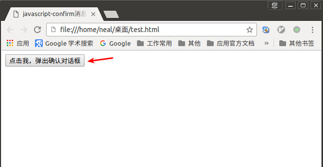
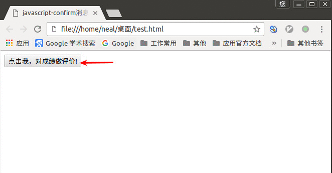

# 输出内容

`document.write()`用于直接在网页上输出内容。

1、 输出的内容直接用`""`英文双引号括起来，直接输出`""`号内的内容

```js
<script type="text/javascript">
  document.write("直接输出内容");
</script>
```

2、 通过变量输出内容

```js
<script type="text/javascript">
  var mystr="通过变量输出内容";
  document.write(mystr);
</script>
```

3、 内容拼接，内容之间用`+`号连接

```js
<script type="text/javascript">
  var mystr = "javascript"
  document.write("我正在学习" + mystr + "!");
</script>
```

4、 输出HTML标签，标签使用`""`括起来

```js
<script type="text/javascript">
  document.write("你好！" + "<br />");  // 输出“你好!”后再输出了一个换行符号
</script>
```

# javascript-警告（alert消息对话框）

我们在访问网站的时候，有时会突然弹出一个小窗口，上面写着一段提示信息文字。如果你不点击“确定”，就不能对网页做任何操作，这个小窗口就是使用alert实现的。

语法：

```js
alert(字符串或变量);
```

alert弹出的消息对话框包含一个确定按钮。

注意:

1. 在点击对话框"确定"按钮前，不能进行任何其它操作。
2. 消息对话框通常可以用于调试程序。
3. alert输出内容，可以是字符串或变量，与document.write 相似。

# javascript-确认（confirm消息对话框）

`confirm消息对话框`通常用于允许用户做选择的动作，此对话框包括一个确定按钮和一个取消按钮。

语法： `confirm(str);`

说明：

1. str: 在消息对话框中要显示的文本
2. 返回值： boolean值，当用户点击`确定`按钮时，返回`true`，当用户点击`取消`按钮时，返回`false`

举例：

```html
<!DOCTYPE HTML>
<html>
<head>
<meta  charset="utf-8">
<title>javascript-confirm消息对话框</title>
<script type="text/javascript">
  function res() {
    var gender = confirm("你是男士吗？");
    if ( gender == true ) {
      document.write("你是男士");
    } else {
      document.write("你是女士");
    }
  }
</script>
</head>
<body>
  <input name="button" type="button" onclick="res()" value="点击我，弹出确认对话框" />
</body>
</html>
```

效果如下：




# javascript-提问（prompt消息对话框）

`prompt`弹出消息对话框,通常用于询问一些需要与用户交互的信息。弹出消息对话框（包含一个确定按钮、取消按钮与一个文本输入框）。

语法： `prompt(str1, str2);`

说明：

1. str1: 要显示在消息对话框中的文本，不可修改
2. str2: 文本框中的内容，可以修改

返回值：

1. 点击`确定`按钮，文本框中的内容将作为函数返回值
2. 点击`取消`按钮，将返回null

举例：

```html
<!DOCTYPE HTML>
<html>
<head>
<meta  charset="utf-8">
<title>javascript-confirm消息对话框</title>
<script type="text/javascript">
    function res() {
      var score;
      score = prompt("请输入你的成绩：", 0);
      if (score >= 90) {
        document.write("非常棒！");
      } else if (score >= 75) {
        document.write("还不错！");
      } else if (score >= 60) {
        document.write("及格了！");
      } else {
        document.write("需要努力得了！");
      }
    }
</script>
</head>
<body>
  <input name="button" type="button" onclick="res()" value="点击我，对成绩做评价!" />
</body>
</html>
```

效果如下：




# javascript-打开新窗口（window.open）

`open()`方法可以查找一个已经存在或者新建浏览器窗口。

语法：

```js
window.open([URL],[窗口名称],[参数列表])
```

说明：

1、 URL： 表示在窗口中要显示网页的路径，如果省略这个参数或是空字符串，那么窗口是一个空白网页

2、 窗口名称： 表示被打开窗口的名称，该名称由字母、数字和下划线字符组成。其中有三个名称具有特称的意义。第一个是`_blank`，表示在新窗口中显示目标网页，第二个是`_self`，表示在当前窗口显示目标网页，第三个是`_top`，表示在当前浏览器中再开一个窗口页显示目标窗口。

如果窗口名称是自定义名称，那相同名称的窗口只能创建一个，要想创建多个窗口则名称不能相同。

3、 参数列表： 参数列表是用来控制打开窗口的各种属性


举例：

```html
<!DOCTYPE HTML>
<html>
<head>
<meta http-equiv="Content-Type" content="text/html; charset=utf-8" />
<title>window.open</title>
<script type="text/javascript">
  function Wopen(){
     window.open('https://zhaochj.github.io', '_blank', 'width=800, height=400, top=100, left=0')
  }
</script>
</head>
<body>
    <input name="button" type="button" onClick="Wopen()" value="点击我，打开新窗口!" / >
</body>
</html>
```

效果请自己测试。

# javascript-关闭窗口（window.close）

用法：

```js
window.close();  //关闭本窗口
窗口对象.close();  //关闭指定的窗口
```

举例：

```js
<script type="text/javascript">
    var mywin=window.open('http://www.imooc.com');
    mywin.close();
</script>
```

上边的代码在打开窗口的同时，关闭该窗口。
