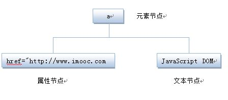
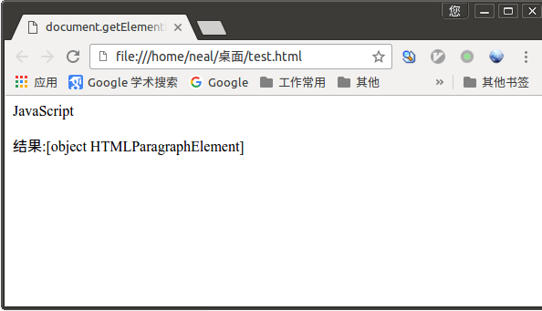
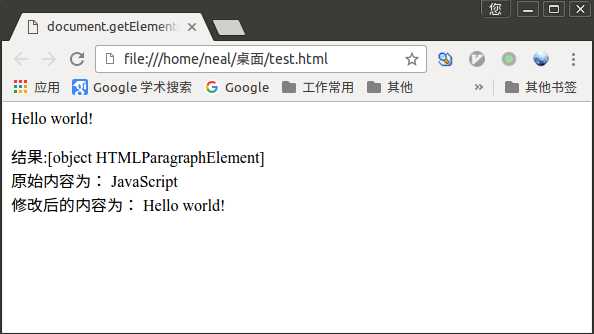
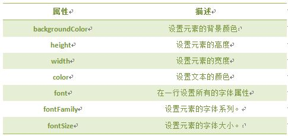
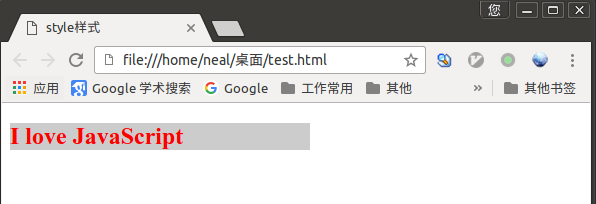
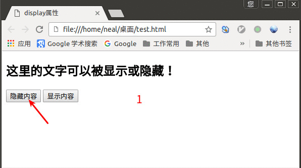
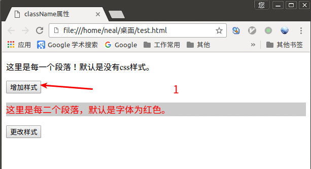

# 认识DOM

DOM(Document Object Model)文档对象模型定义访问和处理HTML文档的标准方法。DOM 将HTML文档呈现为带有元素、属性和文本的树结构（节点树）。

先来看看下面代码:


将HTML代码分解为DOM节点层次图:


HTML文档可以说是由节点构成的集合，三种常见的DOM节点:

1. 元素节点： 上图中的`<html>、<body>、<p>`等都是元素节点，即标签。
2. 文本节点： 向用户展示的内容，如`<li>...</li>`中的JavaScript、DOM、CSS等文本。
3. 属性节点： 元素属性，如`<a>`标签的链接属性`href="http://www.imooc.com"`。

看下面代码:

```html
<a href="http://www.imooc.com">JavaScript DOM</a>
```



# 通过ID获取元素

网页由标签将信息组织起来，而标签的ID属性是唯一的，如同每个人的身份证号一样。在网页中想操作一个标签，就可以通过ID先找到此标签，然后再进行操作。

语法：

```js
document.getElementById('id');
```

举例：

```html
<html>
<head>
<meta http-equiv="Content-Type" content="text/html; charset=utf-8" />
<title>document.getElementById</title>
</head>
<body>
<p id="con">JavaScript</p>
<script type="text/javascript">
  var mychar=document.getElementById('con');           ;
  document.write("结果:"+mychar); //输出获取的P标签。
</script>
</body>
</html>
```

浏览器解析效果如下：



注： 获取到是一个元素对象


# innerHTML属性

getElementById用于获取元素对象，而innerHTML属性用于获取或替换HTML元素的内容。

语法： `Object.innerHTML`

`Object`是获取元素的对象，如`document.getElementById('ID')`获取的元素对象

举例：

```html
<html>
<head>
<meta http-equiv="Content-Type" content="text/html; charset=utf-8" />
<title>document.getElementById</title>
</head>
<body>
<p id="con">JavaScript</p>
<script type="text/javascript">
  var mychar=document.getElementById('con');           ;
  document.write("结果:"+mychar); //输出获取的P标签。
  document.write('<br />');
  document.write("原始内容为： " + mychar.innerHTML + "<br />"); //输出元素的内容。
  mychar.innerHTML="Hello world!"; //修改mychar对象的内容
  document.write("修改后的内容为： " + mychar.innerHTML);
</script>
</body>
</html>
```

效果如下：



# 改变HTML样式

HTML DOM 允许 JavaScript 改变 HTML 元素的样式。如何改变 HTML 元素的样式呢？

语法：

_Object_.style._property_="_new style_";

说明：

1. _Object_ 是获取的元素对象
2. _property_ 是具体的属性

基本的 _property_ 列表：



举例：

```html
<!DOCTYPE HTML>
<html>
<head>
<meta http-equiv="Content-Type" content="text/html; charset=utf-8" />
<title>style样式</title>
</head>
<body>
  <h2 id="con">I love JavaScript</H2>
  <script type="text/javascript">
    var mychar= document.getElementById("con");
    mychar.style.color="red";
    mychar.style.backgroundColor="#ccc";
    mychar.style.width="300px";
  </script>
</body>
</html>
```

效果如下：




# 显示和隐藏（display属性）

在网页中想实现显示与隐藏的效果可以使用`display`属性来实现。

语法：  _Object_.style.display="_value_";

1. _Object_ 是获取元素的对象
2. _value_ 当取值为`none`时，表示隐藏；当取值为`block`时，表示元素将显示为块级元素，即显示。

举例：

```html
<!DOCTYPE HTML>
<html>
<head>
<meta http-equiv="Content-Type" content="text/html; charset=utf-8" />
<title>display属性</title>
  <script type="text/javascript">
    function hidetext() {
      var mychar = document.getElementById('con').style.display="none";
    }
    function showtext() {
      var mychar = document.getElementById('con').style.display="block";
    }
  </script>
</head>
<body>
  <h2 id="con">这里的文字可以被显示或隐藏！</H2>
  <form>
    <input type="button" onclick="hidetext()" value="隐藏内容" />
    <input type="button" onclick="showtext()" value="显示内容" />
  </form>
</body>
</html>
```

效果如下：



# 控制类名（className属性）

className属性设置或返回元素的class属性。

语法： _Object_.className="_classname_";

功能：

1. 获取元素的class属性
2. 为网页内的某个元素指定一个css样式来更改该元素的外观。

举例：

```html
<!DOCTYPE HTML>
<html>
<head>
<meta http-equiv="Content-Type" content="text/html; charset=utf-8" />
<title>className属性</title>
<style type="text/css">
  .one{
    font-size: 18px;
    color: red;
    background: #ccc;
  }
  .two{
    font-size: 24px;
    color: blue;
    background: #8CBB44;
    width: 400px;
  }
</style>
</head>

<body>
  <p id="p1">这里是每一个段落！默认是没有css样式。</p>
  <input type="button" onclick="add()" value="增加样式" />
  <p id="p2" class="one">这里是每二个段落，默认是字体为红色。</p>
  <input type="button" onclick="modify()" value="更改样式" />
  <script type="text/javascript">
    function add() {
        var p1 = document.getElementById('p1');
        p1.className="one";
    }
    function modify() {
      var p2 = document.getElementById('p2');
      p2.className="two";
    }
  </script>
</body>
</html>
```

效果如下：


