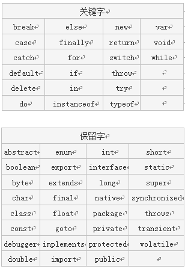
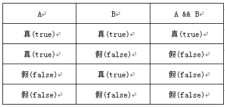

# 什么是变量

变量是用于存储某种/某些数值的存储器。我们可以把变量看做一个盒子,盒子用来存放物品,物品可以是衣服、玩具、水果...等。

# 变量名

为了区分不同的变量，就需要为变量指定一个名称。变量名可以任意取，但需要遵循以下规则：

1. 必须以字母、下划线或美元符号开头，后面可以跟字母、下划线、美元符号和数字。
2. 变量名区分大小写，如:A与a是两个不同变量。
3. 不允许使用JavaScript关键字和保留字做变量名。

 

# 变量声明

 在javascript中要想使用变量得先声明。

 语法： `var 变量名1,[变量名2, ...];`

 使用`var`关键字声明变量，一次声明可以声明多个，变量名间使用逗号隔开。变量的声名就是为变量准备好内存。

# 变量赋值

 变量的赋值使用`=`号，可以在使用`var`声明变量时就赋值，也可以先声明后，再赋值。

如：

```js
var mynum;
mynum = 5;  // 先声明，再赋值

var mychar = "javascript";  // 声明且赋值
```

注： 这里的`=`号的作用是赋值，不是等于号。

# 操作符

操作符是用于在javascript中指定一定动作的符号。主要有三大类操作符：

1. 算术操作符，主要有： 加（+）、减（-）、乘（*）、除（/）、取余（%）等。
2. 比较操作符，主要有： 小于（<）、大于（>）、大于等于（>=）、小于等于（<=）、等于（==）、恒等于（===）等。
3. 逻辑操作符，主要有： 与（&&）、或（||）、非（！）。

- 算术操作符--`+`操作符

`+`操作符在javascript中可代表数字类型的加法运算，也可以连接两个字符串，如：

```js
var mynum = 10 + 5;  // mynum值为15
var mychar = "Java" + "Script";  // mychar值指向"JavaScript"字符串
```

- 算术操作符--自加（++）与自减（--）

算术操作符除了`+、-、*、/`外，还有两个非常常用的操作符，自加（++）与自减（--）。

举例：

```js
var mynum = 10;
mynum++;  // mynum的值为11，等同 mynum = mynum + 1
mynum--;  // mynum的值为10，等同 mynum = mybum - 1
```

- 比较操作符

比较操作符常用的有： 小于（<）、大于（>）、大于等于（>=）、小于等于（<=）、等于（==）、恒等于（===）等。

比较操作的返回值是`真（true）或假（false）`

举例：

```js
var a = 5;
var b = 9;
document.write(a > b);  // false
document.write(a < b);  // true
document.write(a == b); // false
```

- 逻辑操作符--与（&&）

逻辑操作符（&&）表示并且的意思。只有当`&&`两边的值同时为`true`时，整个表达式的值才为`true`，否则就为`flase`。

逻辑与操作符值表：



注意: 如果A为假，`A && B`为假，不会在执行B; 反之，如果A为真，要由 B 的值来决定 `A && B` 的值。

- 逻辑操作符--或（||）

逻辑操作符（||）表示或者的意思。当两个条件中有任一个条件为true时，逻辑或的运算结果就为true。

逻辑或操作符值表：


注意: 如果A为真，`A || B`为真，不会在执行B; 反之，如果A为假，要由 B 的值来决定 `A || B` 的值。

- 逻辑操作符--非（!）

逻辑非就是表示`不是`的意思，`不是真`就是`假（flase）`，`不是假`就是`真（true）`。

举例：

```js
var a = 3;
var b = 5;
var c;
c = !(b > a); //false
c = !(b < a); //true
```

# 操作符优先级

1. 乘（*）、除（/）运算符的优先及比加（+）、减（-）高
2. 可使用括号改变运算的顺序

操作符之间的优先级从高到低：

算术操作符 --> 比较操作符 -->逻辑操作符 --> `=`赋值符
