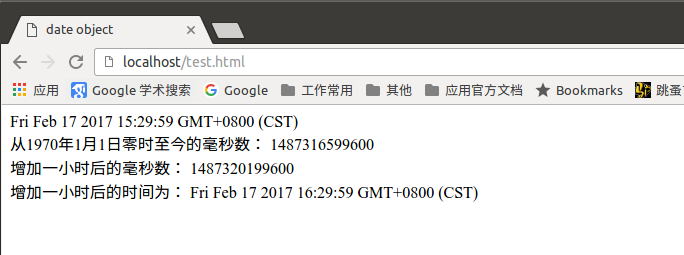

# 什么是对象

JavaScript 中的所有事物都是对象，如:字符串、数值、数组、函数等，每个对象带有属性和方法。

对象的属性：反映该对象某些特定的性质的，如：字符串的长度、图像的长宽等；

对象的方法：能够在对象上执行的动作。例如，表单的“提交”(Submit)，时间的“获取”(getYear)等；

JavaScript 提供多个内建对象，比如 String、Date、Array 等等，使用对象前先定义，如下使用数组对象：

```js
var objectName = new Array(); // 使用new关键字定义对象
或者
var objectName = [];
```

如果访问一个对象的属性使用以下语法：

```js
objectName.propertyName;  // 对象名称.属性名
```

# Date 日期对象

日期对象可以储存任意一个日期，并且可以精确到毫秒数（1/1000 秒）。

日志对象定义：

```js
var mydate = new Date();
```

当不指定初始值时，默认为当前系统的时间，如果要定义初始值，则：

```js
var mydate = new Date(2017, 02, 17); // 年， 月， 日
或者
var mydate = new Date('Feb 17, 2017');
```

Date对象中处理时间和日期的常用方法：


补充一个：

getDay/setDay()   返回/设置星期

- 获取年份（getFullYear）/设置年份（setFullYear）

```js
<!DOCTYPE html>
<html>
 <head>
 <meta http-equiv="Content-Type" content="text/html; charset=utf-8" />
  <title>date object</title>
  <script type="text/javascript">
    var mydate = new Date();
    document.write(mydate + "<br />");
    document.write(mydate.getFullYear() + "<br />");
    mydate.setFullYear(2018);  // 设置年份为2018
    document.write(mydate)
  </script>
 </head>
 <body>

 </body>
</html>
```

效果：


- 返回/设置时间方法

get/setTime() 返回/设置时间，单位毫秒数，计算从 1970 年 1 月 1 日零时到日期对象所指的日期的毫秒数。

举例：

```html
<!DOCTYPE html>
<html>
 <head>
 <meta http-equiv="Content-Type" content="text/html; charset=utf-8" />
  <title>date object</title>
  <script type="text/javascript">
    var mydate = new Date();
    document.write(mydate + "<br />");
    document.write("从1970年1月1日零时至今的毫秒数： " + mydate.getTime() + "<br />");
    mydate.setTime(mydate.getTime() + 60 * 60 * 1000); // 增加一个小时
    document.write("增加一小时后的毫秒数： " + mydate.getTime() + "<br />");
    document.write("增加一小时后的时间为： " + mydate);
  </script>
 </head>
 <body>
 </body>
</html>
```

效果如下：




# String字符串对象

定义字符串就是直接赋值。

如：

```js
var mystr = "javascript";
```

字符串有`length`属性，访问相应的属性使用点号操作：

```js
var mystr = "javascript";
mystr.length; // 输出10
```

字符串对象也有相应的方法，如`toUpperCase()`方法与`toLowerCase()`方法：

```js
var mystr = "JavaScript";
document.write(mystr.toUpperCase()); // 输出 JAVASCRIPT
document.write(mystr.toLowerCase());  // 输出 javascript
```

- 返回指定位置的字符

`charAt(index)`方法返回指定索引位置上的字符。index指字符串的的下标，下标从0开始，最后一个字符的下标为字符串长度减一（string.length-1）。如果index不在0与(string.length-1)之间，那返回一个空字符。

举例：

```js
var mystr = "I Love JavaScript";
document.write(mystr.charAt(0) + "<br />");  // 输出字符 I
document.write(mystr.charAt(1) + "<br />");  // 输出一个空字符
document.write(mystr.charAt(100));   // 索引赶出字符串的长度，输出一个空字符
```

- 返回指定字符串首次出现的位置

语法：

```js
stringObject.indexOf(substring, [startpos]);
```

substring: 需要检索的字符串

startpos: 可选整数参数，指定字符串检索的开始位置 ，取值范围为`0到stringObject.length-1`，如果忽略此参数则从字符串的首字符开始检索。

如果没有检索到指定的字符串，那返回`-1`

举例：

```html
<!DOCTYPE html>
<html>
 <head>
 <meta http-equiv="Content-Type" content="text/html; charset=utf-8" />
  <title>indexOf</title>
  <script type="text/javascript">
    var mystr = "I Love JavaScript, i Love Python too.";
    document.write(mystr.indexOf("L") + "<br />");  // 输出2
    document.write(mystr.indexOf("L", 5) + "<br />"); // 输出21
    document.write(mystr.indexOf("Love") + "<br />");  // 输出2
  </script>
 </head>
 <body>

 </body>
</html>
```

- 字符串分割（split()）

split()方法将字符串分割为字符串数组，并返回此数组。

语法：

```js
stringObject.split(separator, [limit]);
```

1. separator: 分隔符，表示分割字符串的标准
2. limit: 可选项，指定分割的次数
3. 如果separator是一个空字符（""），那字符串对象中的每个字符之间都会被分割

举例：

```html
<!DOCTYPE html>
<html>
 <head>
 <meta http-equiv="Content-Type" content="text/html; charset=utf-8" />
  <title>split</title>
  <script type="text/javascript">
    var mystr = "I Love JavaScript, i Love Python too.";
    document.write(mystr.split(",") + "<br />");
    document.write(mystr.split(" ") + "<br />");
    document.write(mystr.split(" ", 2) + "<br />");
    document.write(mystr.split("") + "<br />");
  </script>
 </head>
 <body>

 </body>
</html>
```

效果如下：


- 提取字符串（substring()）

substring()方法用于提取字符串中介于两个指定下标之间（包含起始字符，不包含结束字符）的字符。

语法：

```js
stringObject.substring(strartPos, stopPos);
```

举例：

```html
<!DOCTYPE html>
<html>
 <head>
 <meta http-equiv="Content-Type" content="text/html; charset=utf-8" />
  <title>substring</title>
  <script type="text/javascript">
    var mystr = "I Love JavaScript, i Love Python too.";
    document.write(mystr.substring(0, 5) + "<br />"); // 提取mystr对象中下标从0开始到下标为5,且不包含下标为5的字符串，输出“I Lov”
    document.write(mystr.substring(5, 5) + "<br />"); //当起始与结束的下标相同时，输出空字符串
    document.write(mystr.substring(5, 0) + "<br />");  // 当起始值大于结束值时，会交换两个值的位置，再提取字符串，输出“I Lov”
  </script>
 </head>
 <body>

 </body>
</html>
```

运行后结果如下：


- 提取指定数目的字符（substr()）

语法：

```js
stringObject.subtr(startPos, length);
```

substr()方法从字符串中提取从startPos位置开始的指定数目的字符串。

startPos: 必选项，指定要提取子串的起始位置，类型为数值，如果是一个负数，则从字符串的尾部算起始位置，最后一个字符是`-1`，倒数第二个字符是`-2`，依次类推

length: 需要提取字符串的长度，是可选项，如果省略，那就是指到字符串的结尾字符


```html
<!DOCTYPE html>
<html>
 <head>
 <meta http-equiv="Content-Type" content="text/html; charset=utf-8" />
  <title>substr</title>
  <script type="text/javascript">
    var mystr = "I Love JavaScript, i Love Python too.";
    document.write(mystr.substr(0, 5) + "<br />");
    document.write(mystr.substr(-7, 5) + "<br />"); // 从字符串尾部往前数7，再往后数5就是提取的子串
    document.write(mystr.substr(2) + "<br />");
  </script>
 </head>
 <body>

 </body>
</html>
```

效果如下：


# Math对象

Math对象提供对数据的数学计算。

Math对象是一个固有的对象，无需创建它，直接把Math作为对象使用就可以调用其所有属性和方法。这是它与Date,String对象的区别。

Math对象的属性：


Math对象方法：


- 向上取整（ceil()）

ceil()方法可对一个数进行向上取整。

语法：

```js
Math.ceil(x);
```

x是一个数值，ceil(x)方法返回的是`大于或等于`x，并且与x最接近的整数。

举例：

```js
Math.ceil(0.2); // 返回 1
Math.ceil(0.8); // 返回 1
Math.ceil(-4.2); // 返回 4
Math.ceil(-4.9); // 返回 4
```

- 向下取整（floor()）

与ceil()对应，floor()方法可对一个数进行向下取整。

语法：

```js
Math.floor(x);
```

x是一个数值，该方法返回的是`小于或等于`x，并且与x最接近的整数。

举例：

```js
Math.floor(0.2); // 返回 0
Math.floor(1.8); // 返回 1
Math.floor(-4.7); // 返回 -5
```

- 四舍五入（round()）

round()方法把一个数字四舍五入为最接近的整数。

语法：

```js
Math.round(x);
```

1. x是一个数字。
2. 如果x正好在两个整数的中间，即`0.5`上，那进行上舍入，如: 5.5将舍入为6, -5.5将舍入为-5，即是负数时正好在0.5，那就向正无穷方向靠近的最近一个数值。

举例：

```js
Math.round(0.3); // 0
Math.round(0.6); // 1
Math.round(0.5); // 1
Math.round(-3.2); // -3
Math.round(-3.8); // -4
Math.round(-3.5); // -3
```

- 随机数（random()）

random()方法可返回介于`0 ～ 1（大于或等于0但小于1）`之间的一个随机数。

语法：

```js
Math.random();
```

举例：

```js
document.write(Math.random())  // 0 ~ 1之间的随机数
document.write(Math.random() * 10) // 0 ~ 10 之间的随机数
document.write(Math.round(Math.random() * 10)); // 0 ~ 10 之间的随机整数
```

# 数组对象

- 数组连接（concat()）

concat()方法用于连接两个或多个数组，返回一个新数组，不改变原来的数组。

语法：

```js
arrayObject.concat(array1, array2, ..., arrayN);
```

举例：

```js
var myarr1 = new Array("I", "Love");
var myarr2 = ["javascript", "!"];
var myarr3 = myarr1.concat(myarr2);
var myarr4 = myarr2.concat(myarr1);
document.write(myarr3 + "<br />");  // 输出“I,Love,javascript,!”
document.write(myarr4);  // 输出“javascript,!,I,Love”
```

- 指定分隔符连接数组元素（join()）

join()方法将数组中的所有元素用指定的分隔符分隔开，并存放在一个字符串里。

语法：

```js
arrayObject.join(分隔符);  // 如果省略分隔符，则默认使用逗号分隔
```

举例：

```js
var myarr = new Array("home", "tomcat", "logs");
document.write("/" + myarr.join("/")); // 输出”/home/tomcat/logs”
```

- 颠倒数组元素顺序（reverse()）

语法：

```js
arrayObject.reverse();
```

举例：

```js
var myarr = new Array("one", "two", "three");
document.write(myarr + "<br />");
document.write("颠倒后的顺序为： " + myarr.reverse());
```

输出内容为：

```
one,two,three
颠倒后的顺序为： three,two,one
```

- 选定元素（slice()）

slice()方法从已有的数组中返回选定的元素。

语法：

```js
arrayObject.slice(start, end);
```

1. start: 必选项，选取元素开始的下标，如果是负数，那从数组的尾部开始，最后一个元素为`-1`，倒数第二个为`-2`，依次类推
2. end: 可选项，表示从哪个下标处结束选取，如果没有指定，则表示到最后一个元素，如果是一个负数，那从尾部计算
3. 如果start大于end，返回空数组
3. slice()方法返回一个新的数组，此数组包含从start开始到end(不包含该元素)的arrayObject中的元素
4. 不会修改原数组，而是返回一个新数组。

举例：

```js
var myarr = new Array("one", "two", "three", "four");
document.write(myarr + "<br />");
document.write(myarr.slice(0, 2) + "<br />"); // one,two
document.write(myarr.slice(2) + "<br />"); // three,four
document.write(myarr.slice(-3, -1) + "<br />"); // two,three
document.write(myarr.slice(-2, -4) + "<br />"); // 空数组
document.write(myarr.slice(-3)); // tow,three,four
```

输出内容为：

```
one,two,three,four
one,two
three,four
two,three

two,three,four
```

- 数组排序（sort()）

sort()方法使数组中的元素按照一定的顺序排列。

语法：

```js
arrayObject.sort(排序方法函数);
```

排序方法函数是可选项，如果省略则是按照unicode码顺序排列。

排序方法函数是要比较两个值，然后返回一个用于说明这两个值的相对顺序的数字。比较函数应该具有两个参数 a 和 b，其返回值如下：

1. 若返回值<=-1，则表示 A 在排序后的序列中出现在 B 之前。
2. 若返回值>-1 && <1，则表示 A 和 B 具有相同的排序顺序。
3. 若返回值>=1，则表示 A 在排序后的序列中出现在 B 之后。

举例：

```html
<!DOCTYPE html>
<html>
 <head>
 <meta http-equiv="Content-Type" content="text/html; charset=utf-8" />
  <title>sort()</title>
  <script type="text/javascript">
    function sortNum(a, b) {
      return a - b;  // 升序，如降序把“a - b”替换为"b - a"
    }
    var myarr = new Array(87, 43, 77, 20, 100);
    document.write(myarr + "<br />");
    document.write(myarr.sort() + "<br />");  // 按照unicode码排序
    document.write(myarr.sort(sortNum));  // 升序排序
  </script>
 </head>
 <body>

 </body>
</html>
```

输出：

```
87,43,77,20,100
100,20,43,77,87
20,43,77,87,100
```
