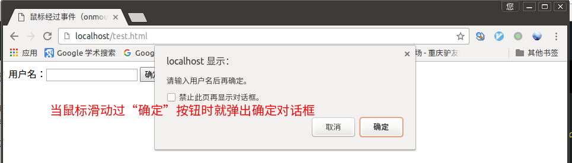
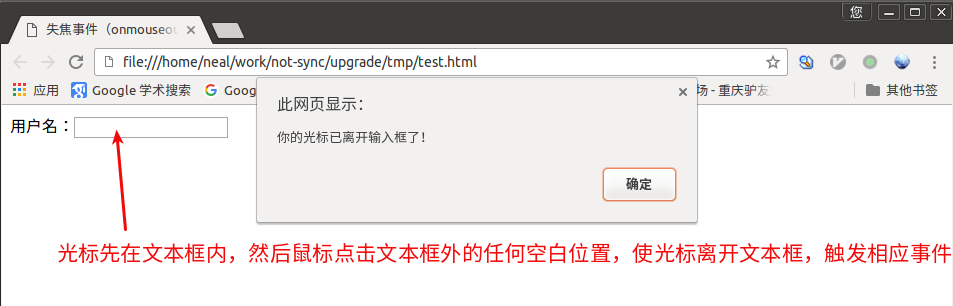
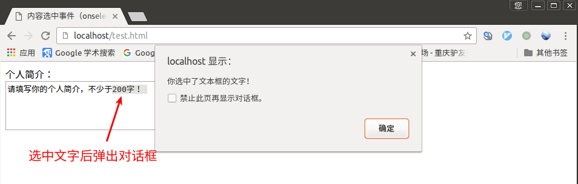
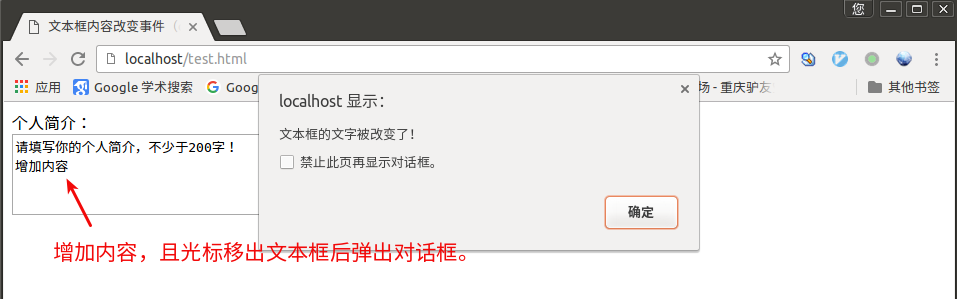

# 什么是事件

JavaScript 创建动态页面。事件是可以被 JavaScript 侦测到的行为。 网页中的每个元素都可以产生某些可以触发 JavaScript 函数或程序的事件。

比如说，当用户单击按钮或者提交表单数据时，就发生一个鼠标单击（onclick）事件，需要浏览器做出处理，返回给用户一个结果。

主要事件表:


# 鼠标单击事件（onclick）

onclick是鼠标单击事件，当在网页上单击鼠标时，就会发生该事件。同时onclick事件调用的程序块（函数）就会被执行，通常与按钮一起使用。

举例：

```html
<!DOCTYPE HTML>
<html>
<head>
<meta http-equiv="Content-Type" content="text/html; charset=utf-8" />
<title>点击按钮调用函数</title>
<script type="text/javascript" >
  function add2() {
    sum = 3 + 4;
    alert(sum);
  }
</script>
</head>

<body>
  <from>
    <input name="button" type="button" value="点击我计算3加4的和" onclick="add2()" >
  </form>
</body>
</html>
```

上边代码实现点击按钮产生onclick事件，onclick调用`add2()`函数计算两数的和。

# 鼠标经过事件（onmouseover）

当鼠标移到一个对象上时，该对象就触发`onmouseover`事件，并执行`onmouseover`事件调用的程序（函数）。

举例：

```html
<!DOCTYPE HTML>
<html>
<head>
<meta http-equiv="Content-Type" content="text/html; charset=utf-8" />
<title>鼠标经过事件（onmouseover）</title>
<script type="text/javascript" >
  function message() {
    confirm("请输入用户名后再确定。");
  }
</script>
</head>

<body>
  <from>
    用户名：<input name="username" type="text" >
    <input name="button" type="button" value="确定" onmouseover="message()" >
  </form>
</body>
</html>
```

效果如下：




# 鼠标移开事件（onmouseout）

当鼠标移动当前对象时，触发onmouseout事件，并执行相应的调用程序。

举例：

```html
<!DOCTYPE HTML>
<html>
<head>
<meta http-equiv="Content-Type" content="text/html; charset=utf-8" />
<title>鼠标移开事件（onmouseout）</title>
<script type="text/javascript" >
  function outMessage() {
    alert("鼠标已离开确定按钮了");
  }
</script>
</head>

<body>
  <from>
    用户名：<input name="username" type="text" >
    <input name="button" type="button" value="确定" onmouseout="outMessage()" >
  </form>
</body>
</html>
```

当鼠标从`确定`按钮移开时就会弹出警告对话框。

# 光标聚焦事件（onfocus）

```html
<!DOCTYPE HTML>
<html>
<head>
<meta http-equiv="Content-Type" content="text/html; charset=utf-8" />
<title>光标聚焦事件（onmouseout）</title>
<script type="text/javascript" >
  var a = 1;
  function message() {
    if (a === 1) {
      alert("请填写你的用户名称！");
    }
    a++;
  }
</script>
</head>

<body>
  <from>
    用户名：<input class="user" name="username" type="text" onfocus="message()" >
  </form>
</body>
</html>
```

上边代码达到的效果是当用户鼠标点击进`用户名：`后边的输入框时，光标聚焦到了输入框中，触发`onfocus`事件，调用`message()`函数，弹出一个警告框，在此函数中用了一个变量`a`来控制警告窗口的弹出时机，因为当alert弹出触发后光标还是聚焦在文本框中，如果没有控制条件，那会循环触发`onfocus`事件。

# 失焦事件（onblur）

与onfocur事件相对应，表示当光标离开当前获得聚焦对象的时候，触发`onblur`事件，同时执行被调用的程序。

举例：

```html
<!DOCTYPE HTML>
<html>
<head>
<meta http-equiv="Content-Type" content="text/html; charset=utf-8" />
<title>失焦事件（onmouseout）</title>
<script type="text/javascript" >
  function message() {
     alert("你的光标已离开输入框了！");
  }
</script>
</head>

<body>
  <from>
    用户名：<input class="user" name="username" type="text" onblur="message()" >
  </form>
</body>
</html>
```

效果如下：



# 内容选中事件（onselect）

选中事件，当文本框或者文本域中的文字被选中时，触发onselect事件，同时调用的程序就会被执行。

```html
<!DOCTYPE HTML>
<html>
<head>
<meta http-equiv="Content-Type" content="text/html; charset=utf-8" />
<title>内容选中事件（onselect）</title>
<script type="text/javascript" >
  function message() {
     alert("你选中了文本框的文字！");
  }
</script>
</head>

<body>
  <from>
    个人简介：<br />
    <textarea name="summary" cols="60" rows=5 onselect="message()" >请填写你的个人简介，不少于200字！ </textarea>
  </form>
</body>
</html>
```



# 文本框内容改变事件（onchange）

通过改变文本框的内容来触发onchange事件，同时执行被调用的程序。

举例：

```html
<!DOCTYPE HTML>
<html>
<head>
<meta http-equiv="Content-Type" content="text/html; charset=utf-8" />
<title>文本框内容改变事件（onselect）</title>
<script type="text/javascript" >
  function message() {
     alert("文本框的文字被改变了！");
  }
</script>
</head>

<body>
  <from>
    个人简介：<br />
    <textarea name="summary" cols="60" rows=5 onchange="message()" >请填写你的个人简介，不少于200字！ </textarea>
  </form>
</body>
</html>
```

效果如下：



# 加载事件（onload）

`onload`事件是在当前页面加载完成后立即触发，同时执行调用的程序(函数)。`onload`事件写在`<body>`标签里。

举例：

```html
<!DOCTYPE HTML>
<html>
<head>
<meta http-equiv="Content-Type" content="text/html; charset=utf-8" />
<title>加载事件（onload）</title>
<script type="text/javascript" >
  function message() {
     alert("页面已加载完成！");
  }
</script>
</head>

<body onload="message()">
  <script type="text/javascript" >
    for (var i=1; i<=80000; i++) {
      document.write(i + "<br />");
    }
  </script>
</body>
</html>
```

上边代码循环的输出80000个数字后，再触发onload事件，弹出alert对话框。

# 卸载事件（onunload）

当用户退出页面时（页面关闭、页面刷新等），触发onUnload事件，同时执行被调用的程序。

举例：

```html
<!DOCTYPE HTML>
<html>
<head>
<meta http-equiv="Content-Type" content="text/html; charset=utf-8" />
<title>卸载事件（onunload）</title>
<script type="text/javascript" >
  window.onunload = onunload_message();
  function onunload_message() {
     alert("你确定要关闭此页面？");
  }
</script>
</head>

<body>
  <h2>标题二</h2>
</body>
</html>
```

当刷新页面时就会触发onunload事件，弹出对话框，onunload事件是针对window。
