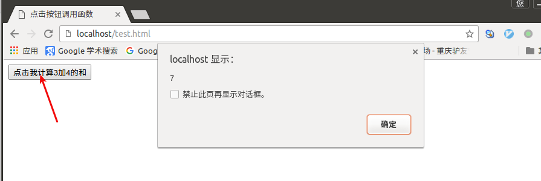

# 函数定义与调用

语法：

```js
function 函数名() {
  函数体;
}
```

function定义函数的关键字，“函数名”你为函数取的名字，“函数体”替换为完成特定功能的代码。

举例：

```js
function add2() {  // 定义名为add2的函数，计算3+4的结果，以弹窗的方式给出答案
  sum = 3 + 4;
  alert(sum);
}

add2();  // 调用函数
```

在HTML文件中调用，如果通过点击按钮后调用定义好的函数：

```html
<!DOCTYPE HTML>
<html>
<head>
<meta http-equiv="Content-Type" content="text/html; charset=utf-8" />
<title>点击按钮调用函数</title>
<script type="text/javascript" >
  function add2() {
    sum = 3 + 4;
    alert(sum);
  }
</script>
</head>

<body>
  <from>
    <input name="button" type="button" value="点击我计算3加4的和" onclick="add2()" >
  </form>
</body>
</html>
```

效果如下：



# 有参数的函数

语法：

```js
function 函数名(参数1, 参数2, ...) {
  函数体;
}
```

举例：

```js
function ad2(x, y) {
  sum = x + y;
  document.write(sum);
}
```

上边定义的函数可以计算任意两个数的和，只要在调用函数时把需要计算的数传递给频数，如： add2(2, 7)。

# 函数返回值

执行函数后不仅是为了打印在网页上，还可能需要把结果进行处理，这时函数就需要把执行的结果返回。返回函数值使用`return`语句。

举例：

```js
function add2(x, y) {
  sum = x + y;
  return sum;  // return后面的值叫做返回值
}
```

可以通过变量存储函数返回值，如下：

```js
var result = add2(3, 6);  // 语句执行后，result变量中的值为9
```
