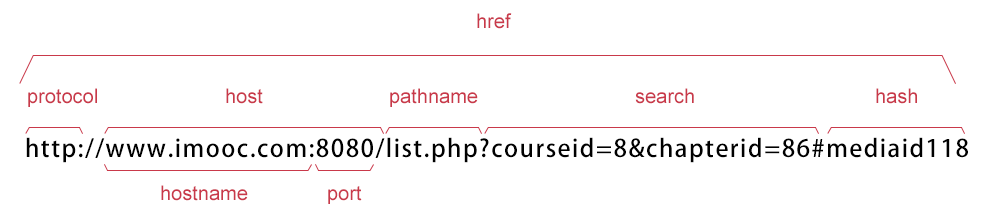

# window对象

window对象是BOM的核心，window对象指当前的浏览器窗口。

widow对象方法：


# javascript计时器

在JavaScript中，我们可以在设定的时间间隔之后来执行代码，而不是在函数被调用后立即执行。

计时器类型：

1. 一次性计时器： 在指定延迟时间后触发一次
2. 间隔性触发计时器： 每隔一定的时间就触发一次

计时器方法：


- 计时器（setInterval()）

在执行时,从载入页面后每隔指定的时间执行代码。

语法：

```js
setInterval(执行代码或函数名，交互时间);
```

1. `执行代码或函数名`： 要调用的函数或要执行的代码
2. `交互时间`： 周期性执行函数或执行代码的间隔时间，以毫秒为单位

返回值：

setInterval()方法返回一个可以传递给`clearInterval()`从而取消对“代码”的周期性执行的值。

举例，动态显示当前时间，格式为`XX时：XX分：XX秒`

```html
<!DOCTYPE HTML>
<html>
<head>
<meta http-equiv="Content-Type" content="text/html; charset=utf-8">
<title>定时器</title>
<script type="text/javascript">
  var attime;
  function clock(){
    var time=new Date();
    attime= time.getHours() + "时:" + time.getMinutes() + "分:" + time.getSeconds() + "秒";
    document.getElementById("clock").value = attime;
  }
  var int = setInterval(clock, 1000);
</script>
</head>
<body>
<form>
<input type="text" id="clock" size="50"  />
</form>
</body>
</html>
```

效果为每一秒更新一次时间：


- 取消计时器（clearInterval()）

clearInterval() 方法可取消由 setInterval() 设置的交互时间。

语法：

```js
clearInterval(id_of_setInterval)
```

`id_of_setInterval`： 由`setInterval()`返回的 ID 值。

举例，当点击`stop`按钮时停止时间刷新：

```html
<!DOCTYPE HTML>
<html>
<head>
<meta http-equiv="Content-Type" content="text/html; charset=utf-8">
<title>定时器</title>
<script type="text/javascript">
  var attime;
  function clock(){
    var time=new Date();
    attime= time.getHours() + "时:" + time.getMinutes() + "分:" + time.getSeconds() + "秒";
    document.getElementById("clock").value = attime;
  }
  var int = setInterval(clock, 1000);
</script>
</head>
<body>
<form>
<input type="text" id="clock" size="50"  />
<input type="button" value="stop" onclick="clearInterval(int)" />
</form>
</body>
</html>
```

效果：


- 计时器setTimeout()

setTimeout()计时器，在载入后延迟指定的时间后，只执行一次表达式。

语法：

```js
setTimeout(执行代码, 延迟时间);
```

1. `执行代码`： 表示要调用的函数或代码
2. `延迟时间`： 在执行代码前要等待的时间，单位是毫秒。

返回值：

setTimeout()方法返回一个可以传递给`clearTimeout()`从而取消对“代码”的延迟执行。

举例，打开一个页面后等待5秒后弹出一个警告框：

```html
<!DOCTYPE HTML>
<html>
<head>
<meta http-equiv="Content-Type" content="text/html; charset=utf-8">
<title>setTimeout定时器</title>
<script type="text/javascript">
  function myinfo() {
  var int = setTimeout("alert('Hello!')", 5000);
  }
</script>
</head>
<body>
  <form>
    <input name="button" type="button" value="点击我延迟5秒弹出警告对话框" onclick="myinfo()" >
  </form>
</body>
</html>
```

效果如下：


- 取消计时器（clearTimeout()）

setTimeout()与clearTimeout()一起使用，停止计时器。

语法：

```js
clearTimeout(id_of_setTimeout);
```

`id_of_setTimeout`是由`setTimeout()`返回的ID值。该值标识要取消的延迟执行代码块。


举例，点击“start”开始计数，点击”stop"停止计数：

```html
<!DOCTYPE HTML>
<html>
<head>
<meta http-equiv="Content-Type" content="text/html; charset=utf-8">
<title>clearTimeout取消定时器</title>
<script type="text/javascript">
  var num = 0, i;
  function timeCount() {
    document.getElementById("txt").value = num;
    num++;
    i = setTimeout("timeCount()", 1000);
  }

  function stop() {
    clearTimeout(i);
  }
</script>
</head>
<body>
  <form>
    <input type="text" id="txt" >
    <input type="button" value="start" onclick="timeCount()" >
    <input name="button" type="button" value="stop" onclick="stop()" >
  </form>
</body>
</html>
```

效果：


# history对象

history对象记录了用户曾经浏览过的页面(URL)，并可以实现浏览器前进与后退相似导航的功能。

语法：

```js
window.history.属性或方法;   // window可省略
```

history对象属性

1. length: 返回浏览器历史列表中URL数量


history对象的方法

1. back(): 加载history列表中前一个URL
2. forward(): 加载history列表中的下一个URL
3. go(): 加载history列表中的某个具体的页面


- length属性

举例：

```js
<!DOCTYPE HTML>
<html>
<head>
<meta http-equiv="Content-Type" content="text/html; charset=utf-8">
<title>history</title>
</head>
<script type="text/javascript">
  var int = window.history.length;
  document.write(int);
</script>
<body>
</body>
</html>
```

输出浏览器历史列表中URL的数量。

- back()方法

加载history列表中前一个URL。

语法：

```js
window.history.back();
```

举例：

```js
<!DOCTYPE HTML>
<html>
<head>
<meta http-equiv="Content-Type" content="text/html; charset=utf-8">
<title>back方法</title>
</head>
<script type="text/javascript">
    function goBack() {
      window.history.back();
    }
</script>
<body>
    <form>
        <input name="button" type="button" value="点击我返回上一个打开页面" onclick="goBack()" />
    </form>
</body>
</html>
```

`window.history.back()`功能相当于点击了浏览器上的倒退按钮，`back()`相当于`go(-1)`。

- forward()方法

加载history列表中的下一个URL。

如果倒退之后，再想回到倒退之前浏览的页面，则可以使用forward()方法,代码如下:

```js
window.history.forward();
```

等价点击了浏览器上的前进按钮，`forward()`相当于`go(1)`。


- 返回浏览历史中的其他页面(go()方法)

go()方法，根据当前所年的页面，加载history列表中的某个页面。

语法：

```js
window.history.go(number);
```

number:

1. 值为`1`时，表示前一个页面，go(1)等价forward()
2. 值为`0`时，表示当前页面
3. 值为`-1`时，表示后一个页面，go(-1)等价back()
4. 其他数值， 表示要访问URL在history的URL列表中的相对位置


# location对象

location用于获取或设置窗体的URL，并且可以用于解析URL。

语法：

```js
location.属性或方法;
```

location对象属性图：



- location对象属性


- location对象方法


# navigator对象

Navigator 对象包含有关浏览器的信息，通常用于检测浏览器与操作系统的版本。

- navigator对象属性


# screen对象

screen对象用于获取用户的屏幕信息。

语法：

```js
window.screen.属性;
```

对象属性：


- 屏幕分辨率的高和宽

1. screen.width: 返回屏幕分辨率的宽，单位为px
2. screen.height: 返回屏幕分辨率的高，单位为px

代码：

```js
<script type="text/javascript" >
   document.write("屏幕的宽为： " + window.screen.width + "px" + "<br />");
   document.write("屏幕的高为： " + window.screen.heigth + "px");
</script>
```

`window`关键字可省略。

- 屏幕可用高和宽度

1. screen.availWidth 属性返回访问者屏幕的宽度，以像素计，减去界面特性，比如任务栏。
2. screen.availHeight 属性返回访问者屏幕的高度，以像素计，减去界面特性，比如任务栏。

注意:

不同系统的任务栏默认高度不一样，及任务栏的位置可在屏幕上下左右任何位置，所以有可能可用宽度和高度不一样。
