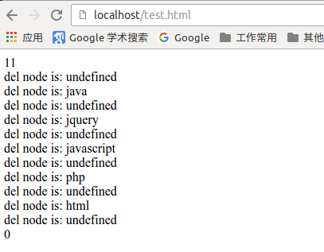

# 认识DOM

文档对象模型DOM（Document Object Model）定义访问和处理HTML文档的标准方法。DOM 将HTML文档呈现为带有元素、属性和文本的树结构（节点树）。

HTML文档可以说由节点构成的集合，DOM节点有：

1. 元素节点： 如`<html>`、`<body>`、`<p>`等都是元素节点，即html中的标签
2. 文本节点： 即向用户展示的内容，如`<h2>...</h2>`间的文字
3. 属性节点： 元素属性，如`<input>`标签中的`type="button"`就是属性

节点属性：

1. nodeName属性: 返回一个字符串，其内容是给定节点的名字。
2. nodeType属性: 返回一个整数，代表给定节点的类型。
3. nodeValue属性: 返回给定节点的当前值。

遍历节点树：

1. childNodes方法： 返回一个数组，这个数组由给定元素节点的子节点构成
2. firstChild方法： 返回第一个子节点
3. lastChild方法： 返回最后一个子节点
4. parentNode方法： 返回一个给定节点的父节点
5. nextSibling方法： 返回给定节点的下一个节点
6. previousSibling方法： 返回给定节点的上一个节点

DOM操作：

1. createElement(element)： 创建一个新的元素节点
2. createTextNode()： 创建一个包含着给定文本的新文本节点
3. appendChild()： 在指定节点的最后一个子节点列表之后添加一个新的子节点
4. insertBefore()： 将一个给定节点插入到一个给定元素节点的给定子节点的前面
5. removeChild()： 从一个给定元素中删除一个子节点
6. replaceChild(): 把一个给定元素里的一个子节点替换为另外一个节点

# getElementsByName()方法

该方法返回带有指定名称的节点对象的集合，即一个数组。

语法：

```js
document.getElementsByName(name);
```

通过元素的`name`属性来查询元素。文档中的`name`属性不是一个唯一值，所以该方法返回的是一个数组。

# getElementsByTagName()方法

该方法返回带有指定标签节点的对象集合，返回元素的顺序是它们在文档中的顺序。

语法：

```js
document.getElementsByTagName(tagName);
```

tagName是html标签的名称，如`p、input`等。

# getAttribute()方法

通过元素节点的`属性名称`获取`属性的值`。

语法：

```js
元素节点.getAttribute(name);
```

1. 元素节点： 是通过`getElementById()或getElementsByTagName()或getElementsByname()`获取到的元素节点。
2. name: 查询的属性名字

举例：

```js
<script type="text/javascript" >
    <input id="test" name="button" type="button" value="start" >
    var mynode = document.getElementById("test");
    document.write(myhode.getAttribute('name')); // 输出 button字符
</script>
```

# setAttribute()方法

增加一个指定名称和值的新属性，或把一个现有的属性设定成指定的值。

语法：

```js
元素节点.setAttribute(name, value);
```

1. name: 属性名称
2. value: 属性的值

# 节点属性

在文档对象模型（DOM）中，每个节点都是一个对象。DOM节点有三个重要的属性：

1. nodeName: 节点的名称
2. nodeValue: 节点的值
3. nodeType: 节点的类型


nodeName属性：

1. 元素节点的nodeName与标签名相同
2. 属性节点的nodeName是属性的名称
3. 文本节点的nodeName永远是`#text`
4. 文档节点的nodeName永远是`#document`

nodeValue属性：

1. 元素节点的nodeValue是`undefined或null`
2. 属性节点的nodeValue是属性的值
3. 文本节点的nodeValue是文本自身

nodeType属性：

1. 元素节点的nodeType是`1`
2. 属性节点的nodeType是`2`
3. 文本节点的nodeType是`3`
4. 文档节点的nodeType是`9`
5. 注释的nodeType是`8`

# 访问子节点（childNode）

访问选定元素节点下的所有子节点列表，返回的是一个数组。

语法：

```js
元素节点.childNodes;
```

举例：

```html
<!DOCTYPE HTML>
<html>
<head>
<meta http-equiv="Content-Type" content="text/html; charset=utf-8">
<title>无标题文档</title>
</head>
<body>
<div>
  javascriptsssss
  <p>javascript</p>
  <div>jQuery</div>
  <h5>PHP</h5>
</div>
<script type="text/javascript">
    var mydiv = document.getElementsByTagName('div');
    var mydiv_subnode = mydiv[0].childNodes;
    for (var i=0; i<mydiv_subnode.length; i++) {
        document.write("第" + i + "个元素的nodeName是： " + mydiv_subnode[i].nodeName + "<br />");
        document.write("第" + i + "个元素的nodeValue是： " + mydiv_subnode[i].nodeValue + "<br />");
        document.write("第" + i + "个元素的nodeType是： " + mydiv_subnode[i].nodeType + "<br />");
        document.write('===============' + "<br />");
    }
</script>
</body>
</html>
```

google浏览器解析的结果为：

```
javascriptsssss
javascript

jQuery
PHP

第0个元素的nodeName是： #text
第0个元素的nodeValue是： javascriptsssss
第0个元素的nodeType是： 3
===============
第1个元素的nodeName是： P
第1个元素的nodeValue是： null
第1个元素的nodeType是： 1
===============
第2个元素的nodeName是： #text
第2个元素的nodeValue是：
第2个元素的nodeType是： 3
===============
第3个元素的nodeName是： DIV
第3个元素的nodeValue是： null
第3个元素的nodeType是： 1
===============
第4个元素的nodeName是： #text
第4个元素的nodeValue是：
第4个元素的nodeType是： 3
===============
第5个元素的nodeName是： H5
第5个元素的nodeValue是： null
第5个元素的nodeType是： 1
===============
第6个元素的nodeName是： #text
第6个元素的nodeValue是：
第6个元素的nodeType是： 3
===============
```

从输出内容来看多了三个空白节点，似乎在各个节点间有一个空白的`文本节点`存在。

- 访问子节点的第一和最后项

firstChild属性返回`childNodes`数组的第一个子节点。如果选定的节点没有子节点，则该属性返回NULL。

语法：

```js
节点数组.firstChild;
```

与`elementNode.childNodes[0]`是同样的效果。

lastChild属性返回`childNodes`数组的最后一个子节点。如果选定的节点没有子节点，则该属性返回NULL。

语法：

```js
节点数组.lastChild;
```

与`elementNode.childNodes[elementNode.childNodes.length - 1]`是两样的效果。

# 访问父节点 parentNode

获取指定节点的父节点。

语法：

```js
elementNode.parentNode;
```

举例：

```html
<!DOCTYPE HTML>
<html>
<head>
<meta http-equiv="Content-Type" content="text/html; charset=utf-8">
<title>无标题文档</title>
</head>
<body>
<div>
  <p id="con" > 获取指定节点的父节点 </p>
</div>
<script type="text/javascript">
    var mynode = document.getElementById("con");
    document.write(mynode.parentNode.nodeName);
</script>
</body>
</html>
```

输出：

```
获取指定节点的父节点

DIV
```

# 访问兄弟节点

一个节点的兄弟节点可以在节点对象的前，也可以在之后。

nextSibling属性返回某个节点之后紧跟的节点（处于同一树层级中）

语法：

```js
nodeObject.nextSibling;
```

如果没有此节点，则该属性返回null。

previousSibling属性可返回某个节点之前紧跟的节点（处于同一树层级中）。

语法：

```js
nodeObject.previousSibling;
```

如果没有此节点，则该属性返回null。

# 插入节点(appendChild())

在指定节点的最后一个子节点列表之后添加一个新的子节点。

语法：

```js
appendChild(newnode);
```

举例：

```html
<!DOCTYPE HTML>
<html>
<head>
<meta http-equiv="Content-Type" content="text/html; charset=utf-8">
<title>无标题文档</title>
</head>
<body>

<ul id="test">
  <li>JavaScript</li>
  <li>HTML</li>
</ul>

<script type="text/javascript">

  var otest = document.getElementById("test");
  var newnode = document.createElement("li");
  newnode.innerHTML = "PHP";
  otest.appendChild(newnode);


</script>

</body>
</html>
```

输出结果为：


# 插入节点 insertBefore()

insertBefore() 方法可在已有的子节点前插入一个新的子节点。

语法：

```js
insertBefore(newnode, node);
```

1. newnode: 要插入的新节点
2. node: 指定此节点前插入节点

举例：

```html

<!DOCTYPE HTML>
<html>
<head>
<meta http-equiv="Content-Type" content="text/html; charset=utf-8">
<title>无标题文档</title>
</head>
<body>

<ul id="test">
    <li>JavaScript</li>
    <li>HTML</li>
</ul>

<script type="text/javascript">

  var otest = document.getElementById("test");
  var newnode = document.createElement("li");
  newnode.innerHTML = "PHP";
  otest.insertBefore(newnode, otest.childNodes[3]); // google浏览器不会忽略li后的空白

</script>

</body>
</html>
```

google浏览器解析结果如下：


# 删除节点 removeChild()

removeChild() 方法从子节点列表中删除某个节点。如删除成功，此方法可返回被删除的节点，如失败，则返回 NULL。

语法：

```js
nodeObject.removeChild(node);
```

1. node: 指定要删除的节点

举例：

```html
<!DOCTYPE HTML>
<html>
<head>
<meta http-equiv="Content-Type" content="text/html; charset=utf-8">
<title>无标题文档</title>
</head>

<body>
<div id="content">
  <h1>html</h1>
  <h1>php</h1>
  <h1>javascript</h1>
  <h1>jquery</h1>
  <h1>java</h1>
</div>

<script type="text/javascript">
function clearText() {
  var content=document.getElementById("content");
  document.write(content.childNodes.length + "<br />");
  for (var i=content.childNodes.length-1; i>=0; i--) {
  	var delnode = content.removeChild(content.childNodes[i]);
  	document.write("del node is: " + delnode.innerHTML + "<br />");
  }
  document.write(content.childNodes.length);
}
</script>

<button onclick="clearText()">清除节点内容</button>


</body>
</html>
```

google浏览器中点击`清除节点内容`按钮后解析结果如下：




# 替换元素节点 replaceChild()

replaceChild 实现子节点(对象)的替换。返回被替换对象的引用。

语法：

```js
node.replaceChild(newnode, oldnode);
```

此方法只有节点的父节点才能执行。

1. newnode: 用于替换oldnew的对象
2. oldnew: 被newnode替换的对象

举例：

```html
<!DOCTYPE HTML>
<html>
<head>
<meta http-equiv="Content-Type" content="text/html; charset=utf-8">
<title>无标题文档</title>
</head>
<body>


  <div><b id="oldnode">JavaScript</b>是一个很常用的技术，为网页添加动态效果。</div>
  <a href="javascript:replaceMessage()"> 将加粗改为斜体</a>

    <script type="text/javascript">
      function replaceMessage(){
        var newnode = document.createElement("i");
        var oldnode = document.getElementById("oldnode");
        newnode.innerHTML = oldnode.innerHTML;
        oldnode.parentNode.replaceChild(newnode,oldnode);
       }
  </script>

 </body>
</html>
```

# 创建元素节点 createElement()

createElement()方法创建元素节点，此方法返回一个元素对象。

语法：

```js
document.createElement(tagName);
```

1. tagName: 字符串值，指明创建元素的类型。要与appendChild() 或 insertBefore()方法联合使用，将元素显示在页面中。

举例：

```html
<!DOCTYPE HTML>
<html>
<head>
<meta http-equiv="Content-Type" content="text/html; charset=utf-8">
<title>无标题文档</title>
</head>
<body>
<script type="text/javascript">
var main = document.body;
//创建链接
function createa(url,text)
{
   var a = document.createElement("a");
   a.href = url;
   a.style.color = 'red';
   a.innerHTML = text;
   main.appendChild(a);
}
// 调用函数创建链接
createa("https://zhaochj.github.io", "点我");

</script>
</body>
</html>
```


# 创建文本节点 createTextNode()

createTextNode() 方法创建新的文本节点，返回新创建的 Text 节点。

语法：

```js
document.createTextNode(data);
```

1. data: 字符串值，可规定此节点的文本。

举例：

```html
<!DOCTYPE HTML>
<html>
<head>
<meta http-equiv="Content-Type" content="text/html; charset=utf-8">
<title>无标题文档</title>
<style type="text/css">

.message{
	width:200px;
	height:100px;
	background-color:#CCC;}

</style>
</head>
<body>
<script type="text/javascript">
    var e = document.createElement("p");
    e.className = "message";
    var textNode = document.createTextNode("I love JavaScript");
    e.appendChild(textNode);
    document.body.appendChild(e);
</script>

</body>
</html>
```

# 浏览器窗口可视区域大小

针对不同的浏览器有所区别，在不同的浏览器都实用的javascript方案：

```js
var w= document.documentElement.clientWidth
      || document.body.clientWidth;
var h= document.documentElement.clientHeight
      || document.body.clientHeight;
```


举例：

```html
<!DOCTYPE HTML>
<html>
<head>
<meta http-equiv="Content-Type" content="text/html; charset=utf-8">
</head>
<body>
<script type="text/javascript">
    var w= document.documentElement.clientWidth
      || document.body.clientWidth;
    var h= document.documentElement.clientHeight
      || document.body.clientHeight;
    document.write(w + "<br />");
    document.write(h);
</script>
</body>
</html>
```

# 网页尺寸 scrollHeight

scrollHeight和scrollWidth，获取网页内容高度和宽度。

针对不同的浏览器有所区别，在不同的浏览器都实用的javascript方案：

```js
var w=document.documentElement.scrollWidth
   || document.body.scrollWidth;
var h=document.documentElement.scrollHeight
   || document.body.scrollHeight;
```

# 网页尺寸offsetHeight

offsetHeight和offsetWidth，获取网页内容高度和宽度(包括滚动条等边线，会随窗口的显示大小改变)。

值：

offsetHeight = clientHeight + 滚动条 + 边框。

浏览器兼容性：

```js
var w= document.documentElement.offsetWidth
    || document.body.offsetWidth;
var h= document.documentElement.offsetHeight
    || document.body.offsetHeight;
```
