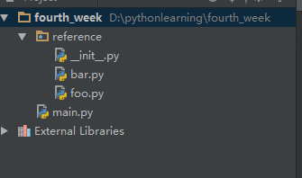

## 模块化

### 基本概念

* 在python中，模块、包和库的概念并没有那么清晰

* 一个文件就是一个模块，模块名就是文件名

* 一个目录，包含了`__init__.py`就是一个包

* 通常的当一个包或者若干包，包含一个`setup.py`就认为是一个可分发的库

### 导入模块

导入模块有两种方式，如下：

import _module_

from _module_ import _submodule_

这两种导入方式的命名空间是不同的，以一个例子说明，如下：


```python
import os
```


```python
os.path.basename('/usr/local/etc')
```


    'etc'


```python
from os import path
```


```python
path.basename('usr/local/etc')
```


    'etc'


```python
from os.path import basename
```


```python
basename('usr/local/etc')
```


    'etc'


```python
import os.path
```

上边的多种引用模块的方式都可以让我们使用`basename`，但各自的命名空间不一样。

### 重命名

引入模块的重命名用`as`语法，看下边的例子：


```python
from os.path import basename as os_basename
```


```python
os_basename('/usr/local/etc')
```


    'etc'


当然直接用`import`导入模块时也可以用`as`语法：


```python
import sys as system
```

这样sys模块的名称被重命名为system了


当一个模块被导入时，真正发生了什么呢？看下边的例子：

```python
(pythv_3.5.1) [root@nod3 learning]# pwd
/root/virtual_env/fourth_week/learning

(pythv_3.5.1) [root@nod3 learning]# ls
foo.py  main.py
```

```python
(pythv_3.5.1) [root@nod3 learning]# cat foo.py
#!/root/.pyenv/versions/pythv_3.5.1/bin/python
# _*_ coding:utf8 _*_


print('ha ha ha')

def bar():
    print('i am bar in foo')

(pythv_3.5.1) [root@nod3 learning]# cat main.py
#!/root/.pyenv/versions/pythv_3.5.1/bin/python
# _*_ coding:utf8 _*_


import foo

foo.bar()
```

```python
(pythv_3.5.1) [root@nod3 learning]# python3 main.py
ha ha ha
i am bar in foo
```

在`main.py`文件中用`import foo`的方式导入了`foo`模块，接着再调用了`foo`模块的`bar`函数，当执行`main.py`文件时，首先执行了`foo`模块的`print('ha ha ha')`语句，再执行了`bar`函数。

这说明当导入一个模块时，其实是执行了此模块，所以当一个文件是以模块的形式被导入时，应避免此模块中有一些全局性的语句，比如这时的`print('ha ha ha')`语句。

用`from foo import bar`的导入方式也是执行了`foo`文件，作如下验证：

```python
(pythv_3.5.1) [root@nod3 learning]# cat main.py
#!/root/.pyenv/versions/pythv_3.5.1/bin/python
# _*_ coding:utf8 _*_


from foo import bar

```

```python
(pythv_3.5.1) [root@nod3 learning]# python3 main.py
ha ha ha
```

## 相对导入和绝对导入

　　在接下来的代码示例不再方便使用jumper来展示，开始用pycharm开发工具来展示代码。

　　为了说明模块的相对导入和绝对导入，在pycharm中创建了一个`reference`包，包内有`bar.py`和`foo.py`两个模块，在`reference`包外有一个`main.py`模块。目录结构如下图：



各个模块中的内容如下：

foo.py:

```python
def fn():
    print('i am in reference.foo')
```

bar.py:

```python
from reference.foo import fn


def bar():
    fn()
```

main.py:

```pyhon
from reference.bar import bar

bar()
```

当运行`main.py`时会得到下边的输出内容：

```python
i am in reference.foo
```

上边的`bar.py`和`main.py`模块中的`from`语句都是从包名`reference`这里开始引用的，这种引用就是`绝对引用`。

因`foo.py`和`bar.py`两个模块都是在包`reference`内，所以`bar.py`里引用`foo`模块时可以使用相对引用的方式，如下：

bar.py:

```python
from .foo import fn


def bar():
    fn()
```
这样就是`相对引用`的方式。

### 循环导入

　　在实际编码中要避免循环导入的，举一个例子说明什么是循环引入。

假如foo.py、bar.py、main.py，这三个模块都在同一个包内，各自的代码如下：

foo.py:

```python
from bar import fn as bar


def fn():
    bar()
    print('i am foo')
```

bar.py:

```python
from foo import fn as foo


def fn():
    foo()
    print('i am bar')
```

main.py:

```python
from foo import fn

fn()
```

当运行main.py时，抛出以下异常：

```py
Traceback (most recent call last):
  File "D:/pythonlearning/fourth_week/reference/main.py", line 1, in <module>
    from foo import fn
  File "D:\pythonlearning\fourth_week\reference\foo.py", line 1, in <module>
    from bar import fn as bar
  File "D:\pythonlearning\fourth_week\reference\bar.py", line 1, in <module>
    from foo import fn as foo
ImportError: cannot import name 'fn'
```

上边的foo模块和bar模块就发生了循环引用的情况，这样在执行main.py时，解释器就会抛出上边的异常信息。
