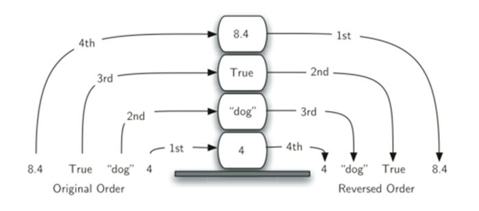
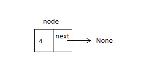
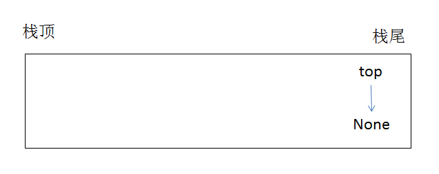
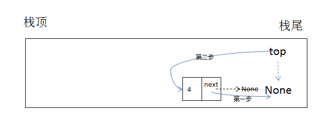
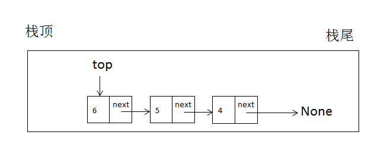
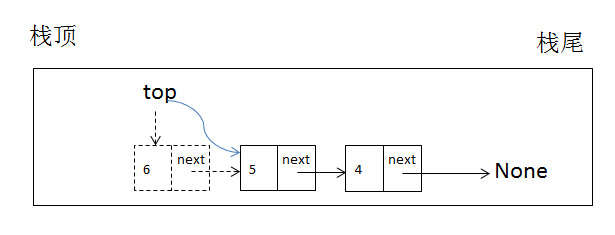

## 数据结构-栈

　　栈（也叫“push-down stack”-下推栈）一种线性有序的数据元素集合，它的特点是，数据的增加删除操作都在同一端进行。进行操作的这一端，我们一般叫做“顶”，另一端叫做“底”。

　　栈的底部很有象征性，因为元素越接近底部，就意味着在栈里的时间越长。最近进来的，总是最早被移走，这种排列规律叫做先进后出，综合为LIFO( last-in first-out)。所以栈的排序是按时间长短来排列元素的。新来的在栈顶，老家伙们在栈底。

下图反应了栈中数据加入和移走的顺序：



一个栈一般会实现以下方法：
1. Stack(),构造方法，创建一个空栈，无参数，返回值是空栈
2. push(value) 向栈顶压入一个新数据项，需要一个数据项参数，无返回值
3. pop() 抛出栈顶数据项，无参数，返回被抛出的数据项，栈本身发生变化
4. peek() 返回栈顶数据项，但不删除。不需要参数，栈不变
5. is_empty() 测试栈是否空栈。不需要参数，返回布尔值。
6. size() 返回栈内数据项的数目，不需要参数，返回值是整数


在python中栈的实现有多种，可以用内置的list数据结构实现，只要约定一个列表的一堆为栈顶，那可以利用现成的`append`和`pop`方法对列表(栈)进行操作，这里以另外的方式实现。

### Node类实现

栈中的节点具有两个部份，这与链表中的节点类似，一个`数据域`，一个`指针域`。先看`Node`类的代码实现：

```py
class Node:
    def __init__(self, value):
        self.value = value
        self.next = None
```

Node类接收一个value参数，实例化后生成一个`数据域`为`value`，`next`指针指向`None`的对象。
用以下代码实例化后生成一个节点：

```py
node = Node(4)
```

一个节点可以用一个示意图表示，如下：




### Stack类实现

#### 构建函数实现

构建函数的代码如下：

```py
class Stack:
    def __init__(self):
        self.top = None
```

构建函数初始化时创建了一个栈顶指针`top`，并指向`None`，如果栈里有数据，`top`指针会指向靠近栈顶的元素。此类执行以下代码实例化后生成一个空栈：

```py
stack = Stack()
```

一个空栈可以用以下示意图表示：



#### push方法实现

　　`push`方法实现向栈增加元素，这个过程叫做`押栈`，有以下操作要做：

1. 既然是增加元素，当然要实例化Node类，这里以node变量表示指向Node类的实例化对象
2. 把node的next指针指向栈的top指针指向的对象
3. 移动top指针移动到栈顶元素

代码如下：
```py
def push(self, value):
        node = Node(value)
        node.next = self.top
        self.top = node
```

如执行以下代码，向栈内增加一个元素：

```py
stack.push(4)
```

此时栈内可用以下示意图来表示这个过程：




当不断向栈内增加数据，如下操作：

```py
stack.push(5)
stack.push(6)
```

这样会出现类似下图的数据结构：




#### pop方法实现

　　pop方法返回栈顶元素的值，此过程需要把top指针指向栈顶指向元素的下一个元素，然后把栈顶元素返回。也要考虑是对空栈的操作。

`pop`方法的代码如下：

```py
def pop(self):
        node = self.top
        if node is None:
            raise Exception('This is an empty stack')
        self.top = node.next
        return node.value
```

代码中使用了一个临时变量`node`，先让此变量指向栈顶元素，这样`node`这个对象就可以调用`next`属性，即可以再把栈的`top`指针指向栈顶元素的下一个元素。其实质就是移动了`top`指针的位置。比如执行如下代码：

```py
stack.pop()
```

这个过程如下示意图：



栈顶指针移动后，栈顶元素会被垃圾回收器回收掉。

#### peek方法实现

　　peek方法直接返回栈顶元素。代码如下：

```py
def peek(self):
        node = self.top
        if node is None:
            raise Exception('This is an empty stack')
        return node.value
```

#### is_empty方法实现

　　is_empty方法判断是否为空栈，代码如下：

```py
def is_empty(self):
        return not self.top
```

#### size方法实现

　　size方法返回栈内元素的个数，和链表的size方法类似，也用一个累加器完成计数。代码如下：

```py
def size(self):
        node = self.top
        count = 0
        if node is None:
            raise Exception('This is an empty stack')
        while node is not None:
            count += 1
            node = node.next
        return count
```

#### Node类和Stack类的完整代码

```py
class Node:
    def __init__(self, value):
        self.value = value
        self.next = None


class Stack:
    def __init__(self):
        self.top = None

    def push(self, value):
        node = Node(value)
        node.next = self.top
        self.top = node

    def pop(self):
        node = self.top
        if node is None:
            raise Exception('This is an empty stack')
        self.top = node.next
        return node.value

    def peek(self):
        node = self.top
        if node is None:
            raise Exception('This is an empty stack')
        return node.value

    def is_empty(self):
        return not self.top

    def size(self):
        node = self.top
        count = 0
        if node is None:
            raise Exception('This is an empty stack')
        while node is not None:
            count += 1
            node = node.next
        return count


if __name__ == '__main__':
    stack = Stack()
    stack.push(2)
    stack.push(3)
#    print(stack.pop())
#    print(stack.top.value)
    print(stack.peek())
    print(stack.is_empty())
    print(stack.size())
```


### 栈运用-平衡符号

　　平衡符号是栈的一种运用。像`[]、()、{}`这样符号都是成对出现的，我们可以用下边的代码来检测一个表达式所使用的这种成对出现的符号是否正确，代码如下：

```py
class Node:
    def __init__(self, value):
        self.value = value
        self.next = None


class Stack:
    def __init__(self):
        self.top = None

    def push(self, value):
        node = Node(value)
        node.next = self.top
        self.top = node

    def pop(self):
        node = self.top
        if node is None:
            raise Exception('This is an empty stack')
        self.top = node.next
        return node.value

    def peek(self):
        node = self.top
        if node is None:
            raise Exception('This is an empty stack')
        return node.value

    def is_empty(self):
        return not self.top

    def size(self):
        node = self.top
        count = 0
        if node is None:
            raise Exception('This is an empty stack')
        while node is not None:
            count += 1
            node = node.next
        return count

if __name__ == '__main__':
    stack = Stack()
    exp = '{a * [x/(x+y)]}'
    for c in exp:
        if c in '{[(':
            stack.push(c)
        elif c in '}])':
            v = stack.top.value
            if c == '}' and v != '{':
                raise Exception('failed')
            if c == ']' and v != '[':
                raise Exception('failed')
            if c == ')' and v != '(':
                raise Exception('failed')
            stack.pop()
    if stack.top is not None:
        raise Exception('failed')
    print('ok')
```
