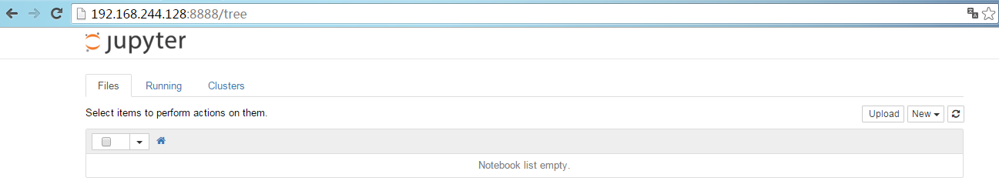
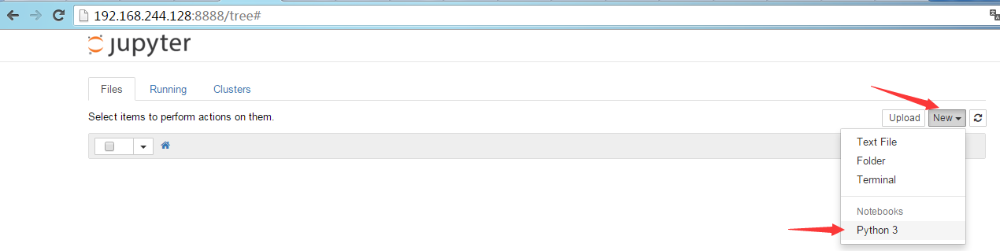
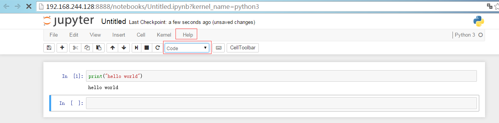

# pyenv简介

pyenv是python environment的简写，它是一个可同时管理多个Python版本的工具，它可以为每个工作目录设定使用指定的python版本。pyenv再结合pyenv-virtualenv这一插件，可以为pyenv管理的python版本运行提供隔离的虚拟环境，在此虚拟环境下的操作都不会影响原有的python环境，例如安装第三方模块，都不会在原始的python环境里直接操作，从而保证各个python环境的纯净性。

# pyenv安装

我的系统环境如下：

```sh
root@test1:~# cat /etc/issue
Debian GNU/Linux 8 \n \l

root@test1:~# uname -a
Linux test1 3.16.0-4-amd64 #1 SMP Debian 3.16.7-ckt11-1+deb8u3 (2015-08-04) x86_64 GNU/Linux
```

在安装pyenv前要先安装一些依赖，参考：https://github.com/yyuu/pyenv/wiki

```sh
root@test1:~# apt-get install -y make build-essential libssl-dev zlib1g-dev libbz2-dev libreadline-dev libsqlite3-dev wget curl llvm libncurses5-dev xz-utils
```


这里我计划把pyenv安装在zhaochj这个普通用户的家目录下，如下：

```sh
root@test1:~# su - zhaochj
zhaochj@test1:~$ git clone https://github.com/yyuu/pyenv.git   ~/.pyenv          #从github克隆的是最新版本的pyenv
正克隆到 '/home/zhaochj/.pyenv'...
remote: Counting objects: 12155, done.
remote: Compressing objects: 100% (90/90), done.
remote: Total 12155 (delta 67), reused 0 (delta 0), pack-reused 12063
接收对象中: 100% (12155/12155), 2.17 MiB | 67.00 KiB/s, 完成.
处理 delta 中: 100% (8452/8452), 完成.
检查连接... 完成。

接着定义pyenv的环境变量，如下：
zhaochj@test1:~$ echo 'export PYENV_ROOT="$HOME/.pyenv"' >> ~/.bash_profile
zhaochj@test1:~$ echo 'export PATH="$PYENV_ROOT/bin:$PATH"' >> ~/.bash_profile
```

向 shell 添加 pyenv init 以启用 shims 和命令补完功能：

```sh
zhaochj@test1:~$ echo 'eval "$(pyenv init -)"' >> ~/.bash_profile

使配置生效：
zhaochj@test1:~$ source .bash_profile
zhaochj@test1:~$ echo $PATH
/home/zhaochj/.pyenv/shims:/home/zhaochj/.pyenv/bin:/usr/local/bin:/usr/bin:/bin:/usr/local/games:/usr/games
```

现在就可以正常使用pyenv了：

```sh
zhaochj@test1:~$ pyenv
pyenv 20160202-10-ga6f1f48
Usage: pyenv <command> [<args>]
Some useful pyenv commands are:
   commands    List all available pyenv commands
   local       Set or show the local application-specific Python version
   global      Set or show the global Python version
   shell       Set or show the shell-specific Python version
   install     Install a Python version using python-build
   uninstall   Uninstall a specific Python version
   rehash      Rehash pyenv shims (run this after installing executables)
   version     Show the current Python version and its origin
   versions    List all Python versions available to pyenv
   which       Display the full path to an executable
   whence      List all Python versions that contain the given executable
See `pyenv help <command>' for information on a specific command.
For full documentation, see: https://github.com/yyuu/pyenv#readme
```

# pyenv-virtualenv插件安装

把pyenv-virtualenv插件git clone到pyenv的插件目录：

```sh
zhaochj@test1:~$ git clone https://github.com/yyuu/pyenv-virtualenv.git   ~/.pyenv/plugins/pyenv-virtualenv
正克隆到 '/home/zhaochj/.pyenv/plugins/pyenv-virtualenv'...
remote: Counting objects: 1694, done.
remote: Total 1694 (delta 0), reused 0 (delta 0), pack-reused 1694
接收对象中: 100% (1694/1694), 466.81 KiB | 166.00 KiB/s, 完成.
处理 delta 中: 100% (1153/1153), 完成.
检查连接... 完成。
```

向 shell 添加 pyenv init 以启用 shims 和命令补完功能：

```sh
zhaochj@test1:~$ echo 'eval "$(pyenv virtualenv-init -)"' >> ~/.bash_profile
zhaochj@test1:~$ cat ~/.bash_profile
export PYENV_ROOT="$HOME/.pyenv"
export PATH="$PYENV_ROOT/bin:$PATH"
eval "$(pyenv init -)"
eval "$(pyenv virtualenv-init -)"
```

重启shell,使配置生效：

```sh
zhaochj@test1:~$ exec $SHELL
zhaochj@test1:~$ echo $PATH
/home/zhaochj/.pyenv/shims:/home/zhaochj/.pyenv/bin:/usr/local/bin:/usr/bin:/bin:/usr/local/games:/usr/games
没有生效，应该是因为zhaochj这个用户是从root用户切换过来的，是一种Non-login状态，那就直接source:
zhaochj@test1:~$ source .bash_profile
zhaochj@test1:~$ echo $PATH
/home/zhaochj/.pyenv/plugins/pyenv-virtualenv/shims:/home/zhaochj/.pyenv/libexec:/home/zhaochj/.pyenv/plugins/python-build/bin:/home/zhaochj/.pyenv/plugins/pyenv-virtualenv/bin:/home/zhaochj/.pyenv/shims:/home/zhaochj/.pyenv/bin:/home/zhaochj/.pyenv/shims:/home/zhaochj/.pyenv/bin:/usr/local/bin:/usr/bin:/bin:/usr/local/games:/usr/games
zhaochj@test1:~$ pyenv virtualenv --help
Usage: pyenv virtualenv [-f|--force] [VIRTUALENV_OPTIONS] [version] <virtualenv-name>
       pyenv virtualenv --version
       pyenv virtualenv --help

  -f/--force       Install even if the version appears to be installed already

```

至此，pyenv算是安装完成，也能够利用插件隔离python的运行环境。

# pyenv使用演示

演示目标是能创建两个相互的隔离的虚拟环境，一个虚拟环境运行python 2.7.11，另一个虚拟环境运行3.4.2。

## 安装python
首先需要通过pyenv来安装需要的python版本，如下：

```sh
zhaochj@test1:~$ python -V   #系统自带的python版本
Python 2.7.9
zhaochj@test1:~$ pyenv version   #列出pyenv可管理的python版本，当前只有系统自带的python
system (set by /home/zhaochj/.pyenv/version)
zhaochj@test1:~$ pyenv install --list | less   #列出pyenv可下载安装的各版本
zhaochj@test1:~$ pyenv install 2.7.11   #安装2.7.11
zhaochj@test1:~$ pyenv install 3.4.2  #安装3.4.2

#为所有已安装的可执行文件 （如：~/.pyenv/versions/*/bin/*） 创建 shims，因此，每当你增删了 Python 版本或带有可执行文件的包（如 pip）以后，都应该执行一次本命令
zhaochj@test1:~$ pyenv rehash

zhaochj@test1:~$ pyenv versions
* system (set by /home/zhaochj/.pyenv/version)
  2.7.11
  3.4.2
```

## python 2.7.11虚拟环境创建
先创建一个目录存放虚拟的Python环境：

```sh
zhaochj@test1:~$ mkdir virtual_env && cd virtual_env
再创建一个名为python_2.7.11的虚拟环境，此虚拟环境使用python 2.7.11版本：
zhaochj@test1:~/virtual_env$ pyenv virtualenv 2.7.11 python_2.7.11
Collecting virtualenv
  Retrying (Retry(total=4, connect=None, read=None, redirect=None)) after connection broken by 'ProtocolError('Connection aborted.', gaierror(-2, 'Name or service not known'))': /simple/virtualenv/
  Downloading virtualenv-14.0.6-py2.py3-none-any.whl (1.8MB)
    100% |████████████████████████████████| 1.8MB 139kB/s
Installing collected packages: virtualenv
Successfully installed virtualenv-14.0.6
You are using pip version 7.1.2, however version 8.0.2 is available.
You should consider upgrading via the 'pip install --upgrade pip' command.
New python executable in /home/zhaochj/.pyenv/versions/2.7.11/envs/python_2.7.11/bin/python2.7
Also creating executable in /home/zhaochj/.pyenv/versions/2.7.11/envs/python_2.7.11/bin/python
Installing setuptools, pip, wheel...done.
Ignoring indexes: https://pypi.python.org/simple
Requirement already satisfied (use --upgrade to upgrade): setuptools in /home/zhaochj/.pyenv/versions/2.7.11/envs/python_2.7.11/lib/python2.7/site-packages
Requirement already satisfied (use --upgrade to upgrade): pip in /home/zhaochj/.pyenv/versions/2.7.11/envs/python_2.7.11/lib/python2.7/site-packages

zhaochj@test1:~/virtual_env$ pyenv virtualenvs  #查看python的可用虚拟环境
  2.7.11/envs/python_2.7.11 (created from /home/zhaochj/.pyenv/versions/2.7.11)
  python_2.7.11 (created from /home/zhaochj/.pyenv/versions/2.7.11)

zhaochj@test1:~/virtual_env$ pyenv versions  #查看python的版本列表，多了 “python_2.7.11”和“2.7.11/envs/python_2.7.11”
* system (set by /home/zhaochj/.pyenv/version)
  2.7.11
  2.7.11/envs/python_2.7.11
  3.4.2
  python_2.7.11

```

在当前工作目录下激活python_2.7.11这个虚拟环境，如下：

```sh
zhaochj@test1:~/virtual_env$ pyenv activate python_2.7.11
pyenv-virtualenv: deactivate
pyenv-virtualenv: activate python_2.7.11
pyenv-virtualenv: prompt changing will be removed from future release. configure `export PYENV_VIRTUALENV_DISABLE_PROMPT=1' to simulate the behavior.
(python_2.7.11) zhaochj@test1:~/virtual_env$             #shell的开头多了一个括号，括号里就是虚拟环境的名称
(python_2.7.11) zhaochj@test1:~/virtual_env$ python -V   #此虚拟环境下的python版本为2.7.11了
Python 2.7.11
这样一个使用2.7.11版本的python虚拟环境就准备好了，现在我们可以在此环境下安装我们所需要的包，如下：
(python_2.7.11) zhaochj@test1:~/virtual_env$ pip install ipython
(python_2.7.11) zhaochj@test1:~/virtual_env$ pip install pymysql
(python_2.7.11) zhaochj@test1:~/virtual_env$ ipython
Python 2.7.11 (default, Feb 21 2016, 15:40:35)
Type "copyright", "credits" or "license" for more information.
IPython 4.1.1 -- An enhanced Interactive Python.
?         -> Introduction and overview of IPython's features.
%quickref -> Quick reference.
help      -> Python's own help system.
object?   -> Details about 'object', use 'object??' for extra details.
In [1]: import pymysql
#能够正常导入pymysql模块
```

## python 3.4.2虚拟环境创建

```sh
(python_2.7.11) zhaochj@test1:~/virtual_env$ pyenv deactivate   #切换到系统环境
zhaochj@test1:~/virtual_env$
```

创建名为pyth_3.4.2的虚拟环境，使用2.4.2的python版本，如下：

```sh
zhaochj@test1:~/virtual_env$ pyenv virtualenv 3.4.2 pyth_3.4.2
Ignoring indexes: https://pypi.python.org/simple/
Requirement already satisfied (use --upgrade to upgrade): setuptools in /home/zhaochj/.pyenv/versions/3.4.2/envs/pyth_3.4.2/lib/python3.4/site-packages
Requirement already satisfied (use --upgrade to upgrade): pip in /home/zhaochj/.pyenv/versions/3.4.2/envs/pyth_3.4.2/lib/python3.4/site-packages
Cleaning up...
zhaochj@test1:~/virtual_env$ pyenv virtualenvs  #列出可用的虚拟环境
  2.7.11/envs/python_2.7.11 (created from /home/zhaochj/.pyenv/versions/2.7.11)
  3.4.2/envs/pyth_3.4.2 (created from /home/zhaochj/.pyenv/versions/3.4.2)
  pyth_3.4.2 (created from /home/zhaochj/.pyenv/versions/3.4.2)
  python_2.7.11 (created from /home/zhaochj/.pyenv/versions/2.7.11)
zhaochj@test1:~/virtual_env$ pyenv activate pyth_3.4.2   #激活虚拟环境
pyenv-virtualenv: deactivate
pyenv-virtualenv: activate pyth_3.4.2
pyenv-virtualenv: prompt changing will be removed from future release. configure `export PYENV_VIRTUALENV_DISABLE_PROMPT=1' to simulate the behavior.
(pyth_3.4.2) zhaochj@test1:~/virtual_env$ python -V  #查看版本
Python 3.4.2
(pyth_3.4.2) zhaochj@test1:~/virtual_env$ ipython   #在此虚拟环境是没有安装ipython的
pyenv: ipython: command not found
The `ipython' command exists in these Python versions:
  2.7.11/envs/python_2.7.11
  python_2.7.11
(pyth_3.4.2) zhaochj@test1:~/virtual_env$ python  #直接用Python命令进入交互式接口，pymysql这个模块也是不能导入成功，因为在此虚拟环境下没有安装这个模块
Python 3.4.2 (default, Feb 21 2016, 15:47:04)
[GCC 4.9.2] on linux
Type "help", "copyright", "credits" or "license" for more information.
>>> import pymysql
Traceback (most recent call last):
  File "<stdin>", line 1, in <module>
ImportError: No module named 'pymysql'
>>>
```

# jupyter notebook
jupyter notebook是一个web应用程序，可以创建、共享有实时代码、方程式、可视化视图组件及解释性文本的文档。用途包括：数据清洗和转换，数值模拟，统计建模，机器学习等。
jupyter的帮助文档：http://jupyter.readthedocs.org/en/latest/

## jupyter安装
继续使用pyth_3.4.2这个虚拟环境来安装jupter,如下：

```sh
(pyth_3.4.2) zhaochj@test1:~/virtual_env$ pip install pyzmq   #jupyter依赖包
(pyth_3.4.2) zhaochj@test1:~/virtual_env$ pip install jinja2     #jupyter依赖包
(pyth_3.4.2) zhaochj@test1:~/virtual_env$ pip install jupyter
#慢慢等待，这里需要安装许多组件
```

## 使用jupyter服务器

安装好jupyter后就可以使用jupyter命令，此命令通过其子命令来完成各种功能，帮助信息如下：

```sh
(pyth_3.4.2) zhaochj@test1:~/virtual_env$ jupyter --help
usage: jupyter [-h] [--version] [--config-dir] [--data-dir] [--runtime-dir]
               [--paths] [--json]
               [subcommand]
Jupyter: Interactive Computing
positional arguments:
  subcommand     the subcommand to launch
optional arguments:
  -h, --help     show this help message and exit
  --version      show the jupyter command's version and exit
  --config-dir   show Jupyter config dir
  --data-dir     show Jupyter data dir
  --runtime-dir  show Jupyter runtime dir
  --paths        show all Jupyter paths. Add --json for machine-readable
                 format.
  --json         output paths as machine-readable json
Available subcommands: console kernelspec migrate nbconvert nbextension
notebook qtconsole trust   #这里是它的可用子命令
```

这里我们要使用“notebook”这个子命令，获取其子命令的帮助手册请执行如下语句：

```sh
(pyth_3.4.2) zhaochj@test1:~/virtual_env$ jupyter notebook --help
```

启动服务，使其监听在任何地址的8888端口上，如下：

```sh
(pyth_3.4.2) zhaochj@test1:~/virtual_env$ jupyter notebook --ip=0.0.0.0 --port=8888 > /dev/null 2>&1 &
[1] 52701
(pyth_3.4.2) zhaochj@test1:~/virtual_env$ ss -tnlp | grep 8888
LISTEN     0      128                       *:8888                     *:*      users:(("jupyter-noteboo",pid=52701,fd=5))
```

现在打开浏览器访问服务器的8888端口，打开后界面如下：



点击右边的New下拉菜单，“Text File”可以在线打开一个编辑器，直接编辑文档，“Folder”用于创建一个目录，“Terminal”用于打开一个终端，“Python 3”则可以打开一个基于web界面的ipython接口，如下示例：





此界面里有许多快捷键，可能过菜单里的“Help”来获取，而且在上图红框里的“Code”处的上拉菜单中还可以选择“Markdown”的模拟，在线编辑文档。


参考资料：

https://github.com/yyuu/pyenv#installation

https://github.com/yyuu/pyenv-virtualenv
