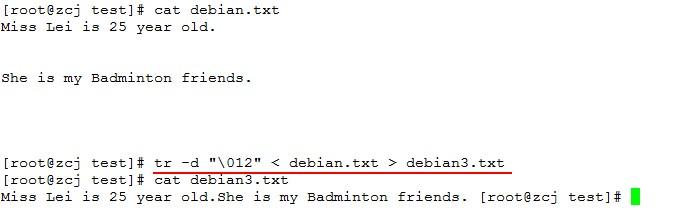
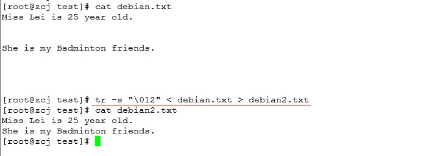

# wc

功能描述：对档案中的字节数、字符数、单词数、行数进行统计后输出到标准输出设备

命令使用格式: `wc [OPTION]... [FILE]...`

常用选项:

```
-l：统计文件中的行数
-w：统计文件中的单词数不全是英语课本的单词含义如“jjjjj”这样也算是单词
-m：统计文件中的字符数
-c：统计文件中的字节数
```

example:

```sh
[root@zhaochj test]# ls -l
total 4
-rw-r--r-- 1 root root 52 Sep  9 02:31 a.txt
[root@zhaochj test]# cat a.txt
tom is a boy
tom is a boy
tom is a boy
tom is a boy
[root@zhaochj test]# wc -l a.txt
4 a.txt
[root@zhaochj test]# wc -w a.txt
16 a.txt
[root@zhaochj test]# wc -m a.txt
52 a.txt
[root@zhaochj test]# wc -c a.txt
52 a.txt
[root@zhaochj test]#
```

a.txt档案中都是英文字母所以“-m”与“-c”统计的字符数与字节数都是相同的如果档案中有中文汉字那就不一样了。

# tr

功能描述：转换或删除字符

命令使用格式：`tr [OPTION]... SET1 [SET2]`

注意tr命令后边接参数SET1、SET2没有接所操作的档案所以此命令不能对档案直接操作只能从标准输出中接收数据用管道的方式来把前一个命令的输出作为tr命令的输入。

常用选项:

```
-d：删除SET1中所匹配到的所有字符
-s：--squeeze-repeats：压缩重复字符去除SET1中连续重复的字符只保留一个。即连续出现的字符压缩成一个字符
```

在SET1这个字符串中可以使用在grep中用到的字符集即`[a-z]、[o-9]、[:lower:]、[:upper:]、[:digit:]`等还可以用以下特殊字符:

```
\octal 一个三位的八进制数对应有效的ASCII字符。
[O*n] 表示字符O重复出现指定次数n。因此[O*2]匹配OO的字符串。
tr中特定控制字符的不同表达方式
速记符含义八进制方式
\a Ctrl-G 铃声\007
\b Ctrl-H 退格符\010
\f Ctrl-L 走行换页\014
\n Ctrl-J 新行\012
\r Ctrl-M 回车\015
\t Ctrl-I tab键\011
\v Ctrl-X \030
```

example，删除匹配到的字符:

```shell
[root@zcj test]# cat debian.txt
Miss Lei is 25 year old.
She is my Badminton friends.
[root@zcj test]# cat debian.txt | tr -d [0-9]
Miss Lei is  year old.
She is my Badminton friends.
[root@zcj test]# cat debian.txt | tr -d [0-9] > debian2.txt
[root@zcj test]# cat debian2.txt
Miss Lei is  year old.
She is my Badminton friends.
[root@zcj test]# cat debian.txt | tr -d "my"
Miss Lei is 25 ear old.
She is  badinton friends.
```

这里用"tr -d"过虑掉了所有0-9的数字所以档案中的25被过虑掉不被显示出来。

注: tr -d "my"中表示凡是档案中出现了字符“m”、“y”的都会被删除并不是只有字符“my”才会被删除。



"-d"选项也可以删除档案中的空白行并且也删除了换行符会把所有的内容在一行显示。

example，压缩重复字符:

```shell
[root@zcj test]# cat debian.txt | tr -s "s"
Mis Lei is 25 year old.
She is my Badminton friends.
```

“-s”去除紧挨着的重复字符这里的“Miss”成了“Mis”这个参数还可以用来删除档案中的空白的行即:



选项“-s”与“-d”在删除空白行的结果是不一样的后者会把档案中的所有行合并为一行。

example，替换匹配到的字符:

```shell
[root@zcj test]# cat debian.txt
Miss Lei is 25 year old.
She is my Badminton friends.
[root@zcj test]# tr "25" "19" < debian.txt
Miss Lei is 19 year old.
She is my Badminton friends.
[root@zcj test]#
```

注: 凡是在debian.txt中出现数字“2”就替换成“1”数字“5”就替换成“9”并不是把数字“25”替换成“19”

通过tr命令可以统一档案字符的大小写:

```shell
[root@zcj test]# cat debian.txt | tr [a-z] [A-Z]
MISS LEI IS 25 YEAR OLD.
SHE IS MY BADMINTON FRIENDS.
```

# sort

功能描述：对文本内的内容进行排序不会对原文件进任何操作只是把结果显示在标准输出设备

命令格式：`sort [OPTION]... [FILE]...`

常用选项

```
-f：fold lower case to upper case characters 排序时忽略大小写
-n：--numeric-sort 以数值大小进行排序且是升序排列如果不指定以数值大小排序,系统l默认以ASCII值大小排序
-r：--reverse相反 以ASCII值降序排列因为默认是升序排列
-rn：一起使用表示以数值大小进行降序排序
-u：--unique 排序后移除重复行只保留一个
-unr：以数值方式降序排列若有相同数据只保留一个
-R：随机排序
```

example:

```shell
[root@zcj test]# cut -d: -f3 < /etc/passwd | sort -n
0
1
2
3
4
5
6
7
8
9
10
11
12
13
14
16
43
48
68
69
70
74
81
99
100
500
502
503
504
1000
```

取出系统中用户的UID并以数值大小以升序排序。

```shell
[root@zcj test]# cut -d: -f3 < /etc/passwd | sort -nr
1000
504
503
502
500
100
99
81
74
70
69
68
48
43
16
14
13
12
11
10
9
8
7
6
5
4
3
2
1
0
```

加入了“-r”选项就是以降序排列。

```shell
[root@zcj test]# cat ubuntu.txt
78
45
12
90
14
90
34
78
[root@zcj test]# sort -nu ubuntu.txt
12
14
34
45
78
90
```

排序后去年了78、90这两个重复数据。

# uniq

功能描述：可以对档案中重复出现的行，唯一的行进行计数并能通过sort的排序处理后可以删除重复的信息。

命令格式  `uniq [OPTION]... [INPUT [OUTPUT]]`，此命令常与sort命令结合使用。

常用选项：

```
-c：--count 统计每行重复的次数
-u：--unique 唯一的，只显示没有重复的行就是显示唯一的行
-d：--repeated 重复，只显示有重复的行
```

example:

```shell
[root@zcj test]# uniq -c < ubuntu.txt
      1 78
      1 45
      1 12
      1 90
      1 14
      1 90
      1 34
      1 78
```

注：数据在没有排序时即使有重复的数据uniq命令也不会认为这里重复的数据只有借助sort命令排序后重复的数据都是紧挨着时uniq才认为这里重复的数据。

```shell
[root@zcj test]# sort -n ubuntu.txt | uniq -c
      1 12
      1 14
      1 34
      1 45
      2 78
      2 90
```

先通过sort命令进行排序后再把命令的结果传递给uniq处理就能正常统计数据的重复次数。

```shell
[root@zcj test]# sort -n ubuntu.txt | uniq -u
12
14
34
45
```

显示出没有重复的行。

```shell
[root@zcj test]# sort -n ubuntu.txt | uniq -d
78
90
```

只显示出重复的行。

# cut

功能描述：以特定的分隔符来分隔档案中的内容并把分隔后的内容编号存入内存中以便引用、输出。

命令使用格式：`cut [OPTION]... [FILE]...`

常用选项：

```
-b：以字节为单位进行分隔单独的“-b”选项会忽略掉档案中多字节字符必须与“-n”选项 一起使用才能匹配多字节字符
-n：取消分割多字节字符。仅和 -b 标志一起使用
-c：以字符为单位进行分隔
-d：自定义分隔符，把档案的每一行按照指定的分隔符分隔成若干个域，当不使用“-d”来指定的分隔符时，cut默认是以制表符tab来做分隔符的。
-f：此选项后接上一个数字表示在“-d”分隔成的域中我们选择第几个域内的数据
```

example:

```shell
[root@zcj test]# who
root     tty1         2013-10-19 22:45
root     pts/0        2013-10-20 09:05 (192.168.138.1)
root     pts/3        2013-10-20 10:03 (192.168.138.1)
[root@zcj test]# who | cut -b 4
t
t
t
[root@zcj test]# who | cut -b 4-
t     tty1         2013-10-19 22:45
t     pts/0        2013-10-20 09:05 (192.168.138.1)
t     pts/3        2013-10-20 10:03 (192.168.138.1)
[root@zcj test]# who | cut -b -4
root
root
root
```

在“-b”的选项参数中可以在数字的前或后加上“-”,加在后表示显示此字节及以后的所有字节加在前表示显示此字节及前的所有字节。

当档案中有多字节字符时比如汉字要用注意“-n”、“-b”、“-nb”的区别，在UTF-8的编码下一个汉字占三个字符。

```shell
[root@zcj test]# cat opensuse
星期一
星期二
this is a test
[root@zcj test]# cut -b 3 opensuse\\只显示第三个字节汉字不能正常显示


i
[root@zcj test]# cut -b 1,2,3 opensuse\\显示第一、二、三个字节
星
星
thi
[root@zcj test]# cut -nb 2 opensuse \\因显示第二个字节一个汉字占据三个字节第二个字节没有在第一个汉字的结尾故不显示汉字。


h
[root@zcj test]# cut -nb 3 opensuse\\因一个汉字占据三个字节加了“-n”选项后忽略多字节字符当“-nb”后接的数字是多字符的末位数时会把在这个字节上的汉字显示出来。
星
星
i
[root@zcj test]# cut -nb 1,2,3 opensuse
星
星
thi
```

```shell
[root@zcj test]# head -3 /etc/passwd | cut -d: -f1
root
bin
daemon
```

取出/etc/passwd中前三行的用户列表

# tee

功能描述：把一个命令的标准输出读取后保存成一个档案并且把读取的内容也一并输出到标准输出

命令使用格式: `tee [OPTION]... [FILE]...`

常用选项

```
-a：--append表示把读取的内容附加到档案的尾部而不是覆盖，类似追加命令“>>”
```

example:

```shell
[root@zcj test]# cat debian.txt
Miss Lei is 25 year old.
She is my Badminton friends.
[root@zcj test]# cat suse
星期一
星期二
[root@zcj test]# cat debian.txt | tee suse
Miss Lei is 25 year old.
She is my Badminton friends.
[root@zcj test]# cat suse
Miss Lei is 25 year old.
She is my Badminton friends.
```

tee不加选项时会把suse原有内容覆盖掉

```sh
[root@zcj test]# cat suse
Miss Lei is 25 year old.
She is my Badminton friends.
[root@zcj test]# cat opensuse
星期一
星期二
[root@zcj test]# cat suse | tee -a opensuse
Miss Lei is 25 year old.
She is my Badminton friends.
[root@zcj test]# cat opensuse
星期一
星期二
Miss Lei is 25 year old.
She is my Badminton friends.
[root@zcj test]#
```
