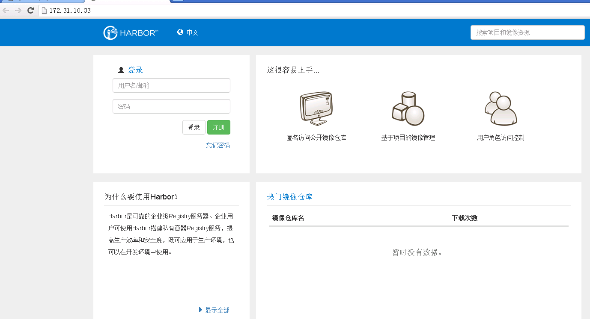
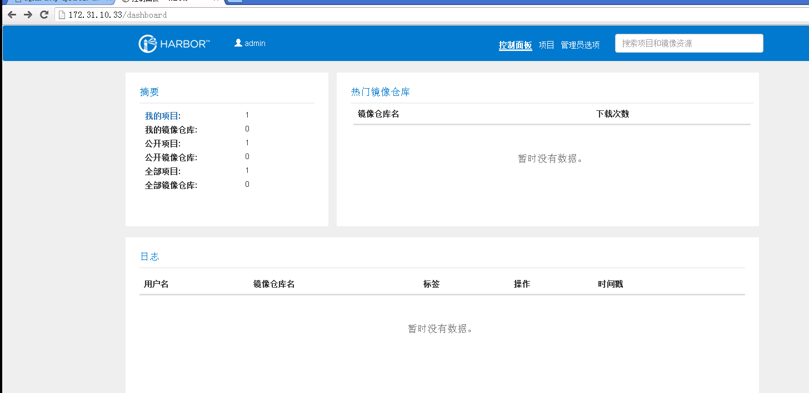
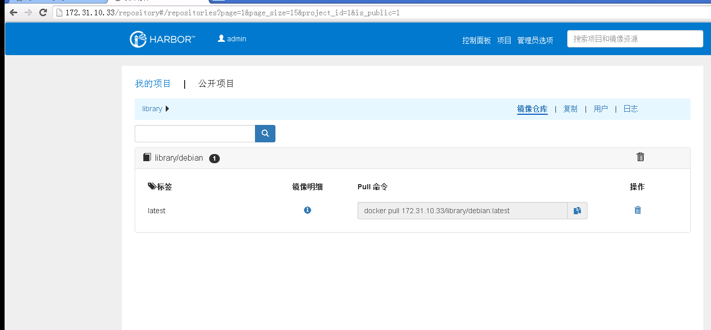

[TOC]


# harbor简介


[harbor](https://github.com/vmware/harbor)是vmware开源的一个企业级注册服务，用于存储及颁发docker镜像。它在docker registry的基础上提供了一个管理的UI界面，提供了用户管理、访问控制，审计等功能，而且还提供了多个注册中心的复制功能，而且还能与AD或LDAP进行结合。harbor只能工作在docker 1.10.0+和docker-compose 1.6.0+

harbor比docker原生的registry更加易用，值得推荐。


# harbor安装与配置


harbor的非常易于安装，各个组件都是被做成了docker镜像，也就是说下载相应的docker镜像并启动起来，一个harbor环境就可以了。基于网络环境的原因，harbor提供了两种安装方式:

- Online installer

这种安装方式需要联网去下载harbor的所需要的各个组件的镜像文件，所以安装程序会比较小；

- Offline installer

这种安装方式允许在没有互联网的环境下进行安装，安装包里包含了所有需要的镜像。


两种方式的安装包都可点击[这里](https://github.com/vmware/harbor/releases)


这里以Offline installer的方式进行安装测试。


## 依赖

- python 2.7+

- docker engine 1.10+

- docker compose 1.6.0+


```sh

root@cst003:~/software# pwd
/root/software
root@cst003:~/software# uname -a
Linux cst003 3.16.0-4-amd64 #1 SMP Debian 3.16.7-ckt20-1+deb8u1 (2015-12-14) x86_64 GNU/Linux
root@cst003:~/software# python -V
Python 2.7.9
root@cst003:~/software# docker -v
Docker version 1.12.0, build 8eab29e
root@cst003:~/software# docker-compose
-bash: docker-compose: command not found

```

没有`docker-compose`命令，需要安装，参考[这里](https://docs.docker.com/compose/install/)，如下：

```sh
root@cst003:~/software# curl -L "https://github.com/docker/compose/releases/download/1.8.1/docker-compose-$(uname -s)-$(uname -m)" > /usr/local/bin/docker-compose
root@cst003:~/software# chmod +x /usr/local/bin/docker-compose
root@cst003:~/software# docker-compose -version
docker-compose version 1.8.0, build f3628c7
```


## 安装与配置

依赖已处理好了，接下来安装harbor。


```sh
root@cst003:~/software# wget https://github.com/vmware/harbor/releases/download/0.4.1/harbor-offline-installer-0.4.1.tgz
root@cst003:~/software# ls
harbor-offline-installer-0.4.1.tgz
root@cst003:~/software# tar xf harbor-offline-installer-0.4.1.tgz 
root@cst003:~/software# ls
harbor  harbor-offline-installer-0.4.1.tgz
root@cst003:~/software# cd harbor/
root@cst003:~/software/harbor#
root@cst003:~/software/harbor# ls -l
total 284572
drwxr-xr-x 7 root root      4096 Sep 30 16:18 config
-rw-r--r-- 1 root root      1949 Sep 30 16:57 docker-compose.yml
-rw-r--r-- 1 root root 291290455 Sep 30 16:58 harbor.0.4.1.tgz
-rw-r--r-- 1 root root      3460 Sep 30 16:18 harbor.cfg
-rwxr-xr-x 1 root root      3536 Sep 30 16:17 install.sh
-rw-r--r-- 1 root root     74231 Sep 30 16:18 LICENSE
-rw-r--r-- 1 root root       485 Sep 30 16:18 NOTICE
-rwxr-xr-x 1 root root      8158 Sep 30 16:18 prepare
drwxr-xr-x 6 root root      4096 Sep 30 16:18 templates
``` 

需要修改`harbor.cfg`配置文件，至少需要修改此配置文件中的`hostname`参数，这里也只修改如下参数，更全面的资料请参考[这里](https://github.com/vmware/harbor/blob/master/docs/installation_guide.md)：

```sh
hostname = 172.31.10.33
```

修改成本地的IP地址，当然也可以是一个可用的域名地址。

修改完成后就可以执行`install.sh`脚本来安装harbor：

```sh
root@cst003:~/software/harbor# ls
config  docker-compose.yml  harbor.0.4.1.tgz  harbor.cfg  install.sh  LICENSE  NOTICE  prepare  templates
root@cst003:~/software/harbor# ./install.sh
```

安装完成后可以发现主机上运行了多个容器，如下：

```sh
root@cst003:~/software/harbor# docker images 
REPOSITORY                 TAG                 IMAGE ID            CREATED             SIZE
harbor_mysql               0.4.1               454464329533        3 weeks ago         324.3 MB
harbor_jobservice_photon   0.4.1               5f64c96acafd        3 weeks ago         161.8 MB
harbor_ui_photon           0.4.1               d98798190a8b        3 weeks ago         224.4 MB
harbor_log_photon          0.4.1               15eaeaa38afa        3 weeks ago         185.3 MB
registry                   2.5.0               c6c14b3960bd        12 weeks ago        33.31 MB
nginx                      1.9.0               7e156d496c9f        17 months ago       132.9 MB
root@cst003:~/software/harbor# docker ps -s
CONTAINER ID        IMAGE                            COMMAND                  CREATED             STATUS              PORTS                                      NAMES                 SIZE
34bf80c3a181        nginx:1.9.0                      "nginx -g 'daemon off"   19 seconds ago      Up 17 seconds       0.0.0.0:80->80/tcp, 0.0.0.0:443->443/tcp   harbor_proxy_1        2 B (virtual 132.9 MB)
33436efce4ef        harbor_jobservice_photon:0.4.1   "/harbor/harbor_jobse"   19 seconds ago      Up 18 seconds                                                  harbor_jobservice_1   0 B (virtual 161.8 MB)
31cb4c29c710        harbor_ui_photon:0.4.1           "/harbor/harbor_ui"      20 seconds ago      Up 19 seconds                                                  harbor_ui_1           0 B (virtual 224.4 MB)
551869d0f1c7        registry:2.5.0                   "/entrypoint.sh serve"   20 seconds ago      Up 19 seconds       5000/tcp                                   harbor_registry_1     0 B (virtual 33.31 MB)
40a7a6a53cde        harbor_mysql:0.4.1               "/entrypoint.sh mysql"   20 seconds ago      Up 19 seconds       3306/tcp                                   harbor_mysql_1        6.566 kB (virtual 324.3 MB)
3210f8102e30        harbor_log_photon:0.4.1          "/bin/sh -c 'crond &&"   21 seconds ago      Up 20 seconds       0.0.0.0:1514->514/tcp                      harbor_log_1          3 B (virtual 185.3 MB)
root@cst003:~/software/harbor# 
```

默认harbor服务监听在80端口，直接访问即可打开主页：



默认harbor的管理员用户为`admin`，密码为`Harbor12345`，登陆后如下：



更多的功能，自己去点点看看吧。


# 镜像push/pull测试


harbor安装好后默认提供了一个名称`library`的项目，在harbor的世界里镜像存放的地方以项目来划分，所以针对不同作用的镜像可以以项目来划分。

再在另一个安装有docker engine的节点上来测试一下harbor是否可用，因为docker默认是需要基于https的方式来访问registry的，所以需要在docker的节点上做一点小小的配置，使docker用http的方式去访问registry，所以做如下操作：


```sh
root@cst006:~# docker -v
Docker version 1.12.0, build 8eab29e
root@cst006:~# ip add
1: lo: <LOOPBACK,UP,LOWER_UP> mtu 65536 qdisc noqueue state UNKNOWN group default 
    link/loopback 00:00:00:00:00:00 brd 00:00:00:00:00:00
    inet 127.0.0.1/8 scope host lo
       valid_lft forever preferred_lft forever
    inet6 ::1/128 scope host 
       valid_lft forever preferred_lft forever
2: eth0: <BROADCAST,MULTICAST,UP,LOWER_UP> mtu 1500 qdisc pfifo_fast state UP group default qlen 1000
    link/ether 00:50:28:80:36:a7 brd ff:ff:ff:ff:ff:ff
    inet 172.31.10.36/16 brd 172.31.255.255 scope global eth0
       valid_lft forever preferred_lft forever
    inet6 fe80::250:28ff:fe80:36a7/64 scope link 
       valid_lft forever preferred_lft forever
3: docker0: <NO-CARRIER,BROADCAST,MULTICAST,UP> mtu 1500 qdisc noqueue state DOWN group default 
    link/ether 02:42:b8:87:12:f2 brd ff:ff:ff:ff:ff:ff
    inet 172.17.0.1/16 scope global docker0
       valid_lft forever preferred_lft forever
root@cst006:~# vim /etc/systemd/system/multi-user.target.wants/docker.service
把这个配置文件中的
ExecStart=/usr/bin/dockerd -H fd://
修改成：
ExecStart=
ExecStart=/usr/bin/dockerd -H fd:// --insecure-registry=172.31.10.33
......
```

配置文件修改后一定要重启docker服务：

```sh
root@cst006:~# systemctl daemon-reload
root@cst006:~# systemctl restart docker.service
```

这个节点上正好有一个debian的镜像，尝试把此镜像push到harbor上：

```sh
root@cst006:~# docker images 
REPOSITORY          TAG                 IMAGE ID            CREATED             SIZE
debian              latest              1b01529cc499        12 weeks ago        125.1 MB
root@cst006:~# docker tag debian 172.31.10.33/library/debian:latest
root@cst006:~# docker images 
REPOSITORY                    TAG                 IMAGE ID            CREATED             SIZE
172.31.10.33/library/debian   latest              1b01529cc499        12 weeks ago        125.1 MB
debian                        latest              1b01529cc499        12 weeks ago        125.1 MB
root@cst006:~# docker login 172.31.10.33
Username: admin
Password: 
Login Succeeded
root@cst006:~# docker push 172.31.10.33/library/debian:latest
The push refers to a repository [172.31.10.33/library/debian]
2f71b45e4e25: Pushed 
latest: digest: sha256:951be409539ec8a509cf84bc374ca6f48124933a7874a2bd1695166e18e50f28 size: 529
```

上传成功，现在登陆harbor去确认一下，登陆后点击：项目 --> 我的项目 --> library就可以看到刚才上传的debian镜像，如下：



现在测试一下下载镜像，把本地的镜像删掉，再尝试pull一下镜像：

```sh
root@cst006:~# docker images 
REPOSITORY                    TAG                 IMAGE ID            CREATED             SIZE
172.31.10.33/library/debian   latest              1b01529cc499        12 weeks ago        125.1 MB
debian                        latest              1b01529cc499        12 weeks ago        125.1 MB
root@cst006:~# docker rmi 172.31.10.33/library/debian
Untagged: 172.31.10.33/library/debian:latest
Untagged: 172.31.10.33/library/debian@sha256:951be409539ec8a509cf84bc374ca6f48124933a7874a2bd1695166e18e50f28
root@cst006:~# docker rmi debian
Untagged: debian:latest
Untagged: debian@sha256:ffb60fdbc401b2a692eef8d04616fca15905dce259d1499d96521970ed0bec36
Deleted: sha256:1b01529cc499d51767c62f9fc8083043610546b4e050898809ec54e00dbb1a34
Deleted: sha256:2f71b45e4e254ddceb187b1467f5471f0e14d7124ac2dd7fdd7ddbc76e13f0e5
root@cst006:~# docker images 
REPOSITORY          TAG                 IMAGE ID            CREATED             SIZE
root@cst006:~#
root@cst006:~# docker pull  172.31.10.33/library/debian
Using default tag: latest
latest: Pulling from library/debian
357ea8c3d80b: Pull complete 
Digest: sha256:951be409539ec8a509cf84bc374ca6f48124933a7874a2bd1695166e18e50f28
Status: Downloaded newer image for 172.31.10.33/library/debian:latest
root@cst006:~# docker images 
REPOSITORY                    TAG                 IMAGE ID            CREATED             SIZE
172.31.10.33/library/debian   latest              1b01529cc499        12 weeks ago        125.1 MB
root@cst006:~# 
```

下载镜像依然成功。


参考：

> https://github.com/vmware/harbor

> https://github.com/vmware/harbor/blob/master/docs/installation_guide.md

