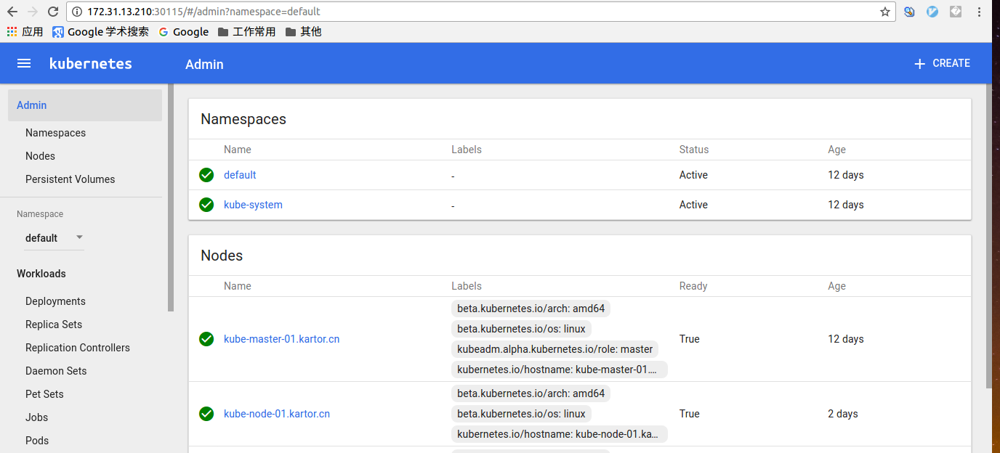

[TOC]


# 实验环境


172.31.13.210     kube-master-01.kartor.cn    centos 7 x64

172.31.13.211     kube-node-01.kartor.cn       centos 7 x64

172.31.13.213     kube-node-02.kartor.cn       centos 7 x64


# 基础准备工作


## 基础包安装


在各个节点上执行：

```sh

# yum update

# yum -y install bridge-utils vim ntpdate telnet

```


## 配置更新本地hosts文件 


在各个节点的`/etc/hosts`文件中增加如下内容：

```

172.31.13.210    kube-master-01.kartor.cn         kube-master-01

172.31.13.211    kube-node-01.kartor.cn            kube-node-01

172.31.13.213    kube-node-02.kartor.cn            kube-node-02

```


## 配置时间同步(chrony)

使用[chrony](https://chrony.tuxfamily.org/index.html)这个组件来实现集群中各个主机的时间同步，当然也可以使用ntpd服务。master节点作为时间同步服务器，node节点都以master主机的时间为准。


在各个节点采用以下方式安装并启动chrony：

```sh

[root@kube-master-01 ~]# yum -y install chrony

[root@kube-master-01 ~]# systemctl is-enabled chronyd.service

enabled

[root@kube-master-01 ~]# systemctl status chronyd.service

● chronyd.service - NTP client/server

   Loaded: loaded (/usr/lib/systemd/system/chronyd.service; enabled; vendor preset: enabled)

   Active: inactive (dead)

[root@kube-master-01 ~]# systemctl start chronyd.service

[root@kube-master-01 ~]# systemctl status chronyd.service

● chronyd.service - NTP client/server

   Loaded: loaded (/usr/lib/systemd/system/chronyd.service; enabled; vendor preset: enabled)

   Active: active (running) since Sat 2016-11-26 13:42:42 CST; 1s ago

  Process: 31794 ExecStartPost=/usr/libexec/chrony-helper update-daemon (code=exited, status=0/SUCCESS)

  Process: 31790 ExecStart=/usr/sbin/chronyd $OPTIONS (code=exited, status=0/SUCCESS)

 Main PID: 31792 (chronyd)

   Memory: 296.0K

   CGroup: /system.slice/chronyd.service

           └─31792 /usr/sbin/chronyd


Nov 26 13:42:42 kube-master-01.kartor.cn systemd[1]: Starting NTP client/server...

Nov 26 13:42:42 kube-master-01.kartor.cn chronyd[31792]: chronyd version 2.1.1 starting (+CMDMON +NTP +REFCLOCK +RTC +PRIVDROP +DEBUG +ASYNC...ECHASH)

Nov 26 13:42:42 kube-master-01.kartor.cn chronyd[31792]: Generated key 1

Nov 26 13:42:42 kube-master-01.kartor.cn systemd[1]: Started NTP client/server.

Hint: Some lines were ellipsized, use -l to show in full.

```

检查NTP的来源状态：

```sh

[root@kube-master-01 ~]# chronyc sourcestats

210 Number of sources = 4

Name/IP Address            NP  NR  Span  Frequency  Freq Skew  Offset  Std Dev

==============================================================================

dns2.synet.edu.cn           4   3   23m     +0.230     39.315    -50ms  1537us

120.25.115.19              19   9   22m     -5.644     12.829  +2558us  5116us

82.200.209.236             13   8   26m     -4.811      4.180    +21ms  1821us

news.neu.edu.cn            15  12   17m     +0.051     13.785  +4925ns  3982us

```

检查同步的详细状态信息：

```sh

[root@kube-master-01 ~]# chronyc sources -vv

210 Number of sources = 4

MS Name/IP address         Stratum Poll Reach LastRx Last sample

===============================================================================

^- dns2.synet.edu.cn             2   8   101   234    -49ms[  -50ms] +/-   77ms

^- 120.25.115.19                 2   8   377    42    +11ms[  +11ms] +/-   89ms

^- 82.200.209.236                2   7   357    99    +22ms[  +21ms] +/-  227ms

^* news.neu.edu.cn               2   7   377    44  -4890us[-5924us] +/-   32ms

[root@kube-master-01 ~]# date

Sat Nov 26 14:11:03 CST 2016

```


如果想把kube-master-01这个主机作为服务端提供给内部的其他主机作为时间服务器，则需要修改配置文件，启用allow指令：


```sh

[root@kube-master-01 ~]#   vim /etc/chrony.conf  #把allow启用，并开放允许接入的主机地址

......

# Allow NTP client access from local network.

allow 172.31/16

....

```
保存退出后重启服务：

```sh

[root@kube-master-01 ~]# systemctl start chronyd.service

```


配置node节点的时间服务器指向master节点：

```sh

[root@kube-node-01 ~]# vim /etc/chrony.conf

......

#server 0.centos.pool.ntp.org iburst

#server 1.centos.pool.ntp.org iburst

#server 2.centos.pool.ntp.org iburst

#server 3.centos.pool.ntp.org iburst

server kube-master-01 iburst

```

注释原有的server,增加内部的时间服务器地址，重启chronyd服务，查看同步状态：

```sh

[root@kube-node-01 ~]# systemctl restart chronyd.service

[root@kube-node-01 ~]# chronyc sources -vv

210 Number of sources = 1

MS Name/IP address         Stratum Poll Reach LastRx Last sample

===============================================================================

^? kube-master-01.kartor.cn      0   7     0   10y     +0ns[   +0ns] +/-    0ns

```

可以尝试把node节点的时间改成一个不正确的时间来验证时间同步是否在工作 。


## 防火墙与selinux处理


CentOS 7默认采用firewalld防火墙，对此防火墙不怎么熟悉，建议停用此防火墙，使用熟悉的(netfilter/iptables)。在**集群各个节点**上都执行以下命令关闭firewalld防火墙，并检查本地是否已安装iptables服务，如果没有需要安装：

```sh


[root@kube-master-01 kubernetes]# systemctl disable firewalld.service

[root@kube-master-01 kubernetes]# systemctl stop firewalld.service

[root@kube-node-02 ~]# rpm -qa iptables

iptables-1.4.21-16.el7.x86_64

[root@kube-node-02 ~]# iptables -v

iptables v1.4.21: no command specified

Try `iptables -h' or 'iptables --help' for more information.

```

至今不知CentOS7上的iptables怎么像以前老版本那样启动和关闭？


关闭selinux:

```sh

[root@kube-master-01 ~]# setenforce 0

[root@kube-master-01 ~]# vim /etc/selinux/config    # 把SELINUX修改为disabled

SELINUX=disabled

```


# kubernetes集群安装

kubernetes 1.4.4版本增加了kubeadm工具来帮助我们完成集群的搭建工作，此工具简化的集群的搭建，使集群的搭建工作简化到只需要两个命令即可完成，但在master节点的初始化操作时会连接google的服务器下载相应的镜像文件，所以在国内被的墙的情况下是安装不成功的，所以请自备一个稳定的vpn，或提前获得需要的镜像文件和rpm包。


## docker-engine安装


首先需要安装docker引擎，按照docker[官方文档](https://docs.docker.com/engine/installation/linux/centos/)在集群中各个节点上安装最新版本的docker-engine：

```sh

[root@kube-master-01 ~]# vim /etc/yum.repos.d/docker.repo    # 配置yum仓库

[dockerrepo]

name=Docker Repository

baseurl=https://yum.dockerproject.org/repo/main/centos/7/

enabled=1

gpgcheck=1

gpgkey=https://yum.dockerproject.org/gpg

```

```sh


[root@kube-master-01 ~]# yum -y install docker-engine   # 安装docker-engine


[root@kube-master-01 ~]# docker -v

Docker version 1.12.3, build 6b644ec

[root@kube-master-01 ~]# systemctl enable docker && systemctl start docker  

```

有时因网络原因安装docker-engine不成功，大概就是说连接不上相应的yum仓库或仓库认证有问题，此时需要把` /etc/yum.repos.d/docker.repo`文件中的`baseurl=https://yum.dockerproject.org/repo/main/centos/7/`修改成`baseurl=http://yum.dockerproject.org/repo/main/centos/7/`并且把`gpgcheck=1`修改成`gpgcheck=0`后再安装docker-engine就OK了。


修改docker启动参数使其能接入内部的私有registry:


```sh

root@kube-master-01 ~]# vim /usr/lib/systemd/system/docker.service   #在“ExecStart=/usr/bin/dockerd”增加了"--insecure-registry=172.16.250.1"


[Unit]

Description=Docker Application Container Engine

Documentation=https://docs.docker.com

After=network.target


[Service]

Type=notify

# the default is not to use systemd for cgroups because the delegate issues still

# exists and systemd currently does not support the cgroup feature set required

# for containers run by docker

ExecStart=/usr/bin/dockerd  --insecure-registry=172.16.250.1

ExecReload=/bin/kill -s HUP $MAINPID

# Having non-zero Limit*s causes performance problems due to accounting overhead

# in the kernel. We recommend using cgroups to do container-local accounting.

LimitNOFILE=infinity

LimitNPROC=infinity

LimitCORE=infinity

# Uncomment TasksMax if your systemd version supports it.

# Only systemd 226 and above support this version.

#TasksMax=infinity

TimeoutStartSec=0

# set delegate yes so that systemd does not reset the cgroups of docker containers

Delegate=yes

# kill only the docker process, not all processes in the cgroup

KillMode=process


[Install]

WantedBy=multi-user.target

```

重启服务：

```sh

root@kube-master-01 ~]# systemctl daemon-reload && systemctl restart docker.service

```


## kubelet、kubeadm、kubectl、kubernetes-cni组件安装


其中kubeadm是集群部署工具，kubernetes-cni是一个网络组件，对这个不了解。

以上四个组件需要在集群中各个节点都需要安装。

按照[官方文档](http://kubernetes.io/docs/getting-started-guides/kubeadm/)安装以上四个组件，这四个组件是放在google的服务器上的，这时就需要vpn了，操作如下：


```sh

[root@kube-master-01 ~]# vim /etc/yum.repos.d/kubernetes.repo


[kubernetes]

name=Kubernetes

baseurl=http://yum.kubernetes.io/repos/kubernetes-el7-x86_64

enabled=1

gpgcheck=1

repo_gpgcheck=1

gpgkey=https://packages.cloud.google.com/yum/doc/yum-key.gpg

       https://packages.cloud.google.com/yum/doc/rpm-package-key.gpg

```


```sh

[root@kube-master-01 ~]# yum install -y kubelet kubeadm kubectl kubernetes-cni

[root@kube-master-01 ~]# systemctl enable kubelet && systemctl start kubelet

```


其实此时kubelet这个服务并不能正常启动

```sh


[root@kube-master-01 ~]# systemctl status kubelet.service

● kubelet.service - Kubernetes Kubelet Server

   Loaded: loaded (/etc/systemd/system/kubelet.service; enabled; vendor preset: disabled)

  Drop-In: /etc/systemd/system/kubelet.service.d

           └─10-kubeadm.conf

   Active: activating (auto-restart) (Result: exit-code) since Thu 2016-11-17 17:03:24 CST; 7s ago

     Docs: https://github.com/kubernetes/kubernetes

  Process: 10380 ExecStart=/usr/bin/kubelet $KUBELET_KUBECONFIG_ARGS $KUBELET_SYSTEM_PODS_ARGS $KUBELET_NETWORK_ARGS $KUBELET_DNS_ARGS $KUBELET_EXTRA_ARGS (code=exited, status=1/FAILURE)

 Main PID: 10380 (code=exited, status=1/FAILURE)


Nov 17 17:03:24 kube-master-01.kartor.cn systemd[1]: kubelet.service: main process exited, code=exited, status=1/FAILURE

Nov 17 17:03:24kube-master-01.kartor.cn systemd[1]: Unit kubelet.service entered failed state.

Nov 17 17:03:24kube-master-01.kartor.cn systemd[1]: kubelet.service failed.

```

但是不启动这个服务，在后边node加入集群时就会报`kubectl`这个服务没有启动。


- master节点初始化操作


当节点是作为master时，需要使用以下命令把节点初始为master角色，如果docker的网络是计划用flannel来打通，那需要使用` --pod-network-cidr=10.244.0.0/16`这个参数，以下的操作只在master节点上：


```sh

[root@kube-master-01 ~]# kubeadm init  --api-advertise-addresses=172.31.13.210  --pod-network-cidr=10.244.0.0/16

Running pre-flight checks

<master/tokens> generated token: "e101af.3192be63d8db4d4a"

<master/pki> generated Certificate Authority key and certificate:

Issuer: CN=kubernetes | Subject: CN=kubernetes | CA: true

Not before: 2016-11-17 06:20:02 +0000 UTC Not After: 2026-11-15 06:20:02 +0000 UTC

Public: /etc/kubernetes/pki/ca-pub.pem

Private: /etc/kubernetes/pki/ca-key.pem

Cert: /etc/kubernetes/pki/ca.pem

<master/pki> generated API Server key and certificate:

Issuer: CN=kubernetes | Subject: CN=kube-apiserver | CA: false

Not before: 2016-11-17 06:20:02 +0000 UTC Not After: 2017-11-17 06:20:02 +0000 UTC

Alternate Names: [172.31.13.210 10.96.0.1 kubernetes kubernetes.default kubernetes.default.svc kubernetes.default.svc.cluster.local]

Public: /etc/kubernetes/pki/apiserver-pub.pem

Private: /etc/kubernetes/pki/apiserver-key.pem

Cert: /etc/kubernetes/pki/apiserver.pem

<master/pki> generated Service Account Signing keys:

Public: /etc/kubernetes/pki/sa-pub.pem

Private: /etc/kubernetes/pki/sa-key.pem

<master/pki> created keys and certificates in "/etc/kubernetes/pki"

<util/kubeconfig> created "/etc/kubernetes/kubelet.conf"

<util/kubeconfig> created "/etc/kubernetes/admin.conf"

<master/apiclient> created API client configuration

<master/apiclient> created API client, waiting for the control plane to become ready

<master/apiclient> all control plane components are healthy after 28.298047 seconds

<master/apiclient> waiting for at least one node to register and become ready

<master/apiclient> first node is ready after 2.002058 seconds

<master/apiclient> attempting a test deployment

<master/apiclient> test deployment succeeded

<master/discovery> created essential addon: kube-discovery, waiting for it to become ready

<master/discovery> kube-discovery is ready after 5.002174 seconds

<master/addons> created essential addon: kube-proxy

<master/addons> created essential addon: kube-dns

Kubernetes master initialised successfully!

You can now join any number of machines by running the following on each node:

kubeadm join --token=e101af.3192be63d8db4d4a 172.31.13.210

```


初始化的过程中会去google的服务器下载相应的镜像文件，所以如果没有vpn，且本地又没有相应的镜像，那就一直为卡在这里，当正常下载好相应的镜像后会启动一些pods，最后打印出`kubeadm join --token=e101af.3192be63d8db4d4a 172.31.13.210`，这就是node节点要想加入集群所执行的唯一一条命令。其中最重要的就是token值，在加入node是需要，如果忘记了可以用在master节点上执行`kubectl -n kube-system get secret clusterinfo -o yaml | grep token-map | awk '{print $2}' | base64 -d | sed "s|{||g;s|}||g;s|:|.|g;s/\"//g;" | xargs echo

` 命令来查询token值。


查询master初始化后运行的pods，这些pods默认运行在`kube-system`这个命名空间：


```sh

[root@kube-master-01 ~]# kubectl get pods --all-namespaces

NAMESPACE     NAME                                               READY     STATUS              RESTARTS   AGE

kube-system   dummy-2088944543-7shj0                             1/1       Running             0          47m

kube-system   etcd-kube-master-01.kartor.cn                      1/1       Running             0          47m

kube-system   kube-apiserver-kube-master-01.kartor.cn            1/1       Running             0          47m

kube-system   kube-controller-manager-kube-master-01.kartor.cn   1/1       Running             0          47m

kube-system   kube-discovery-1150918428-0aqpz                    1/1       Running             0          47m

kube-system   kube-dns-654381707-k6tni                           0/3       ContainerCreating   0          47m

kube-system   kube-proxy-2x8sj                                   1/1       Running             0          47m

kube-system   kube-scheduler-kube-master-01.kartor.cn            1/1       Running             0          47m

```


其中与dns相关的`kube-dns-654381707-k6tni`这个pods没有正常运行，这是因为我们必须要启用一个网络插件，我们这里就是flannel，只有部署好flannel类似这样的网络插件后`kube-dns-*****`才能Running起来。


## flannel组件安装


到“https://github.com/coreos/flannel/blob/master/Documentation/kube-flannel.yml”下载此yaml文件保存到本地

```sh

[root@kube-master-01 kubernetes]# ls

kube-flannel.yaml

[root@kube-master-01 kubernetes]# kubectl apply -f kube-flannel.yaml


configmap "kube-flannel-cfg" created

daemonset "kube-flannel-ds" created

[root@kube-master-01 kubernetes]# kubectl get pods --all-namespaces

NAMESPACE     NAME                                               READY     STATUS              RESTARTS   AGE

kube-system   dummy-2088944543-7shj0                             1/1       Running             0          2h

kube-system   etcd-kube-master-01.kartor.cn                      1/1       Running             0          2h

kube-system   kube-apiserver-kube-master-01.kartor.cn            1/1       Running             0          2h

kube-system   kube-controller-manager-kube-master-01.kartor.cn   1/1       Running             0          2h

kube-system   kube-discovery-1150918428-0aqpz                    1/1       Running             0          2h

kube-system   kube-dns-654381707-k6tni                           0/3       ContainerCreating   0          2h

kube-system   kube-flannel-ds-ruwpm                              0/2       ContainerCreating   0          38s

kube-system   kube-proxy-2x8sj                                   1/1       Running             0          2h

kube-system   kube-scheduler-kube-master-01.kartor.cn            1/1       Running             0          2h

```

等一会再观察

```sh

[root@kube-master-01 kubernetes]# kubectl get pods --all-namespaces

NAMESPACE     NAME                                               READY     STATUS    RESTARTS   AGE

kube-system   dummy-2088944543-7shj0                             1/1       Running   0          2h

kube-system   etcd-kube-master-01.kartor.cn                      1/1       Running   0          2h

kube-system   kube-apiserver-kube-master-01.kartor.cn            1/1       Running   0          2h

kube-system   kube-controller-manager-kube-master-01.kartor.cn   1/1       Running   0          2h

kube-system   kube-discovery-1150918428-0aqpz                    1/1       Running   0          2h

kube-system   kube-dns-654381707-k6tni                           2/3       Running   0          2h

kube-system   kube-flannel-ds-ruwpm                              2/2       Running   0          1m

kube-system   kube-proxy-2x8sj                                   1/1       Running   0          2h

kube-system   kube-scheduler-kube-master-01.kartor.cn            1/1       Running   0          2h

```

flannel与dns相关的pod都正常运行起来，此时master节点就完成了所有操作。


## node节点加入集群


node节点同样需要连接vpn，因为node节点也需要下载相应的镜像文件：


[root@kube-node-01 kubernetes]# kubeadm join --token=e101af.3192be63d8db4d4a 172.31.13.210

Running pre-flight checks

preflight check errors:

    /etc/kubernetes is not empty

```

会报`   /etc/kubernetes is not empty`，这也是一个bug，直接删除此目录，再join即可：

```sh

[root@kube-node-01 kubernetes]# kubeadm join --token=e101af.3192be63d8db4d4a 172.31.13.210

Running pre-flight checks

<util/tokens> validating provided token

<node/discovery> created cluster info discovery client, requesting info from "http://172.31.13.210:9898/cluster-info/v1/?token-id=e101af"

<node/discovery> cluster info object received, verifying signature using given token

<node/discovery> cluster info signature and contents are valid, will use API endpoints [https://172.31.13.210:6443]

<node/bootstrap> trying to connect to endpoint https://172.31.13.210:6443

<node/bootstrap> detected server version v1.4.4

<node/bootstrap> successfully established connection with endpoint https://172.31.13.210:6443

<node/csr> created API client to obtain unique certificate for this node, generating keys and certificate signing request

<node/csr> received signed certificate from the API server:

Issuer: CN=kubernetes | Subject: CN=system:node:kube-node-01.kartor.cn | CA: false

Not before: 2016-11-17 08:57:00 +0000 UTC Not After: 2017-11-17 08:57:00 +0000 UTC

<node/csr> generating kubelet configuration

<util/kubeconfig> created "/etc/kubernetes/kubelet.conf"


Node join complete:

* Certificate signing request sent to master and response

  received.

* Kubelet informed of new secure connection details.


Run 'kubectl get nodes' on the master to see this machine join.

```
已加入成功，回到master节点上可以看到已注册上来的节点信息：

```sh

[root@kube-master-01 kubernetes]# kubectl get nodes

NAME                       STATUS    AGE

kube-master-01.kartor.cn   Ready     2h

kube-node-01.kartor.cn     Ready     44s

```

同样的操作把另外的节点也加入进来：

```sh

[root@kube-master-01 kubernetes]# kubectl get nodes

NAME                       STATUS    AGE

kube-master-01.kartor.cn   Ready     2h

kube-node-01.kartor.cn     Ready     3m

kube-node-02.kartor.cn     Ready     4s

```


## 安装dashboard


参照[官方文档](http://kubernetes.io/docs/user-guide/ui/)来部署， dashboard也是需要连接google服务下载相应的镜像，如果本地没有此镜像，则需要先连接vpn。


```sh

[root@kube-master-01 kubernetes]# wget https://rawgit.com/kubernetes/dashboard/master/src/deploy/kubernetes-dashboard.yaml

[root@kube-master-01 kubernetes]# ls

kube-flannel.yml  kubernetes-dashboard.yaml

```

这里有一个小坑，在`kubernetes-dashboard.yaml`文件中对dashboard镜像的拉取策略是`imagePullPolicy: Always`，所以，如果你是先把dashboard镜像下载到本地，在不开启vpn的情况下，dashboard是不能成功部署的。其实这也不符合逻辑，所以我们修改kubernetes-dashboard.yaml文件，把`magePullPolicy: Always`修改成`imagePullPolicy: IfNotPresent`，表示当本地没有镜像时才下载镜像。


导入yaml文件：


```sh

[root@kube-master-01 kubernetes]# kubectl create -f  kubernetes-dashboard.yaml

[root@kube-master-01 kubernetes]# docker ps -a | grep dashboard

336f5be3c8fe        gcr.io/google_containers/kubernetes-dashboard-amd64:v1.4.2      "/dashboard --port=90"   2 days ago          Up 2 days                                       k8s_kubernetes-dashboard.9169daee_kubernetes-dashboard-3109394916-da9iw_kube-system_946ca4c9-b16a-11e6-b2ca-006000c71e31_09e8ca55

3e4d5496ca08        gcr.io/google_containers/pause-amd64:3.0                        "/pause"                 2 days ago          Up 2 days                                       k8s_POD.d8dbe16c_kubernetes-dashboard-3109394916-da9iw_kube-system_946ca4c9-b16a-11e6-b2ca-006000c71e31_641efabb

```


查看dashboard监听的端口：

```sh

[root@kube-master-01 kubernetes]# kubectl describe svc kubernetes-dashboard --namespace=kube-system

Name:           kubernetes-dashboard

Namespace:      kube-system

Labels:         app=kubernetes-dashboard

Selector:       app=kubernetes-dashboard

Type:           NodePort

IP:         10.101.174.231

Port:           <unset> 80/TCP

NodePort:       <unset> 30115/TCP

Endpoints:      10.244.0.5:9090

Session Affinity:   None

```


dashboard监听在30115端口上，可以通过浏览器进行访问：




据说，kubernetes 1.4.4放出的dashboard能取代90%的命令操作。


# 无vpn安装kubernetes集群


##  kubelet、kubeadm、kubectl、kubernetes-cni组件rpm下载


在CentOS7系统下可以采用一些手段把这几个组件在连接vpn的状态下下载下来，比如安装`yum-utils`这个yum的扩展插件，再使用`yumdownloader`命令把这几个包下载到本地，直接安装这几个rpm包即可。

下载后的rpm包类似如下：

```sh

[root@kube-master-01 kubeadm_yumdown]# ls

04fc07d4526b18dbe8c5af04cc314fe9d837f864748d086d6cd9382fe1028638-kubeadm-1.5.0-1.alpha.2.380.85fe0f1aadf91e.0.x86_64.rpm

0f79053882493cac2acfb314e686540025094dea54d239e08d8f30a4b116e000-kubernetes-cni-0.3.0.1-1.07a8a2.x86_64.rpm

27c5d85464edb23541dc28a4df2892eaac82f8f4e2440b8e8d0f7508a5a9817e-kubelet-1.4.4-1.x86_64.rpm

ca412a6a073b9e78c659cff0ca3b075e231c637bfb2cc2cc06d0231b122b996c-kubectl-1.4.4-1.x86_64.rpm

```

## 镜像提前拉取


上边把几个所需要的rpm包安装后就要初始化master了，如果本地没有相应的镜像文件，那会直接去google的服务下载，所以需要把之前通过vpn下载到本地的镜像保存好，以备重新搭建集群环境，我这里把这些镜像上传本地的仓库里，再需要搭建集群时下载后再重新命名即可，这里整理成了shell脚本完成拉取镜像、重名称、删除等操作。


- master 节点提前下载镜像

```sh

#!/bin/bash

#Author: Neal

#Email: 419775240@qq.com


images=(kube-apiserver-amd64:v1.4.4

        kube-controller-manager-amd64:v1.4.4

        kube-proxy-amd64:v1.4.4

        kube-scheduler-amd64:v1.4.4

        kube-discovery-amd64:1.0

        pause-amd64:3.0

        etcd-amd64:2.2.5

        exechealthz-amd64:1.1

        kubernetes-dashboard-amd64:v1.4.2

        kubedns-amd64:1.7

        kube-dnsmasq-amd64:1.3

)


registry=172.16.250.1/kubernetes


for imageName in ${images[@]};do

    docker pull $registry/$imageName

    docker tag $registry/$imageName gcr.io/google_containers/$imageName

    docker rmi $registry/$imageName

done


docker pull $registry/flannel-git:v0.6.1-28-g5dde68d-amd64

docker tag $registry/flannel-git:v0.6.1-28-g5dde68d-amd64 quay.io/coreos/flannel-git:v0.6.1-28-g5dde68d-amd64

docker rmi $registry/flannel-git:v0.6.1-28-g5dde68d-amd64

```


- node节点提前下载镜像


```sh

#!/bin/bash

#Author: Neal

#Email: 419775240@qq.com


images=(

        kube-proxy-amd64:v1.4.4

        pause-amd64:3.0

        kubernetes-dashboard-amd64:v1.4.2

)


registry=172.16.250.1/kubernetes


for imageName in ${images[@]};do

    docker pull $registry/$imageName

    docker tag $registry/$imageName gcr.io/google_containers/$imageName

    docker rmi $registry/$imageName

done

docker pull $registry/flannel-git:v0.6.1-28-g5dde68d-amd64

docker tag $registry/flannel-git:v0.6.1-28-g5dde68d-amd64 quay.io/coreos/flannel-git:v0.6.1-28-g5dde68d-amd64

docker rmi $registry/flannel-git:v0.6.1-28-g5dde68d-amd64

```
