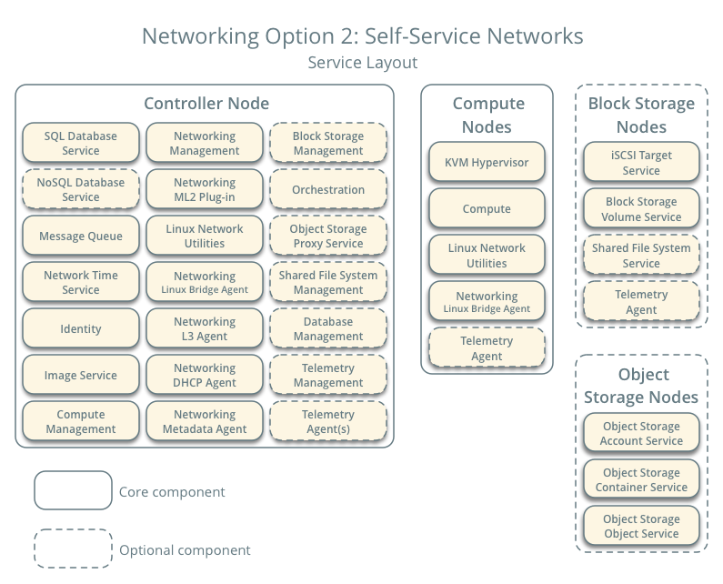

[TOC]

# 简介

[官网](www.openstack.org)

- 按需按量来交互资源、计算能力；

- 资源池(cpu, 存储，网络，内存)

- 交付模式

涉及技术知识点：

- 虚拟化管理 程序hypversior

   - KVM, Xen, ESX, HyperV, VBox

- 虚拟化管理接口

   - Libvirt, XenAPI, vCenter API, HyperV WMI API

- RESTFULL API

- 消息队列

- 分布式存储

- 网络虚拟化

   - openvswitch, netns, SDN, NFV

# 各组件间关系

- Horizon 是一个web ui

- Nova   提供计算资源的完整生命周期管理

- Neutron   提供网络连接的服务

- Swift  分布式存储，

- Cinder  提供块存储

- Keystone   提供认证及授权服务

- Glance    存储虚拟机镜像

- Ceilometer  监控和计量云使用情况

- Heat   提供编排服务

- Trove  提供高可靠，可扩充的DBaas功能

- Ironic   提供祼金属基础设施服务

- Sahara    在openstack上部署Hadoop大数据处理

- Murano   提供模板方式来部署指定的环境

- Magnum   openstack中创建基于容 器的编排引擎

# vpn连接方式

uuu加速器

天行vpn

www.vpngate.net

#  准备工作

控制节点:    2core  4GB  60GB    X  1

计算节点：2core   4GB   80GB

存储节点：2core   2GB   100GB

各节点所需要安装服务：

网络规划：

网卡1：公共流量，管理浏览，各组件间通信

网卡2：私有网络，云主机专属性

网卡3：存储网络

