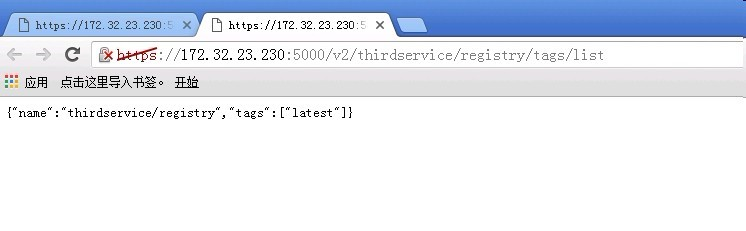

## 基于tls的registry

### 生成证书

没有公认的证书，只好自建一个CA，并为registry颁发一个证书。

自己CA及证书颁发脚本如下：

```sh
#!/bin/bash
#Program: ca.sh
#Author: Neal
#E_mail: 419775240@qq.com
#Date: 2016-4-30
#platform: Debian 8 x86_64
#Version 1.0

# SUBJECT为CA服务的机构信息
SUBJECT="/C=CN/ST=ChongQing/L=YuBei/O=SJKJ/OU=CA"
# SUBJECT_REQUEST为需要申请证书的机构信息
SUBJECT_REQUEST="/C=CN/ST=ChongQing/L=YuBei/O=SJKJ/OU=OP"
#证书存放目录
SSL_DIR="/etc/docker/certs"

#apt-get -y install openssl  依赖包
## 自建CA
read -p "Enter your CA domain [www.example.com]: " DOMAIN
mkdir -pv /etc/ssl/demoCA/{private,newcerts} > /dev/null
cd /etc/ssl
# 生成密钥对
(umask 077;openssl genrsa -out ./demoCA/private/cakey.pem 2048)
# 生成自签证书
#手动输入ca机构信息时输入命令：openssl req -new -x509 -key ./demoCA/private/cakey.pem -out ./demoCA/cacert.pem -days 3650
openssl req -new -subj "${SUBJECT}/CN=$DOMAIN" -x509 -key ./demoCA/private/cakey.pem -out ./demoCA/cacert.pem -days 3650
result=$?
touch ./demoCA/index.txt
echo 01 > ./demoCA/serial
[ $result == 0 ] && echo -e "\033[33mCertificate services is created...\033[0m" || echo -e '\033[33mCertificate services is NOT created...\033[0m'
#自建CA完成


# 开始为你的域名申请证书
read -p "Enter your domain [www.example.com]: " DOMAIN_GITLAB
[ ! -d ${SSL_DIR} ] && mkdir -p ${SSL_DIR}
cd ${SSL_DIR}
# 生成私钥
(umask 077;openssl genrsa -out ${DOMAIN_GITLAB}.key 1024)
# 生成证书签署请求
openssl req -new -subj "$SUBJECT_REQUEST/CN=$DOMAIN_GITLAB" -key ${DOMAIN_GITLAB}.key -out ${DOMAIN_GITLAB}.csr
# CA签署证书
cd /etc/ssl
openssl ca -in ${SSL_DIR}/${DOMAIN_GITLAB}.csr -out ${SSL_DIR}/${DOMAIN_GITLAB}.crt -days 3650
# 更改目录权限
chmod 700 ${SSL_DIR}
```

如果主机没有安装`openssl`，那先要运行`apt-get install openssl`进行安装，运行上边的脚本会要求输入registry的域名，这里假设为`registry.docker.kartor.cn`, 上边的脚本运行后在`/etc/docker/certs`目录下会生成你为registry规划域名的三个文件，类似如下：

```sh
root@registry-01:/etc/docker/certs# ls
registry.docker.kartor.cn.crt  registry.docker.kartor.cn.csr  registry.docker.kartor.cn.key
```

- `registry.docker.kartor.cn.crt`是registry所用的证书
- `registry.docker.kartor.cn.key`是registry的密钥文件
- `registry.docker.kartor.cn.csr`这是证书签署请求时生成的文件，可删除

### 基于registry镜像启动注册服务

因registry镜像默认是把用户push上来的镜像存放在`/var/lib/registry`下，当容器销毁后用户push的镜像数据是会丢失的，所有需要在宿主机上规划一个目录来存放这些镜像文件，这里以`/opt/docker-images`目录为例。

```sh
root@registry-01:/etc/docker# docker run -td -p 5000:5000 --restart=always --name myregistry \
-v /etc/docker/certs:/certs \
-v /opt/docker-images:/var/lib/registry \
-e REGISTRY_HTTP_TLS_CERTIFICATE=/certs/registry.docker.kartor.cn.crt \
-e REGISTRY_HTTP_TLS_KEY=/certs/registry.docker.kartor.cn.key \
registry:latest
```

运行此命令后，docker会自动下载`registry`镜像，下载完成后启动一个名为`myregistry`的容器。

```sh
root@registry-01:~# docker ps -a
CONTAINER ID        IMAGE               COMMAND                  CREATED             STATUS              PORTS                    NAMES
6675e81d87b7        c6c14b3960bd        "/entrypoint.sh /etc/"   3 hours ago         Up 29 minutes       0.0.0.0:5000->5000/tcp   myregistry
```

在本机测试一下registry是否可用，如下：

```sh
root@registry-01:~# curl -k -XGET https://localhost:5000/v2/
{}root@registry-01:~#
```
返回了一组`{}`，表示注册服务已正常工作。

## 测试

因`registry.docker.kartor.cn`不是一个合法的域名，所以需要在本地hosts里增加相应的映射关系，在`/etc/hosts`中增加以下条目：

```sh
172.32.23.230    registry.docker.kartor.cn
```

现在把本地的registry这个镜像push到我们的注册服务，如下操作：

```sh
root@registry-01:/etc/docker# docker images
REPOSITORY          TAG                 IMAGE ID            CREATED             SIZE
registry            latest              c6c14b3960bd        3 weeks ago         33.31 MB
root@registry-01:/etc/docker# docker tag registry:latest registry.docker.kartor.cn:5000/thirdservice/registry:latest
root@registry-01:/etc/docker# docker push registry.docker.kartor.cn:5000/thirdservice/registry:latest
The push refers to a repository [registry.docker.kartor.cn:5000/thirdservice/registry]
Get https://registry.docker.kartor.cn:5000/v1/_ping: x509: certificate signed by unknown authority
```

push失败了，证书认证没有通过，所以需要配置证书，我的理解是需要访问`registry.docker.kartor.cn`这个域名的证书，即是`/etc/docker/certs/registry.docker.kartor.cn.crt`这个文件，但官方认为自签的证书也是不合法的，
所以即使配置好证书也是不能push成功。所以当是自建CA颁发的证书时，所以在要上传镜像端需要配置CA的证书，如下操作：

```sh
root@registry-01:/etc/docker# mkdir -p certs.d/registry.docker.kartor.cn:5000
root@registry-01:/etc/docker# cp /etc/ssl/demoCA/cacert.pem ./certs.d/registry.docker.kartor.cn:5000
root@registry-01:/etc/docker# systemctl restart docker.service
```

再尝试推送一次：

```sh
root@registry-01:~# docker push registry.docker.kartor.cn:5000/thirdservice/registry:latest
The push refers to a repository [registry.docker.kartor.cn:5000/thirdservice/registry]
Get https://registry.docker.kartor.cn:5000/v1/_ping: x509: certificate signed by unknown authority
```

push还是失败，经查找资料后发现CA证书的名字必须为`ca.crt`：

```sh
root@registry-01:/etc/docker/certs.d/registry.docker.kartor.cn:5000# mv cacert.pem ca.crt
root@registry-01:/etc/docker/certs.d/registry.docker.kartor.cn:5000# ls
ca.crt
root@registry-01:/etc/docker/certs.d/registry.docker.kartor.cn:5000# systemctl restart docker.service
```

再推送一次：

```sh
root@registry-01:~# docker push registry.docker.kartor.cn:5000/thirdservice/registry:latest
The push refers to a repository [registry.docker.kartor.cn:5000/thirdservice/registry]
3bb5bc5ad373: Pushed
35039a507f7a: Pushed
d00444e19d65: Pushed
aa3a31ee27f3: Pushed
4fe15f8d0ae6: Pushed
latest: digest: sha256:51d8869caea35f58dd6a2309423ec5382f19c4e649b5d2c0e3898493f42289d6 size: 1363
```

推送成功，可通过registry的API接口查询：

```sh
root@registry-01:~# curl -k -XGET https://registry.docker.kartor.cn:5000/v2/_catalog
{"repositories":["thirdservice/registry"]}
root@registry-01:~# curl -k -XGET https://registry.docker.kartor.cn:5000/v2/thirdservice/registry/tags/list
{"name":"thirdservice/registry","tags":["latest"]}
```

小结：

通过自建CA来为registry颁发证书所搭建的registry，需要在推送端安装证书，且这个证书是CA的证书，不是为registry颁发的那个证书，
且证书路径必须为`/etc/docker/certs.d/registry.docker.kartor.cn:5000/ca.crt`，其中的`registry.docker.kartor.cn:5000`根据实际情况进行更改，但证书的名称必须为`ca.crt`。

如果在其他节点进行镜像的推送操作呢？也是一样需要安装CA的证书，不知道如果有一个公认的证书是如何配置？在另一个节点上测试如下：

```sh
root@gdcp-01:/etc/docker# pwd
/etc/docker
root@gdcp-01:/etc/docker# tree certs.d
certs.d
└── registry.docker.kartor.cn:5000
    └── ca.crt

1 directory, 1 file
root@gdcp-01:/etc/docker/certs.d# systemctl restart docker.service
root@gdcp-01:/etc/docker/certs.d# docker pull registry.docker.kartor.cn:5000/thirdservice/registry:latest
latest: Pulling from thirdservice/registry
e110a4a17941: Pull complete
2ee5ed28ffa7: Pull complete
d1562c23a8aa: Pull complete
06ba8e23299f: Pull complete
802d2a9c64e8: Pull complete
Digest: sha256:51d8869caea35f58dd6a2309423ec5382f19c4e649b5d2c0e3898493f42289d6
Status: Downloaded newer image for registry.docker.kartor.cn:5000/thirdservice/registry:latest
root@gdcp-01:/etc/docker# docker images
REPOSITORY                                             TAG                 IMAGE ID            CREATED             SIZE
tomcat                                                 latest              a48852c0fc95        8 days ago          357.4 MB
registry.docker.kartor.cn:5000/thirdservice/registry   latest              c6c14b3960bd        3 weeks ago         33.31 MB
```

## 限制访问

基于自建CA后颁发证书的访问方式只有用户拥有CA的证书时才能pull和push操作，但是通过registry v2的API接口可以查询注册服务内各仓库的信息，通过浏览器访问`https://172.32.23.230:5000/v2/_catalog`
可以得到注册服务中的信息，如下:




这些信息应该做一下限制，registry提供了一个非常简单的基本认证功能，前提是registry已是基于TLS方式访问。操作如下：

```sh
root@registry-01:/etc/docker/certs# pwd
/etc/docker/certs
root@registry-01:/etc/docker/certs# mkdir auth
root@registry-01:/etc/docker/certs# docker run --entrypoint htpasswd registry:latest -Bbn testuser testpassword > auth/htpasswd
root@registry-01:/etc/docker# docker stop myregistry
myregistry
root@registry-01:/etc/docker# docker run -td -p 5000:5000 --restart=always --name myregistry_auth \
-v /etc/docker/certs:/certs \
-v /opt/docker-images:/var/lib/registry \
-e "REGISTRY_AUTH=htpasswd" \
-e "REGISTRY_AUTH_HTPASSWD_REALM=Registry Realm" \
-e REGISTRY_AUTH_HTPASSWD_PATH=/certs/auth/htpasswd \
-e REGISTRY_HTTP_TLS_CERTIFICATE=/certs/registry.docker.kartor.cn.crt \
-e REGISTRY_HTTP_TLS_KEY=/certs/registry.docker.kartor.cn.key \
registry:latest
5b127856193eba11b5bf79d19833955afd35dd897fa5a96c90e6da557d926150

root@registry-01:/etc/docker/certs# docker ps -a
CONTAINER ID        IMAGE               COMMAND                  CREATED             STATUS                      PORTS                    NAMES
20d6153e97a8        registry:latest     "/entrypoint.sh /etc/"   8 seconds ago       Up 7 seconds                0.0.0.0:5000->5000/tcp   myregistry_auth
6675e81d87b7        c6c14b3960bd        "/entrypoint.sh /etc/"   27 hours ago        Exited (2) 34 minutes ago                            myregistry
```

*注意*

```sh
docker run --entrypoint htpasswd registry:latest -Bbn testuser testpassword > auth/htpasswd
```

这个命令会启动一个容器，得到密码后把此容器删除即可。


再来访问一下registry的API接口试试：


输入密码之后才能查看：


在之前另一个安装了CA证书的主机上试着push一个镜像：

```sh
root@gdcp-01:/etc/docker# docker images
REPOSITORY                                             TAG                 IMAGE ID            CREATED             SIZE
tomcat                                                 latest              a48852c0fc95        8 days ago          357.4 MB
registry.docker.kartor.cn:5000/thirdservice/registry   latest              c6c14b3960bd        3 weeks ago         33.31 MB
root@gdcp-01:/etc/docker# docker tag tomcat:latest registry.docker.kartor.cn:5000/test/tomcat:latest
root@gdcp-01:/etc/docker# docker push registry.docker.kartor.cn:5000/test/tomcat:latest
The push refers to a repository [registry.docker.kartor.cn:5000/test/tomcat]

e433cc54cfbc: Preparing
8a3e25fabd85: Preparing
1c900245f510: Preparing
9a329420f9ba: Preparing
d6895f7becf9: Waiting
903bf3d7e2ff: Waiting
61f50980a4b2: Waiting
b5412699bc1b: Waiting
66d8e5ee400c: Waiting
2f71b45e4e25: Waiting
no basic auth credentials
```

没有成功，没有基本的认证。

```sh
root@gdcp-01:/etc/docker# docker login registry.docker.kartor.cn:5000
Username: testuser
Password:
Login Succeeded
root@gdcp-01:/etc/docker# docker push registry.docker.kartor.cn:5000/test/tomcat:latest
The push refers to a repository [registry.docker.kartor.cn:5000/test/tomcat]
e433cc54cfbc: Pushed
8a3e25fabd85: Pushed
1c900245f510: Pushed
9a329420f9ba: Pushed
615046ded065: Pushed
d6895f7becf9: Pushed
903bf3d7e2ff: Pushed
61f50980a4b2: Pushed
b5412699bc1b: Pushed
66d8e5ee400c: Pushed
2f71b45e4e25: Pushed
latest: digest: sha256:4b39c52437294a77e3035bd5fcfb71c54758065f58c5f9a088364c1e05ec549c size: 2624
root@gdcp-01:/etc/docker#
```

登陆后push成功。再查看API接口，两个仓库都可查询到：

```sh
root@gdcp-01:/etc/docker# curl -k -XGET --user testuser:testpassword https://registry.docker.kartor.cn:5000/v2/_catalog
{"repositories":["test/tomcat","thirdservice/registry"]}
```


[*参考*]

http://www.lsproc.com/post/docker-faq/#toc_17

http://tonybai.com/2016/02/26/deploy-a-private-docker-registry/

https://docs.docker.com/registry/spec/api/

https://docs.docker.com/registry/deploying/
