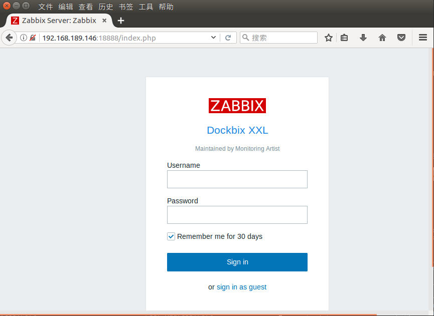
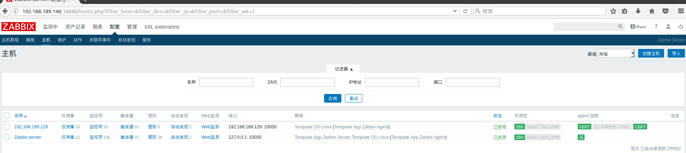

# docker实现zabbix server环境搭建

## 写在前面

zabbix server环境需要数据库，webserver，zabbix server相应的php程序和php环境这四个主要部件。数据库一般采用mysql或mariadb，webserver一般使用apache或nginx，php使用相应的版本就可以了。针对数据库有相应的docker镜像，webserver、zabbix server程序和php环境也有相应的docker镜像。如此，只要两个docker镜像，就能搭建起zabbix server的环境。

## docker engine及compose安装

实验环境为Centos 7操作系统，docker engine及compose的安装可以用以下shell脚本实现。

```sh
#!/bin/bash
#platform: Centos 7

#update
yum -y update

#uninstall old versions
yum remove docker docker-common docker-selinux docker-engine

#Install required packages
yum install -y yum-utils device-mapper-persistent-data lvm2

#add stable repository
yum-config-manager --add-repo https://download.docker.com/linux/centos/docker-ce.repo

#install docker-ce
yum install -y docker-ce

#start docker engine
systemctl start docker
systemctl enable docker

#print version information
docker version

#install docker compose
curl -L https://github.com/docker/compose/releases/download/1.19.0/docker-compose-`uname -s`-`uname -m` -o /usr/local/bin/docker-compose
chmod +x /usr/local/bin/docker-compose
docker-compose --version
```

## 修改images保存路径

因某些原因可能会修改docker默认的镜像保存路径，默认时为`/var/lib/docker`。

```sh
#停止socker
[root@centos7 ~]# systemctl stop docker
#备份
[root@centos7 ~]# tar -zcC /var/lib docker > /tmp/var_lib_docker-backup-$(date +%s).tar.gz
#移动默认目录到指定目录，并创建软链接
[root@centos7 ~]# mv /var/lib/docker /home/
[root@centos7 ~]# ln -s /home/docker /var/lib/docker
#启动docker
[root@centos7 ~]# systemctl start docker
```

## 准备mariadb镜像并运行相应容器

```sh
[root@centos7 ~]# docker pull mariadb
[root@centos7 ~]# docker images
REPOSITORY          TAG                 IMAGE ID            CREATED             SIZE
mariadb             latest              e1dd445713ae        8 days ago          396MB

[root@centos7 mariadb_compose]# pwd
/root/zabbix_server/mariadb_compose
[root@centos7 mariadb_compose]# ll
总用量 8
-rw-r--r--. 1 root root 254 二月 26 18:04 docker-compose.yml
-rw-r--r--. 1 root root  45 二月 26 18:19 Dockerfile
drwxr-xr-x. 4 root root  94 二月 26 18:05 mysql
[root@centos7 mariadb_compose]# tree mysql
mysql
├── conf.d
│   ├── docker.cnf
│   ├── mariadb.cnf
│   └── mysqld_safe_syslog.cnf
├── debian.cnf
├── debian-start
├── mariadb.conf.d
└── my.cnf

2 directories, 6 files
```

mysql目录是以mariadb镜像运行的容器中`/etc/mysql`这个目录，最主要是数据库相关的配置文件，把此目录单独提取出来是为了在修改数据库的配置文件后好重新构建新的镜像并运行新配置的数据库容器。

```sh
[root@centos7 mariadb_compose]# cat Dockerfile 
FROM mariadb:latest
COPY ./mysql /etc/mysql

[root@centos7 mariadb_compose]# cat docker-compose.yml 
version: '3'
services:
  db:
    build: .
    container_name: mariadb_server
    network_mode: "bridge"
    restart: always
    ports:
      - "3306:3306"
    volumes:
      - ./mysqldata:/var/lib/mysql
    environment:
      MYSQL_ROOT_PASSWORD: 123456
```

根据Dockerfile构建镜像，并根据docker compose定义运行相应的容器。

```sh
[root@centos7 mariadb_compose]# docker-compose up 
Building db
Step 1/2 : FROM mariadb:latest
 ---> e1dd445713ae
Step 2/2 : COPY ./mysql /etc/mysql
 ---> 2c38c4bc1d14
Successfully built 2c38c4bc1d14
Successfully tagged mariadbcompose_db:latest
WARNING: Image for service db was built because it did not already exist. To rebuild this image you must use `docker-compose build` or `docker-compose up --build`.
Creating mariadb_server ... done
Attaching to mariadb_server
mariadb_server | Initializing database
mariadb_server | 
mariadb_server | PLEASE REMEMBER TO SET A PASSWORD FOR THE MariaDB root USER !
mariadb_server | To do so, start the server, then issue the following commands:
mariadb_server | 
mariadb_server | '/usr/bin/mysqladmin' -u root password 'new-password'
mariadb_server | '/usr/bin/mysqladmin' -u root -h  password 'new-password'
mariadb_server | 
mariadb_server | Alternatively you can run:
mariadb_server | '/usr/bin/mysql_secure_installation'
mariadb_server | 
mariadb_server | which will also give you the option of removing the test
mariadb_server | databases and anonymous user created by default.  This is
mariadb_server | strongly recommended for production servers.
mariadb_server | 
mariadb_server | See the MariaDB Knowledgebase at http://mariadb.com/kb or the
mariadb_server | MySQL manual for more instructions.
mariadb_server | 
mariadb_server | Please report any problems at http://mariadb.org/jira
mariadb_server | 
mariadb_server | The latest information about MariaDB is available at http://mariadb.org/.
mariadb_server | You can find additional information about the MySQL part at:
mariadb_server | http://dev.mysql.com
mariadb_server | Consider joining MariaDB's strong and vibrant community:
mariadb_server | https://mariadb.org/get-involved/
mariadb_server | 
mariadb_server | Database initialized
mariadb_server | MySQL init process in progress...
mariadb_server | 2018-02-27  3:12:19 139755673970560 [Note] mysqld (mysqld 10.2.13-MariaDB-10.2.13+maria~jessie) starting as process 98 ...
mariadb_server | 2018-02-27  3:12:19 139755673970560 [Note] InnoDB: Mutexes and rw_locks use GCC atomic builtins
mariadb_server | 2018-02-27  3:12:19 139755673970560 [Note] InnoDB: Uses event mutexes
mariadb_server | 2018-02-27  3:12:19 139755673970560 [Note] InnoDB: Compressed tables use zlib 1.2.8
mariadb_server | 2018-02-27  3:12:19 139755673970560 [Note] InnoDB: Using Linux native AIO
mariadb_server | 2018-02-27  3:12:19 139755673970560 [Note] InnoDB: Number of pools: 1
mariadb_server | 2018-02-27  3:12:19 139755673970560 [Note] InnoDB: Using SSE2 crc32 instructions
mariadb_server | 2018-02-27  3:12:19 139755673970560 [Note] InnoDB: Initializing buffer pool, total size = 256M, instances = 1, chunk size = 128M
mariadb_server | 2018-02-27  3:12:19 139755673970560 [Note] InnoDB: Completed initialization of buffer pool
mariadb_server | 2018-02-27  3:12:19 139754948454144 [Note] InnoDB: If the mysqld execution user is authorized, page cleaner thread priority can be changed. See the man page of setpriority().
mariadb_server | 2018-02-27  3:12:19 139755673970560 [Note] InnoDB: Highest supported file format is Barracuda.
mariadb_server | 2018-02-27  3:12:19 139755673970560 [Note] InnoDB: 128 out of 128 rollback segments are active.
mariadb_server | 2018-02-27  3:12:19 139755673970560 [Note] InnoDB: Creating shared tablespace for temporary tables
mariadb_server | 2018-02-27  3:12:19 139755673970560 [Note] InnoDB: Setting file './ibtmp1' size to 12 MB. Physically writing the file full; Please wait ...
mariadb_server | 2018-02-27  3:12:19 139755673970560 [Note] InnoDB: File './ibtmp1' size is now 12 MB.
mariadb_server | 2018-02-27  3:12:19 139755673970560 [Note] InnoDB: Waiting for purge to start
mariadb_server | 2018-02-27  3:12:19 139755673970560 [Note] InnoDB: 5.7.21 started; log sequence number 1619987
mariadb_server | 2018-02-27  3:12:19 139754788079360 [Note] InnoDB: Loading buffer pool(s) from /var/lib/mysql/ib_buffer_pool
mariadb_server | 2018-02-27  3:12:19 139755673970560 [Note] Plugin 'FEEDBACK' is disabled.
mariadb_server | 2018-02-27  3:12:19 139754788079360 [Note] InnoDB: Buffer pool(s) load completed at 180227  3:12:19
mariadb_server | 2018-02-27  3:12:19 139755673970560 [Warning] 'user' entry 'root@ab38e3374e89' ignored in --skip-name-resolve mode.
mariadb_server | 2018-02-27  3:12:19 139755673970560 [Warning] 'proxies_priv' entry '@% root@ab38e3374e89' ignored in --skip-name-resolve mode.
mariadb_server | 2018-02-27  3:12:19 139755673970560 [Note] Reading of all Master_info entries succeded
mariadb_server | 2018-02-27  3:12:19 139755673970560 [Note] Added new Master_info '' to hash table
mariadb_server | 2018-02-27  3:12:19 139755673970560 [Note] mysqld: ready for connections.
mariadb_server | Version: '10.2.13-MariaDB-10.2.13+maria~jessie'  socket: '/var/run/mysqld/mysqld.sock'  port: 0  mariadb.org binary distribution
mariadb_server | Warning: Unable to load '/usr/share/zoneinfo/leap-seconds.list' as time zone. Skipping it.
mariadb_server | 2018-02-27  3:12:21 139755492984576 [Warning] 'proxies_priv' entry '@% root@ab38e3374e89' ignored in --skip-name-resolve mode.
mariadb_server | 
mariadb_server | 2018-02-27  3:12:21 139755488360192 [Note] mysqld (unknown): Normal shutdown
mariadb_server | 2018-02-27  3:12:21 139755488360192 [Note] Event Scheduler: Purging the queue. 0 events
mariadb_server | 2018-02-27  3:12:21 139754898097920 [Note] InnoDB: FTS optimize thread exiting.
mariadb_server | 2018-02-27  3:12:21 139755488360192 [Note] InnoDB: Starting shutdown...
mariadb_server | 2018-02-27  3:12:21 139754788079360 [Note] InnoDB: Dumping buffer pool(s) to /var/lib/mysql/ib_buffer_pool
mariadb_server | 2018-02-27  3:12:21 139754788079360 [Note] InnoDB: Buffer pool(s) dump completed at 180227  3:12:21
mariadb_server | 2018-02-27  3:12:22 139755488360192 [Note] InnoDB: Shutdown completed; log sequence number 1620015
mariadb_server | 2018-02-27  3:12:22 139755488360192 [Note] InnoDB: Removed temporary tablespace data file: "ibtmp1"
mariadb_server | 2018-02-27  3:12:22 139755488360192 [Note] mysqld: Shutdown complete
mariadb_server | 
mariadb_server | 
mariadb_server | MySQL init process done. Ready for start up.
mariadb_server | 
mariadb_server | 2018-02-27  3:12:23 140182768576384 [Note] mysqld (mysqld 10.2.13-MariaDB-10.2.13+maria~jessie) starting as process 1 ...
mariadb_server | 2018-02-27  3:12:23 140182768576384 [Note] InnoDB: Mutexes and rw_locks use GCC atomic builtins
mariadb_server | 2018-02-27  3:12:23 140182768576384 [Note] InnoDB: Uses event mutexes
mariadb_server | 2018-02-27  3:12:23 140182768576384 [Note] InnoDB: Compressed tables use zlib 1.2.8
mariadb_server | 2018-02-27  3:12:23 140182768576384 [Note] InnoDB: Using Linux native AIO
mariadb_server | 2018-02-27  3:12:23 140182768576384 [Note] InnoDB: Number of pools: 1
mariadb_server | 2018-02-27  3:12:23 140182768576384 [Note] InnoDB: Using SSE2 crc32 instructions
mariadb_server | 2018-02-27  3:12:23 140182768576384 [Note] InnoDB: Initializing buffer pool, total size = 256M, instances = 1, chunk size = 128M
mariadb_server | 2018-02-27  3:12:23 140182768576384 [Note] InnoDB: Completed initialization of buffer pool
mariadb_server | 2018-02-27  3:12:23 140182042461952 [Note] InnoDB: If the mysqld execution user is authorized, page cleaner thread priority can be changed. See the man page of setpriority().
mariadb_server | 2018-02-27  3:12:23 140182768576384 [Note] InnoDB: Highest supported file format is Barracuda.
mariadb_server | 2018-02-27  3:12:23 140182768576384 [Note] InnoDB: 128 out of 128 rollback segments are active.
mariadb_server | 2018-02-27  3:12:23 140182768576384 [Note] InnoDB: Creating shared tablespace for temporary tables
mariadb_server | 2018-02-27  3:12:23 140182768576384 [Note] InnoDB: Setting file './ibtmp1' size to 12 MB. Physically writing the file full; Please wait ...
mariadb_server | 2018-02-27  3:12:23 140182768576384 [Note] InnoDB: File './ibtmp1' size is now 12 MB.
mariadb_server | 2018-02-27  3:12:23 140182768576384 [Note] InnoDB: Waiting for purge to start
mariadb_server | 2018-02-27  3:12:23 140182768576384 [Note] InnoDB: 5.7.21 started; log sequence number 1620015
mariadb_server | 2018-02-27  3:12:23 140181667563264 [Note] InnoDB: Loading buffer pool(s) from /var/lib/mysql/ib_buffer_pool
mariadb_server | 2018-02-27  3:12:23 140181667563264 [Note] InnoDB: Buffer pool(s) load completed at 180227  3:12:23
mariadb_server | 2018-02-27  3:12:23 140182768576384 [Note] Plugin 'FEEDBACK' is disabled.
mariadb_server | 2018-02-27  3:12:23 140182768576384 [Note] Server socket created on IP: '::'.
mariadb_server | 2018-02-27  3:12:23 140182768576384 [Warning] 'proxies_priv' entry '@% root@ab38e3374e89' ignored in --skip-name-resolve mode.
mariadb_server | 2018-02-27  3:12:23 140182768576384 [Note] Reading of all Master_info entries succeded
mariadb_server | 2018-02-27  3:12:23 140182768576384 [Note] Added new Master_info '' to hash table
mariadb_server | 2018-02-27  3:12:23 140182768576384 [Note] mysqld: ready for connections.
mariadb_server | Version: '10.2.13-MariaDB-10.2.13+maria~jessie'  socket: '/var/run/mysqld/mysqld.sock'  port: 3306  mariadb.org binary distribution
```

看下当前的镜像和运行的容器：

```sh
[root@centos7 mariadb_compose]# docker images
REPOSITORY          TAG                 IMAGE ID            CREATED             SIZE
mariadbcompose_db   latest              2c38c4bc1d14        3 minutes ago       396MB
mariadb             latest              e1dd445713ae        9 days ago          396MB
hello-world         latest              f2a91732366c        3 months ago        1.85kB
[root@centos7 mariadb_compose]# docker ps -a
CONTAINER ID        IMAGE               COMMAND                  CREATED             STATUS                   PORTS                    NAMES
ab38e3374e89        mariadbcompose_db   "docker-entrypoint.s…"   3 minutes ago       Up 3 minutes             0.0.0.0:3306->3306/tcp   mariadb_server
b0118c58dab5        hello-world         "/hello"                 4 weeks ago         Exited (0) 4 weeks ago                            naughty_hoover
```

```sh
[root@centos7 mariadb_compose]# ss -tanl
State      Recv-Q Send-Q       Local Address:Port                      Peer Address:Port              
LISTEN     0      128                      *:22                                   *:*                  
LISTEN     0      128                     :::3306                                :::*                  
LISTEN     0      128                     :::22                                  :::*     

[root@centos7 mariadb_compose]# ll
总用量 8
-rw-r--r--. 1 root    root     254 二月 26 18:04 docker-compose.yml
-rw-r--r--. 1 root    root      44 二月 27 11:02 Dockerfile
drwxr-xr-x. 4 root    root      94 二月 27 11:12 mysql
drwxr-xr-x. 4 polkitd ssh_keys 222 二月 27 11:12 mysqldata
[root@centos7 mariadb_compose]# ll mysqldata/
总用量 122932
-rw-rw----. 1 polkitd ssh_keys    16384 二月 27 11:12 aria_log.00000001
-rw-rw----. 1 polkitd ssh_keys       52 二月 27 11:12 aria_log_control
-rw-rw----. 1 polkitd ssh_keys     2799 二月 27 11:12 ib_buffer_pool
-rw-rw----. 1 polkitd ssh_keys 12582912 二月 27 11:12 ibdata1
-rw-rw----. 1 polkitd ssh_keys 50331648 二月 27 11:12 ib_logfile0
-rw-rw----. 1 polkitd ssh_keys 50331648 二月 27 11:12 ib_logfile1
-rw-rw----. 1 polkitd ssh_keys 12582912 二月 27 11:12 ibtmp1
-rw-rw----. 1 polkitd ssh_keys        0 二月 27 11:12 multi-master.info
drwx------. 2 polkitd ssh_keys     4096 二月 27 11:12 mysql
drwx------. 2 polkitd ssh_keys       20 二月 27 11:12 performance_schema
-rw-rw----. 1 polkitd ssh_keys    24576 二月 27 11:12 tc.log
```

从以上输出信息看，3306端口已在监听，数据库的数据目录mysqldata已经自动创建。可以尝试从其他主机连接数据库测试。

```sh
guest@ubuntu:~$ mysql -uroot -h192.168.189.146 -p123456
Welcome to the MariaDB monitor.  Commands end with ; or \g.
Your MariaDB connection id is 8
Server version: 10.2.13-MariaDB-10.2.13+maria~jessie mariadb.org binary distribution

Copyright (c) 2000, 2017, Oracle, MariaDB Corporation Ab and others.

Type 'help;' or '\h' for help. Type '\c' to clear the current input statement.

MariaDB [(none)]> show databases;
+--------------------+
| Database           |
+--------------------+
| information_schema |
| mysql              |
| performance_schema |
+--------------------+
3 rows in set (0.00 sec)

MariaDB [(none)]> 
```

创建zabbix server所需要的数据库及数据初始化:

```mysql
MariaDB [(none)]> CREATE DATABASE zabbix character set utf8 collate utf8_bin;
Query OK, 1 row affected (0.00 sec)

MariaDB [(none)]> GRANT all privileges ON zabbix.* TO 'zabbix'@'%' IDENTIFIED BY '123456';
Query OK, 0 rows affected (0.00 sec)

MariaDB [(none)]> show databases;
+--------------------+
| Database           |
+--------------------+
| information_schema |
| mysql              |
| performance_schema |
| zabbix             |
+--------------------+
4 rows in set (0.00 sec)
```

zabbix server数据库初始化会使用到3个sql脚本，schema.sql, images.sql和data.sql，这三个脚本在zabbix server的源码包里。这里可以先pull好`monitoringartist/dockbix-xxl:latest`镜像，再以此镜像启动一个容器，把容器里的`/usr/local/src/zabbix/database/mysql`目录拷贝到本地，此目录下就有三个相应的sql脚本。

```sh
guest@ubuntu:~$ mysql -uzabbix -h192.168.189.146 -p123456 zabbix < /tmp/mysql/schema.sql
guest@ubuntu:~$ mysql -uzabbix -h192.168.189.146 -p123456 zabbix < /tmp/mysql/images.sql
guest@ubuntu:~$ mysql -uzabbix -h192.168.189.146 -p123456 zabbix < /tmp/mysql/data.sql
```

`192.168.189.146`是容器运行的宿主机，至此，数据库的容器配置完成。


## 准备zabbix server、webserver和php环境镜像

### pull相应的镜像

```sh
[root@centos7 mariadb_compose]# docker pull monitoringartist/dockbix-xxl:latest
latest: Pulling from monitoringartist/dockbix-xxl
af4b0a2388c6: Pull complete 
86d5659b834c: Pull complete 
7a59cf58b3d2: Pull complete 
26a7b2c078f2: Pull complete 
70b245a50ae1: Pull complete 
7d64f2d77804: Pull complete 
225d5d348f20: Pull complete 
Digest: sha256:9c3374364cfd9070c439e0c742f213ca4c177cfb58aebfc622aa9560640fa61b
Status: Downloaded newer image for monitoringartist/dockbix-xxl:latest

[root@centos7 mariadb_compose]# docker images
REPOSITORY                     TAG                 IMAGE ID            CREATED             SIZE
mariadbcompose_db              latest              2c38c4bc1d14        About an hour ago   396MB
monitoringartist/dockbix-xxl   latest              4b3295cdf3c6        7 days ago          866MB
mariadb                        latest              e1dd445713ae        9 days ago          396MB
hello-world                    latest              f2a91732366c        3 months ago        1.85kB
```

### 准备dockerfile和docker compose文件

在传统的zabbix server端的安装后一般会手动解决图例中的中文乱码问题，还有如果要想让server与agent端的通讯是基于TLS加密的，那还要额外准备相应的服务端和agent端的证书、密钥等相关文件。此次通过容器方式实现zabbix安装也通过Dockerfile来构建新镜像来解决中文乱码和TLS加密通讯的需求。

```sh
[root@centos7 zabbix_compose]# pwd
/root/zabbix_server/zabbix_compose

[root@centos7 zabbix_compose]# ll
总用量 12
-rw-r--r--. 1 root root 383 二月 27 18:09 docker-compose.yml
-rw-r--r--. 1 root root 654 二月 27 18:17 Dockerfile
drwxrwxr-x. 2 root root  24 二月 27 12:39 font
drwxrwxr-x. 2 root root  74 二月 27 18:03 keys
-rw-r--r--. 1 root root 330 二月 27 12:39 tls.sh
drwxrwxr-x. 5 root root  60 二月 27 16:13 zabbix
[root@centos7 zabbix_compose]# tree font/
font/
└── simhei.ttf

0 directories, 1 file
[root@centos7 zabbix_compose]# tree keys/
keys/
├── cacert.pem
├── zabbix_server.crt
└── zabbix_server.key

0 directories, 3 files

[root@centos7 zabbix_compose]# tree zabbix/
zabbix/
├── alertscripts
└── externalscripts

2 directories, 0 files

```

keys目录是存放证书相关的文件，Dockerfile文件中会用到。zabbix目录是`monitoringartist/dockbix-xxl:latest`镜像运行的容器中的`/usr/local/share/zabbix`目录，此目录下规划有告警脚本的存放目录，扩展脚本的存放目录及证书相关文件的存放目录。提取出来是为了修改alertscripts和externalscripts目录下的文件后重新构建镜像。


```sh
[root@centos7 zabbix_compose]# cat tls.sh 
#!/bin/bash

echo "TLSCAFile=/usr/local/share/zabbix/ssl/certs/cacert.pem" >> /usr/local/etc/zabbix_server.conf
echo "TLSCertFile=/usr/local/share/zabbix/ssl/certs/zabbix_server.crt" >> /usr/local/etc/zabbix_server.conf
echo "TLSKeyFile=/usr/local/share/zabbix/ssl/keys/zabbix_server.key" >> /usr/local/etc/zabbix_server.conf

```

font目录下是中文字体文件，用于处理图例中中文乱码问题，tls.sh这个shell脚本是为了方便修改容器中`zabbix_server.conf`文件。


```sh
[root@centos7 zabbix_compose]# cat Dockerfile 
FROM monitoringartist/dockbix-xxl:latest

ENV basedir /usr/local/share/zabbix

COPY ./keys/cacert.pem  ${basedir}/ssl/certs/
COPY ./keys/zabbix_server.crt ${basedir}/ssl/certs/
COPY ./keys/zabbix_server.key ${basedir}/ssl/keys/

COPY ./zabbix/alertscripts/ ${basedir}/alertscripts/
COPY ./zabbix/externalscripts/ ${basedir}/externalscripts/

#tls.sh配置zabbix_server.conf，启用agent与server基于TLS的连接或其他配置
#/config/init/目录的shell脚本在容器运行时会执行
COPY tls.sh /config/init/


#解决zabbix图例中乱码问题
COPY ./font/simhei.ttf /usr/local/src/zabbix/frontends/php/fonts/
RUN sed -i 's/DejaVuSans/simhei/g' /usr/local/src/zabbix/frontends/php/include/defines.inc.php
```


```sh
[root@centos7 zabbix_compose]# pwd
/root/zabbix_server/zabbix_compose
[root@centos7 zabbix_compose]# cat docker-compose.yml 
version: '3'
services:
  zabbix-server:
    build: .
    container_name: zbserver
    network_mode: "bridge"
    restart: always
    ports:
      - "18888:80"
      - "10051:10051"
    volumes:
      - /etc/localtime:/etc/localtime:ro
    environment:
      - ZS_DBHost=172.17.0.2
      - ZS_DBPort=3306
      - ZS_DBUser=zabbix
      - ZS_DBPassword=123456
      - ZS_DBName=zabbix
```

docker-compose.yml文件中的`ZS_DBHost=172.17.0.2`，理论上填写宿主机的IP更好，即`192.168.189.146`，但此次实验中填写宿主机IP无法连接数据库，只好填写mariabd容器的IP地址。

启动docker compose，第一次使用docker-compose命令时可以不加`-d`选项，这样让其在前台运行，便于排错，无问题后再让其后台运行：

```sh
[root@centos7 zabbix_compose]# docker-compose up    #前台运行
[root@centos7 zabbix_compose]# docker-compose up -d #后台运行

[root@centos7 zabbix_compose]# docker images
REPOSITORY                     TAG                 IMAGE ID            CREATED             SIZE
zabbixcompose_zabbix-server    latest              d382f177ab03        About an hour ago   875MB
mariadbcompose_db              latest              2c38c4bc1d14        5 hours ago         396MB
monitoringartist/dockbix-xxl   latest              4b3295cdf3c6        7 days ago          866MB
mariadb                        latest              e1dd445713ae        10 days ago         396MB
hello-world                    latest              f2a91732366c        3 months ago        1.85kB

[root@centos7 zabbix_compose]# docker ps 
CONTAINER ID        IMAGE                         COMMAND                  CREATED             STATUS              PORTS                                                                 NAMES
80ca13acb2a1        zabbixcompose_zabbix-server   "/config/bootstrap.sh"   21 minutes ago      Up 57 seconds       162/udp, 0.0.0.0:10051->10051/tcp, 10052/tcp, 0.0.0.0:18888->80/tcp   zbserver
926d3f4d7b44        mariadbcompose_db             "docker-entrypoint.s…"   About an hour ago   Up About an hour    0.0.0.0:3306->3306/tcp


[root@centos7 zabbix_compose]# ss -tanl
State      Recv-Q Send-Q                    Local Address:Port                                   Peer Address:Port              
LISTEN     0      128                                   *:22                                                *:*                  
LISTEN     0      128                                  :::3306                                             :::*                  
LISTEN     0      128                                  :::22                                               :::*                  
LISTEN     0      128                                  :::10051                                            :::*                  
LISTEN     0      128                                  :::18888                                            :::*       

```

此时用浏览器访问`http://192.168.189.146:18888`就可以打开zabbix server的登陆页面，如下：



默认的用户名/密码为： Admin/zabbix

登陆后把语言修改为中文即可，至此，基于docker的zabbix server端部署已完成。

## 安装zabbix agent测试

agent端的测试系统为Centos6.9 x64，agent端和服务器通过证书实现加密通讯，所以要事先准备好agent端的相关证书文件，证书的生成这里就不再给出具体的方法。

从zabbix官方网站上下载zabbix的源码包，因zabbix server端是3.4.7的版本，所以这里也下载3.4.7的版本。

```sh
[root@neal ~]# cat /etc/redhat-release 
CentOS release 6.9 (Final)
[root@neal ~]# ip add
1: lo: <LOOPBACK,UP,LOWER_UP> mtu 65536 qdisc noqueue state UNKNOWN 
    link/loopback 00:00:00:00:00:00 brd 00:00:00:00:00:00
    inet 127.0.0.1/8 scope host lo
    inet6 ::1/128 scope host 
       valid_lft forever preferred_lft forever
2: eth0: <BROADCAST,MULTICAST,UP,LOWER_UP> mtu 1500 qdisc pfifo_fast state UP qlen 1000
    link/ether 00:0c:29:e3:93:d4 brd ff:ff:ff:ff:ff:ff
    inet 192.168.189.129/24 brd 192.168.189.255 scope global eth0
    inet6 fe80::20c:29ff:fee3:93d4/64 scope link 
       valid_lft forever preferred_lft forever

[root@neal ~]# ll
总用量 16800
-rw-------. 1 root root      993 2017-07-11 10:26 anaconda-ks.cfg
drwxr-xr-x. 3 root root     4096 2018-02-28 11:30 bak
-rw-r--r--. 1 root root     8837 2017-07-11 10:26 install.log
-rw-r--r--. 1 root root     3384 2017-07-11 10:25 install.log.syslog
-rw-r--r--. 1 root root 17177022 2018-02-28 11:31 zabbix-3.4.7.tar.gz
```

```sh
[root@neal ~]#  yum -y install libssl-devel openssl-devel    #安装依赖
[root@neal ~]# useradd -M -s /bin/nologin zabbix
[root@neal ~]# tar xf zabbix-3.4.7.tar.gz 
[root@neal ~]# ls
anaconda-ks.cfg  bak  install.log  install.log.syslog  zabbix-3.4.7  zabbix-3.4.7.tar.gz
[root@neal ~]# cd zabbix-3.4.7
[root@neal zabbix-3.4.7]# ./configure --prefix=/opt/zabbix_agent --enable-agent --with-openssl
[root@neal zabbix-3.4.7]# make install
[root@neal zabbix-3.4.7]# cd /opt/
[root@neal opt]# ls
zabbix_agent
[root@neal opt]# cd zabbix_agent/
[root@neal zabbix_agent]# ls
bin  etc  lib  sbin  share
[root@neal zabbix_agent]# mkdir ssl    # 用于存放agent端证书相关文件
[root@neal zabbix_agent]# ll ssl/
总用量 12
-rw-r--r--. 1 root root 1285 2018-02-28 11:40 cacert.pem
-rw-r--r--. 1 root root 3658 2018-02-28 11:40 zabbix_agent.crt
-rw-------. 1 root root  887 2018-02-28 11:40 zabbix_agent.key

[root@neal zabbix_agent]# mkdir pid     #用于存放pid文件
[root@neal zabbix_agent]# mkdir logs   #用于存放日志文件
```
修改配置文件：

```sh
[root@neal zabbix_agent]# grep -v "^#" etc/zabbix_agentd.conf | grep -v "^$"
PidFile=/opt/zabbix_agent/pid/zabbix_agentd.pid
LogFile=/opt/zabbix_agent/logs/zabbix_agentd.log
Server=192.168.189.146
ServerActive=192.168.189.146
Hostname=192.168.189.129
Timeout=30
Include=/opt/zabbix_agent/etc/zabbix_agentd.conf.d/*.conf
TLSConnect=cert
TLSAccept=cert
TLSCAFile=/opt/zabbix_agent/ssl/cacert.pem
TLSCertFile=/opt/zabbix_agent/ssl/zabbix_agent.crt
TLSKeyFile=/opt/zabbix_agent/ssl/zabbix_agent.key
```

修改zabbix_agent目录的属主和属组：

```sh
[root@neal opt]# ll
总用量 4
drwxr-xr-x. 10 root root 4096 2018-02-28 11:44 zabbix_agent
[root@neal opt]# pwd
/opt
[root@neal opt]# ls
zabbix_agent
[root@neal opt]# chown -R zabbix.zabbix zabbix_agent/
```

启动zabbix agent：

```sh
[root@neal zabbix_agent]# pwd
/opt/zabbix_agent
[root@neal zabbix_agent]# sbin/zabbix_agentd -c etc/zabbix_agentd.conf
[root@neal zabbix_agent]# ps aux | grep zabbix
zabbix     9457  0.0  0.0  48668  1136 ?        S    12:01   0:00 sbin/zabbix_agentd -c etc/zabbix_agentd.conf
zabbix     9458  0.0  0.0  48668  1220 ?        S    12:01   0:00 sbin/zabbix_agentd: collector [idle 1 sec]  
zabbix     9459  0.0  0.1  48800  2592 ?        S    12:01   0:00 sbin/zabbix_agentd: listener #1 [waiting for connection]
zabbix     9460  0.0  0.1  48800  2164 ?        S    12:01   0:00 sbin/zabbix_agentd: listener #2 [waiting for connection]
zabbix     9461  0.0  0.1  48800  2160 ?        S    12:01   0:00 sbin/zabbix_agentd: listener #3 [waiting for connection]
zabbix     9462  0.0  0.1  48800  2256 ?        S    12:01   0:00 sbin/zabbix_agentd: active checks #1 [idle 1 sec]
root       9464  0.0  0.0 105384   924 pts/0    R+   12:01   0:00 grep zabbix

[root@neal zabbix_agent]# ss -tanl
State      Recv-Q Send-Q                                                 Local Address:Port                                                   Peer Address:Port 
LISTEN     0      128                                                                *:10050                                                             *:*     
LISTEN     0      128                                                               :::22                                                               :::*     
LISTEN     0      128                                                                *:22                                                                *:*     
LISTEN     0      100                                                              ::1:25                                                               :::*     
LISTEN     0      100                                                        127.0.0.1:25                                                                *:*   
```

agent端配置好后再到zabbix server的web配置增加监控主机测试，结果如下：



server与agent已实现监控通讯的加密通讯。


> 参考资料

https://hub.docker.com/_/mariadb/


